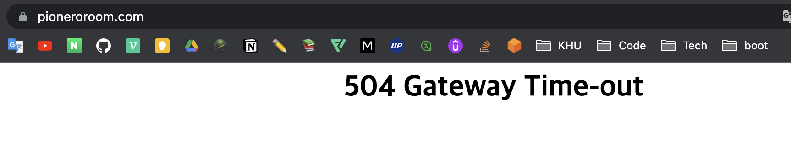
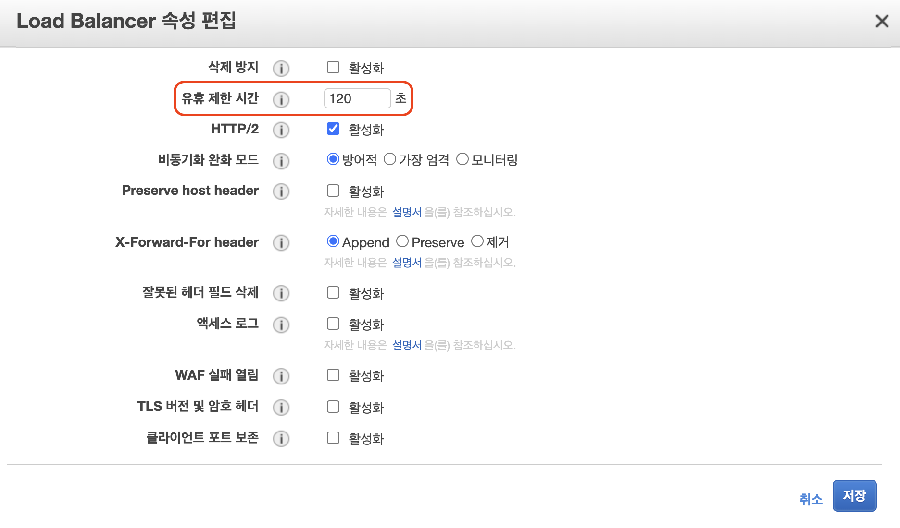
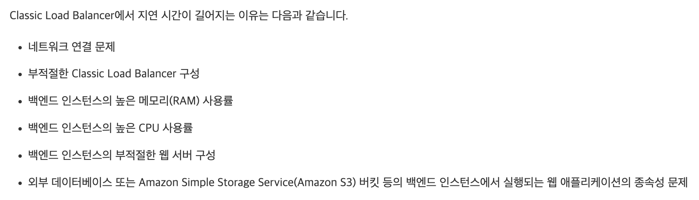

# Error: 504 GateWay Time-Out

 

### **문제 상황**
EC2에 웹 앱을 백그라운드로 실행시키고 있었다. 근데 간헐적으로 EC2 서버에 정상적으로 접속이 안되고 `504` 에러가 발생하는 것을 포착했다.

 

 

구글링을 통해 공식 문서를 확인한 결과 `504` 문제에 대한 원인은 두 가지 정도가 있다.

[공식 문서: HTTP 오류](https://docs.aws.amazon.com/elasticloadbalancing/latest/classic/ts-elb-error-message.html#ts-elb-errorcodes-http504)

 

**문제 원인**

1. 로드 밸런서에 설정된 유휴 시간보다 응답하는데 더 오래 걸렸기 때문.
2. Elastic Load Balancing(ELB)에 대한 연결을 닫는 EC2 인스턴스

 

**해결 방안**

1. 로드 밸런서의 속성에서 유휴 제한 시간을 늘려준다. (Default: 60s)

2. ELB 연결을 닫지 않도록 EC2의 연결 유지 설정 활성화

 

### Load Balancing에서 지연 시간이 길어지는 이유 ❓

 

 

+++ 보안) 위 방법들로도 해결이 안되어서 [swap](./Swap.md) 방법 시도하여 504 예방함.

Reference 🌈

- [Classic Load Balancer에 대한 유휴 연결 시간 초과 구성](https://docs.aws.amazon.com/elasticloadbalancing/latest/classic/config-idle-timeout.html)
- [ELB Classic Load Balancer의 긴 지연 시간 문제를 해결하려면 어떻게 해야 하나요?](https://aws.amazon.com/ko/premiumsupport/knowledge-center/elb-latency-troubleshooting/)