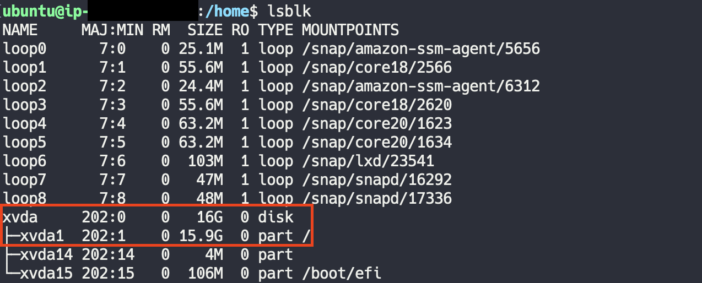

# EBS(Elastic Block Stroage) 볼륨 크기 증설

EC2를 프리티어로 사용하면 Default로 8GiB의 용량이 주어진다. <u>프리티어로 EBS 30GiB가 제공</u>되니 걱정말고 볼륨 크기를 늘려보자.

<br>

아래 순서대로 볼륨 크기 수정을 진행한다.

> EC2 대시보드 ➡️ EBS 볼륨 선택 ➡️ 볼륨 수정

기본으로 8GiB이지만 이것을 16GiB로 수정해준다.

<p align="center"></p>

<br>

다음으로 EC2에 원격으로 접속하여 각 볼륨의 용량을 확인해 보자.

### EC2 볼륨 용량 확인 명령어
```bash
df -hT # 각 볼륨의 파일 시스템 용량, 타입 확인

du <dir> # dir과 dir 내부에 있는 모든 dir의 용량 확인
```

<p align="center"></p>

전체 8GB 중 72% 정도 사용 중에 있다. 메모리 역시 사용량이 86%... 메모리 부족 대안책으로 [swap](./Swap.md) 공간을 활용해보자.

<br>

> ❗️ EBS의 크기를 16GiB로 볼륨을 늘리긴 했지만, 우리의 EC2 파티션에 늘린 공간을 할당해주고, 이것을 파일 시스템에 바뀐 파티션의 size를 적용시켜줘야지만 온전히 증가된 16GiB를 사용할 수 있게된다.

<br>

### 인스턴스에 연결된 블록 디바이스 확인 명령어
```bash
lsblk
```
<br>

파티션 증가 전


루트 볼륨은 16GB으로 증가했지만, 아직 파티션의 크기가 이전 크기인 8GB 이다.

<br>

### 파티션 크기 수정 명령어
```bash
sudo growpart <볼륨> <파티션번호>
# ex) sudo growpart /dev/xvda 1
```


<br>

파티션 증가 후



❗️ 용량이 너무 full 한 상태이면 파티션 크기 수정이 안 될 수도 있으니, 어느 정도 여유 공간을 마련하고 명령어를 실행시키자.

<br>

### 파일 시스템의 크기 수정 명령어
```bash
sudo resize2fs <파티션>
# ex) sudo resize 2fs /dev/xvda1
```

다시 `df -hT` 명령어를 통해 EBS 볼륨의 용량을 확인해 보면,

