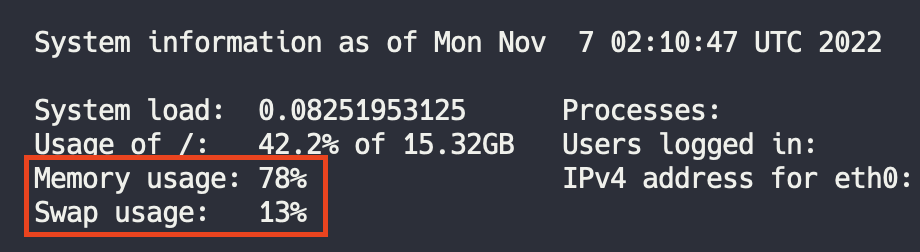

# Swap file을 사용하여 EC2에 가상 메모리 할당

❗️ 스왑 공간으로 지정한 블록 크기는 EC2 인스턴스에서 사용 가능한 메모리보다 작아야 한다. 예를 들어, 프리티어 t2.micro를 사용하는 경우, 메모리가 1GB 밖에 되지 않기 때문에 스왑 공간이 1GB를 넘지 못한다. 그렇지 않으면 "memory exhausted" 오류가 발생한다.

아래 예제 dd 명령에서 스왑 파일은 1GB(128MB × 8)이다.

<br>

1. dd 명령을 사용하여 루트 파일 시스템에 스왑 파일을 생성한다. `bs`는 블록 크기이고, `count`는 블록 수 이다. 스왑 파일의 크기는 dd 명령의 (블록 크기 × 블록 개수) 값이다. 블록의 크기와 개수 옵션을 조절하여 스왑 파일의 크기를 결정한다.

```bash
$ sudo dd if=/dev/zero of=/swapfile bs=128M count=8
```

2. 스왑 파일의 읽기 및 쓰기 권한을 업데이트한다.

```bash
$ sudo chmod 600 /swapfile
```

3. Linux 스왑 영역을 설정한다.

```bash
$ sudo mkswap /swapfile
```

4. 스왑 공간에 스왑 파일을 추가하여 스왑 파일을 즉시 사용할 수 있도록 한다.

```bash
$ sudo swapon /swapfile
```

5. 프로시저가 성공적인지 확인한다.

```bash
$ sudo swapon -s
```

6. /ect/fstab 파일을 편집하여 부팅 시 스왑 파일을 시작합니다.

```bash
$ sudo vi /etc/fstab
```

7. 파일 끝에 다음 줄을 새로 추가하고 파일을 저장한 다음 종료한다.

```bash
/swapfile swap swap defaults 0 0
```

<br>



EC2에 원격 접속을 하면 system information에 `Swap Usage`가 사용되고 있는 것을 확인할 수 있다. ~~(Memory Usage가 환상적으로 줄어들진 않았다...)~~