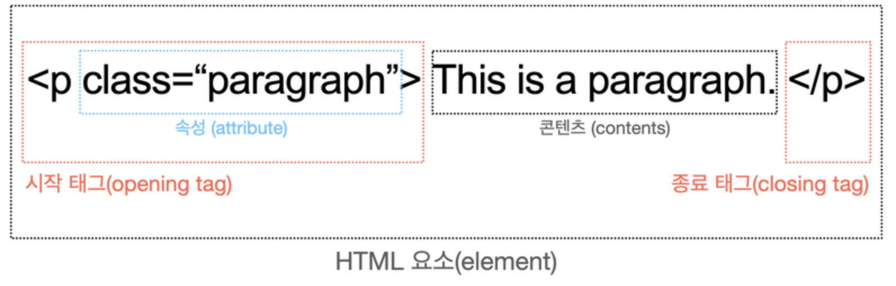
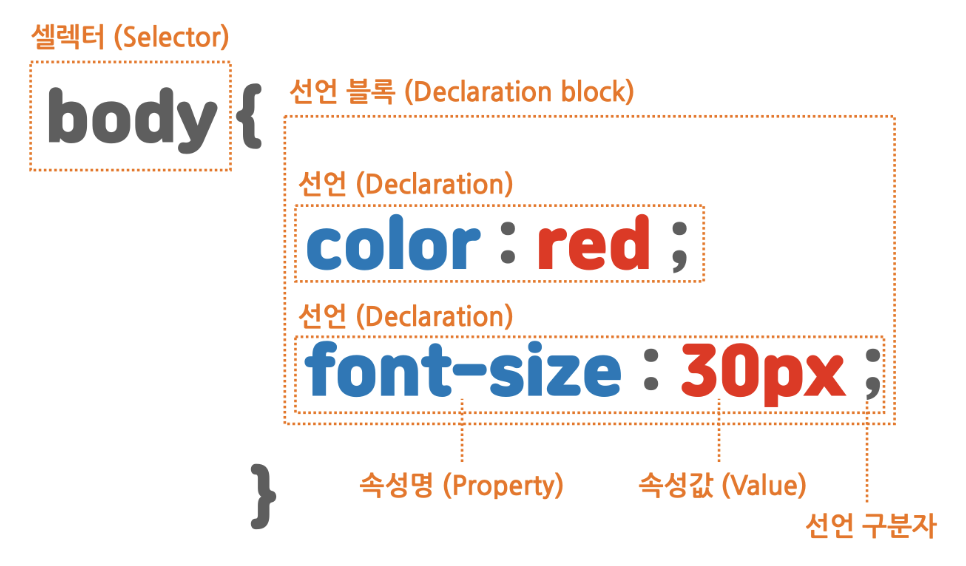
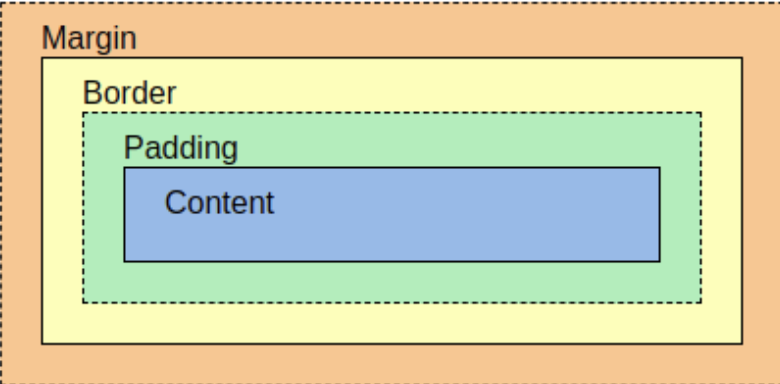
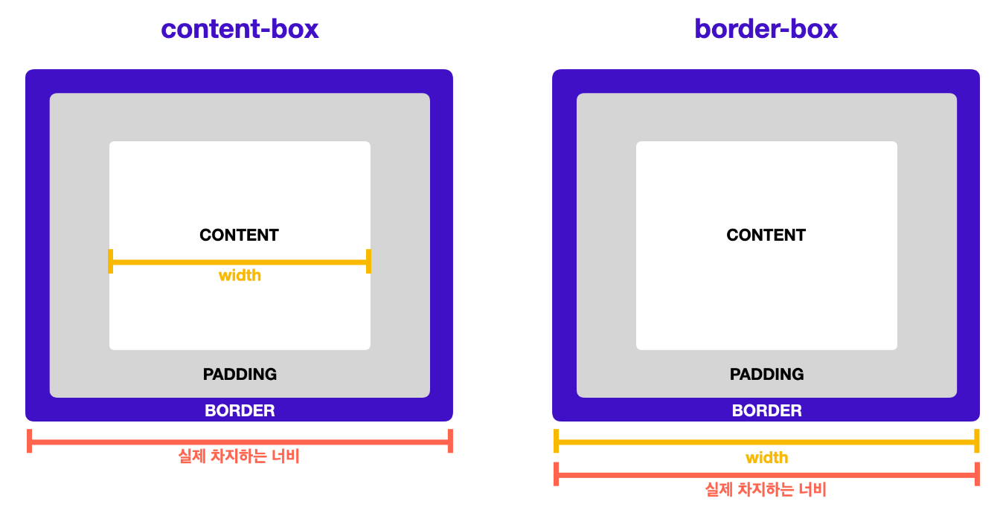

# 22-06-27 [03] Publighing HTML, CSS

- HTML
  - [HTML 기본 구조](#html-기본-구조)
  - [HTML Element](#html-element)
  - [Semantic tag](#semantic-tag)
  - [self closing Tag](#self-closing-tag)
  - [Most Used Tags in HTML](#most-used-tags-in-html)
- CSS
  - [UI/UX](#uiuser-interface)
  - [Selector 기본 구조](#selector-기본-구조)
  - [CSS 적용 방법 3가지](#css-적용-방법-3가지)
  - [id로 이름 붙여서 스타일링 적용하기](#id로-이름-붙여서-스타일링-적용하기)
  - [class로 스타일을 분류하여 적용하기](#class로-스타일을-분류하여-적용하기)
  - [하나의 요소에 여러 class 적용하는 방법](#하나의-요소에-여러-class-적용하는-방법)
  - [글꼴 크기 단위](#글꼴-크기-단위)
  - [Box Model(박스 모델)](#box-model박스-모델)
  - [박스의 구성 요소](#박스의-구성-요소)
  - [박스를 벗어나는 콘텐츠 처리](#박스를-벗어나는-콘텐츠-처리)
  - [박스 크기 측정 기준](#박스-크기-측정-기준)

---

## HTML ❓

> HTML은 웹 문서를 구조적으로 표현하기 위한 언어입니다.

<br>

### HTML 기본 구조

👉 트리 구조 🌲

- html
  - head
    - title: Page title
  - body
    - h1: Hello World
    - div: Contents here!
      - span: Here too!

<br>

### HTML Element



- `<p>` ➡️ opening tag
- `class` ➡️ atrribute <u>name</u>
- `"paragraph"` ➡️ atrribute <u>value</u>
- `This is a paragraph` ➡️ contents
- `</p>` ➡️ closing tag

<br>

### Semantic tag

HTML 문서 안에 수많은 요소들이 들어가게 되면 복잡할 수 있다.

`<div></div>` 만으로 구조를 계속 나누다보면 매우 복잡 ! 

매우 큰 구역을 나눌 때 `<div>` 사용을 권장하지 않는다! ❌ 

작은 구역에서 *"최후의 수단(as a last resort)"* 으로 사용 

∴ `semantic tag`를 사용하여 개발자로 하여금 **직관적인** 구조 파악 👍

Ex. `<section>`, `<article>`, `<main>`, `<nav>`, `<footer>` etc

- 의미론(Semantic)에 대해 참고하면 좋은 자료 👉 [developer.mozilla](https://developer.mozilla.org/en-US/docs/Glossary/Semantics)
- `<sectio>`과 `<div>` 차이점 👉 [stackoverflow](https://stackoverflow.com/questions/6939864/what-is-the-difference-between-section-and-div/6941170#6941170)


<br>

### self closing Tag

`<tag></tag>` 대신 `<tag/>` 처럼 쓸 수 태그들이 있다.

Ex. ``, `<input>`, `<br>`, `<hr>` etc

사실 태그 끝에 `/>` 슬래시로 닫을 필요 없다. HTML에서는 무시 👉 [자세한 내용](https://www.tutorialstonight.com/self-closing-tags-in-html.php)

<br>

### Most Used Tags in HTML

| 태그                | 설명                                                         |
| ------------------- | ------------------------------------------------------------ |
| `<div>`             | Division, 한 줄 차지                                         |
| `<span>`            | span, 컨텐츠 크기만큼 공간 차지                              |
| ``             | 닫는 태그 필요없음, 속성; src                                |
| `<a>`               | 속성;  href, target                                          |
| `<ul>, <ol> & <li>` | Unordered , Ordered list & List Item, 한쌍                   |
| `<input>`           | 다양한 입력 폼(Text, Radio, Checkbox), 속성; type, placeholder, name, value |
| `<textarea>`        | Multi-Line text Input                                        |
| `<button>`          | Button                                                       |

### 🐯 HTML 연습 문제 풀어보기 👉 [W3 Schools](https://www.w3schools.com/html/html_exercises.asp)
### HTML 요소 참고서 👉 [Ref](https://developer.mozilla.org/ko/docs/Web/HTML/Element#%EC%BD%98%ED%85%90%EC%B8%A0_%EA%B5%AC%ED%9A%8D)

---

## CSS ❓

> 구조적인 문서를 어떻게 시각적으로 표현하는지에 대한 언어입니다.

<br/>

#### **UI(User Interface)**

- User가 웹 애플리케이션을 CLI(Command Line Interface)로 소통한다면 매우 어려울 것이다!🔥

- CLI 명령어를 몰라도 일반 사용자가 **UI**를 통해 쉽게 웹 애플리케이션과 소통이 가능해진다! ✨

**UX(User Experience**

- 직관적이고 쉬운 UI 제작은 프론트엔드 개발자의 기본 소양

- 좋은 사용자 경험(UX; User Experience)은 직관적이고 쉬운 UI에서 나옵니다.

**더 나은 UI/UX를 제공하기 위해 CSS는 필수 ❗️**

<br/>

### Selector 기본 구조



- `body` ➡️ Selector
- `{ }` ➡️ Declaration block
- `color` ➡️ property <u>name</u>
- `red` ➡️ property <u>value</u>
- `;` ➡️ Delclaration delimiter

<br/>

### CSS 적용 방법 3가지

1. 인라인 스타일 💧

    CSS 파일로 구분하지 않을 정도로 적은 양의 CSS인 경우 인라인 추천

2. 내부 스타일 시트 💧

    [관심사 분리](https://ko.wikipedia.org/wiki/%EA%B4%80%EC%8B%AC%EC%82%AC_%EB%B6%84%EB%A6%AC) 측면에서 인라인 스타일과 내부 스타일 시트는 권장 ❌

3. 외부 스타일 시트 ⭐️

   HTML은 웹 페이지의 구조와 내용만 담당하고, CSS는 디자인만 담당하도록 역할 분담! **관심사 분리 측면에서 Good✨**

```html
<!--CSS 외부 스타일 시트 HTML에 적용하는 방법-->
<link rel="stylesheet" href="index.css" />
```

link 해오는 파일이 CSS인 경우: rel 속성 ➡️  `rel="stylesheet"`

불러오고자 하는 외부 CSS 파일 경로: href 속성 ➡️ `href="index.css"`

<br>

### id로 이름 붙여서 스타일링 적용하기

```html
<h4 id="navigation-title">This is the navigation section.</h4>
```

태그에 `id`가 할당된 경우, CSS 파일에서 `#id_value`로 접근하여 해당 태그에 스타일링을 적용할 수 있다. 

`id`는 HTML 안에서 <u>고유해야 한다</u>. 즉, 단일 요소에만 스타일링 적용

```css
#navigation-title {
  color: red;
}
```

<br>

### class로 스타일을 분류하여 적용하기

```html
<ul>
	<li class="menu-item">Home</li>
        <li class="menu-item">Mac</li>
	<li class="menu-item">iPhone</li>
	<li class="menu-item">iPad</li>
</ul>
```
태그에 `class`가 할당된 경우, CSS 파일에서 `.class_value`로 접근하여 해당 태그에 스타일링을 적용할 수 있다. 

`class`는 HTML 안에서 <u>중복 사용이 가능하다</u>. 즉, 여러 요소들에 중복으로 스타일링 적용

```css
.menu-item {
  text-decoration: underline;
}
```

<br>

### 하나의 요소에 여러 class 적용하는 방법

적용하려는 class들의 이름을 `띄어쓰기`로 구분합니다.

```html
<li class="menu-item selected">Home</li
```

위와 같이 `menu-item`의 클래스와 `selected` 클래스를 `li` 요소에 동시 적용 가능하다.

```css
.menu-item {
  text-decoration: underline;
}

.selected {
  font-weight: bold;
  color: #009999;
}
```

<br>

**id vs class**

| id                                        | class                                     |
| ----------------------------------------- | ----------------------------------------- |
| #으로 html 요소 선택                      | .으로 html 요소 선택                      |
| 단 하나의 요소에만 적용(중복 ❌) | 여러 요소들에 적용 가능(중복 ⭕️) |
| 특정 요소에 이름을 붙이는 데 주로 사용    | 스타일의 분류에 많이 사용                 |

<br>

### 글꼴 크기 단위

1. 절대 단위

    ➡️ px, pt etc

2. 상대 단위

    ➡️ , em, **rem(추천⭐️)**, ch, vw, vh etc

    (em은 부모 엘리먼트에 따라 상대적으로 크기가 변경되므로 계산이 어렵습니다. 이에 비해 rem은 root의 글자 크기에 따라서만 상대적으로 변합니다.)

단위에 대한 좀 더 많은 정보 👉 [MDN](https://developer.mozilla.org/en-US/docs/Learn/CSS/Building_blocks/Values_and_units#numbers_lengths_and_percentages), [W3Schools](https://www.w3schools.com/cssref/css_units.asp)

<br>

**기타 스타일링 속성**

- 굵기: `font-weight`
- 밑줄, 가로줄: `text-decoration`
- 정렬: `text-align`
- 자간: `letter-spacing`
- 행간: `line-height`

<br>

### Box Model(박스 모델)

> 웹 페이지 내의 모든 컨텐츠는 고유 영역을 가지고, 직사가형을 띈다. 그래서 Box라 부른다.

<Br>

### 줄바꿈이 되는 박스(block) vs. 옆으로 붙는 박스(inline, inline-block)

|                              | Block           | Inline-block           | Inline                 |
| ---------------------------- | --------------- | ---------------------- | ---------------------- |
| 줄바꿈 여부                  | 줄바꿈이 일어남 | 줄바꿈이 일어나지 않음 | 줄바꿈이 일어나지 않음 |
| 기본적으로 갖는 너비(width)  | 100%            | 글자가 차지하는 만큼   | 글자가 차지하는 만큼   |
| width, height 사용 가능 여부 | 가능            | 가능                   | 불가능                 |


block 요소 목록 확인하러 가기 👉 [Block-level elements](https://developer.mozilla.org/en-US/docs/Web/HTML/Block-level_elements)

inline 요소 목록 확인하러 가기 👉 [Inline-level elements](https://developer.mozilla.org/en-US/docs/Web/HTML/Inline_elements)


`inline-block` 박스는 `inline` 박스처럼 다른 요소의 옆으로 붙으면서, <u>자체적으로 고유의 크기를 가진다.</u>

<br>

### 박스의 구성 요소



`margin` ▶︎ `border` ▶︎ `padding` ▶︎ `content`

<Br>

**여백 조정하기**

1. 각각의 값은 top, right, bottom, left로 <u>시계방향</u>

```Css
p {
  margin: 10px 20px 30px 40px;
}
```

1. 값을 두 개만 넣으면 top과 bottom이 10px, left 및 right가 20px

```css
p {
  margin: 10px 20px;
}
```

3. 값을 하나만 넣으면 모든 방향의 바깥 여백에 적용

```css
p {
  margin: 10px;
}
```

4. 방향을 특정한 속성도 존재

```css
p {
  margin-top: 10px;
  margin-right: 20px;
  margin-bottom: 30px;
  margin-left: 40px;
}
```

**✌️ 위와 같은 규칙은 `padding`에도 동일하게 적용된다**

👻 margin에는 음수 값을 지정하여 화면에서 사라지게 하거나, 다른 요소와 겹치게 할 수 있다.

<br>

### 박스를 벗어나는 콘텐츠 처리

박스 크기보다 콘텐츠 크기가 큰 경우에는 어떻게 될까 ❓

콘텐츠가 박스 바깥으로 빠져나온다 🙀

이런 경우 두 가지 방법이 있다. ✌️

1. 콘텐츠를 더 이상 표현하지 않거나, 

    hidden 값을 지정하면 콘텐츠 크기가 넘칠 경우 숨겨진다.

```css
p {
  overflow: hidden;
}
```

2. 박스 안에 스크롤을 추가하거나.

    auto 값을 지정하면 콘텐츠 크기가 넘칠 경우 스크롤이 추가된다. `overflow-x` 속성과 `overflow-y` 속성을 이용하면 x축과 y축을 지정해 가로 방향으로 스크롤 하거나 세로 방향으로 스크롤 할 수 있게끔 지정할 수 있다.


```css
p {
  overflow: auto;
}
```

<br>

### 박스 크기 측정 기준

☠️ 레이아웃을 디자인할 때 가장 많이 하는 실수. 

박스의 크기를 디자인할 때 여백의 크기를 신경쓰지 않고 콘텐츠 영역만 고려하면, 처음 생각한 레이아웃을 벗어날 수 있다 😹

간단한 해결법  ✨ **여백과 테두리 두께를 포함한 박스 계산법** ✨

```css
* {
  box-sizing: border-box;
}
```

요소를 선택해 `box-sizing` 속성을 추가하고, `border-box`라는 값을 추가한다. 이렇게 모든 요소에 `box-sizing: border-box`를 적용하면, 모든 박스에서 여백과 테두리를 포함한 크기로 계산된다. <U>⭐️일반적으로 box-sizing은 HTML 문서 전체에 적용합니다.</U> box-sizing을 일부 요소에만 적용하는 경우, 혼란을 가중시킬 수 있습니다.



- `content-box`: 박스 크기를 측정하는 기본값; 여백과 테두리 포함 ❌
- `border-box`: 대부분의 레이아웃 디자인에서 여백과 테두리를 포함하는 박스 크기 계산법 🌈


### 🐯 CSS 연습 문제 풀어보기 👉 [W3 Schools](https://www.w3schools.com/css/css_exercises.asp)
