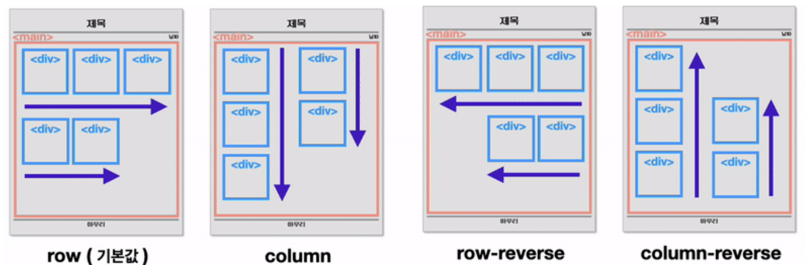
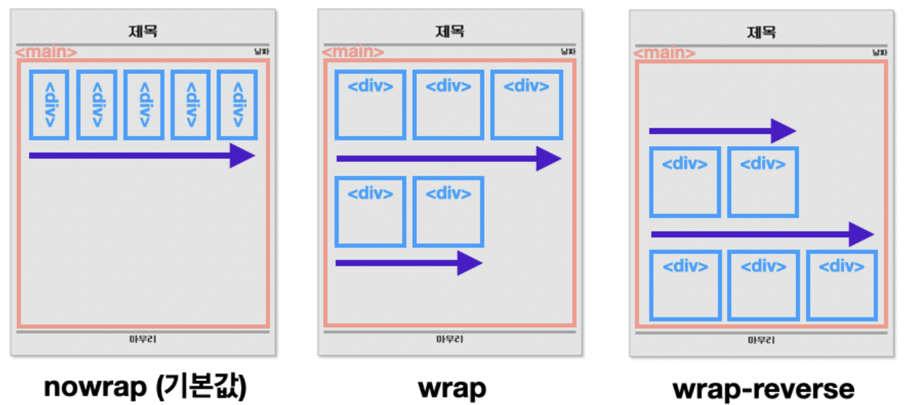
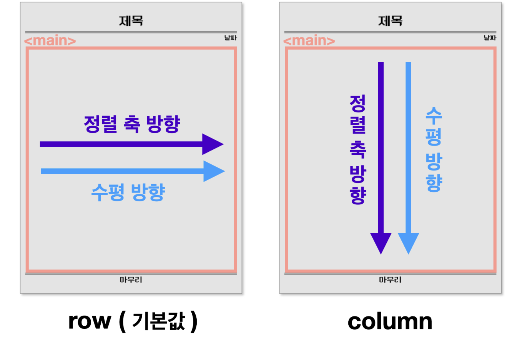
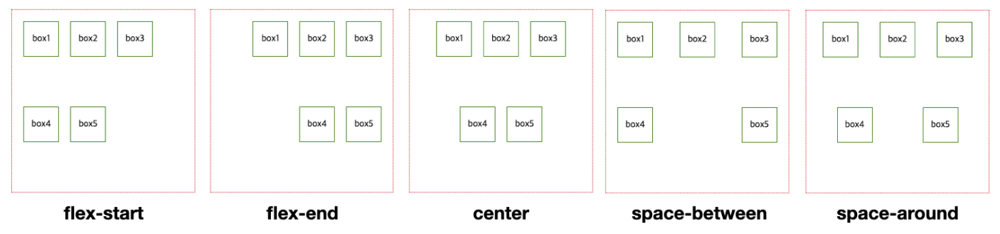
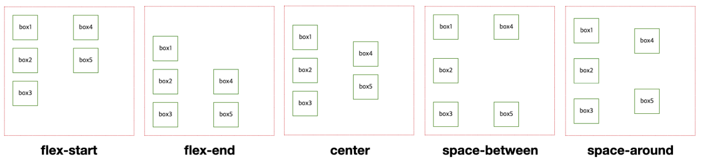
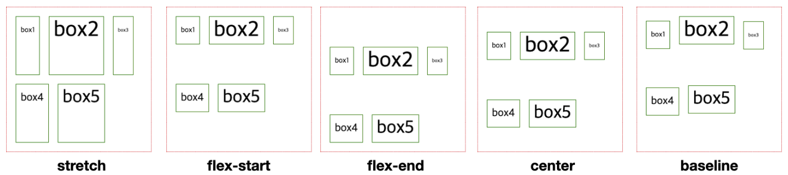
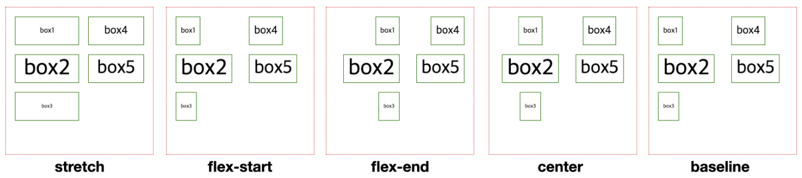

# 22-06-27 [03] Publighing_Page layout, 와이어프레임


---

## Page Layout

> 잘 배치된 페이지 레이아웃은 UX 측면에 있어서 매우 중요하다.

<br>

### ⊞ 레이아웃: 화면을 나누는 방법

콘텐츠의 흐름 `좌 ➡️ 우`, `위 ➡️ 아래`로 흐른다.

CSS로 화면을 구분할 때 `수직분할` ➡️ `수평분할` 차례대로 적용.

- 수직분할: 화면을 수직으로 구분하여 콘텐츠를 가로로 배치
- 수평분할: 화면을 수평으로 구분하여 콘텐츠를 세로로 배치

<Br>

### 레이아웃 리셋

기본 스타일링을 제거하는 CSS 코드

- 박스의 시작을 (0,0)으로 시작하고 싶을 때
- width, height 계산이 여백을 포함하지 않을 때
- 브라우저마다 기본 스타일이 다를 때

위에 언급한 문제들을 해결할 코드 ✨
```Css
* {
    box-sizing: border-box;
}

body {
    margin: 0;
    padding: 0;
}
```
<Br>

## Flexbox로 레이아웃 잡기

Flexbox 속성들을 활용하면 요소의 `정렬`, 요소가 `차지하는 공간`을 설정 가능하다.

❗️ Flexbox 속성을 사용할 때 유의점 

- <u>적절한 위치에 속성을 지정해줘야 한다.</U>
- `부모 요소`에 적용해야하는 속성들
- `자식 요소`에 적용해야하는 속성들

<br>


### 🐔 부모 요소에 적용해야 하는 Flexbox 속성들

1. `flex-direction`: 정렬 축 정하기
  
    자식 요소들을 정렬할 정렬 축을 정한다.



<br>

2. `flex-wrap`: 줄 바꿈 설정하기
  
   하위 요소들의 크기가 상위 요소의 크기를 넘으면 자동 줄 바꿈을 할 것인지 정한다.



<br>

3. `justify-content`: 축 수평 방향 정렬

    자식 요소들을 축의 수평 방향으로 어떻게 정렬할 것인지 정한다.
     - flex-start
     - flex-end
     - center
     - space-between
     - space-around



`flex-direction : row` 인 경우



`flex-direction : column` 인 경우



<br>

4. `align-items`: 축 수직 방향 정렬

    자식 요소들을 축의 수직 방향으로 어떻게 정렬할 것인지 정한다.
   - stretch
   - flex-start
   - flex-end
   - center
   - baseline


`flex-direction : row` 인 경우



`flex-direction : column` 인 경우



<br>

### 🐥 자식 요소에 적용해야 하는 Flexbox 속성들

부모 요소에 적용해야 하는 속성들이 자식 요소들의 **정렬**과 관련이 있었다면, 자식 요소에게 적용해야 하는 속성인 `flex`는 요소가 **차지하는 공간**과 관련이 있다.

