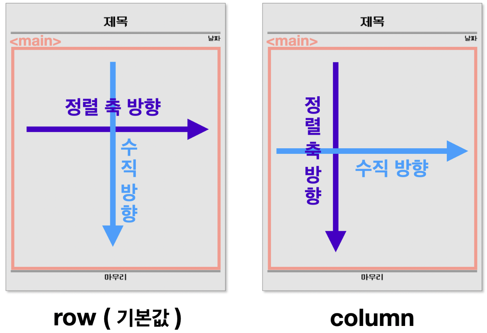

# 22-06-28 [03] Publighing_Page layout, Wireframe

- [Page layout](#page-layout)
- [Flexbox로 레이아웃 잡기](#flexbox로-레이아웃-잡기)
- [와이어프레임](#와이어프레임wireframe)


---
## ✏️ Goal of study

**page layout**

- 레이아웃을 위한 HTML 구조를 만들 수 있다.
- 손쉽게 웹 페이지의 각 요소를 정렬하는 데 Flexbox에 대한 핵심적인 개념과 내용을 이해할 수 있다

<br>

**와이어프레임**

- 만들고 싶은 앱의 와이어프레임을 그려볼 수 있다.
- 와이어프레임만 보고 HTML로 코딩할 수 있다.
- div 태그 또는 section, header 등의 시맨틱 태그로 영역을 구분하는 이유를 이해할 수 있다.
- HTML 문서에서 언제 id 혹은 class를 사용해야 하는지 이해할 수 있다.

---

## Page Layout

> 잘 배치된 페이지 레이아웃은 UX 측면에 있어서 매우 중요하다.

<br>

### ⊞ 레이아웃: 화면을 나누는 방법

콘텐츠의 흐름 `좌 ➡️ 우`, `위 ➡️ 아래`로 흐른다.

CSS로 화면을 구분할 때 `수직분할` ➡️ `수평분할` 차례대로 적용.

- 수직분할: 화면을 수직으로 구분하여 콘텐츠를 가로로 배치
- 수평분할: 화면을 수평으로 구분하여 콘텐츠를 세로로 배치

<Br>

### 레이아웃 리셋

기본 스타일링을 제거하는 CSS 코드

- 박스의 시작을 (0,0)으로 시작하고 싶을 때
- width, height 계산이 여백을 포함하지 않을 때
- 브라우저마다 기본 스타일이 다를 때

위에 언급한 문제들을 해결할 코드 ✨
```Css
* {
    box-sizing: border-box;
}

body {
    margin: 0;
    padding: 0;
}
```
<Br>

## Flexbox로 레이아웃 잡기

Flexbox 속성들을 활용하면 요소의 `정렬`, 요소가 `차지하는 공간`을 설정 가능하다.

❗️ Flexbox 속성을 사용할 때 유의점 

- <u>적절한 위치에 속성을 지정해줘야 한다.</U>
- `부모 요소`에 적용해야하는 속성들
- `자식 요소`에 적용해야하는 속성들

<br>


### 🐔 부모 요소에 적용해야 하는 Flexbox 속성들

1. `flex-direction`: 정렬 축 정하기
  
    자식 요소들을 정렬할 정렬 축을 정한다.


<br>

2. `flex-wrap`: 줄 바꿈 설정하기
  
   하위 요소들의 크기가 상위 요소의 크기를 넘으면 자동 줄 바꿈을 할 것인지 정한다.


<br>

3. `justify-content`: 축 수평 방향 정렬

    자식 요소들을 축의 수평 방향으로 어떻게 정렬할 것인지 정한다.
     - flex-start
     - flex-end
     - center
     - space-between
     - space-around


`flex-direction : row` 인 경우


`flex-direction : column` 인 경우


<br>

4. `align-items`: 축 수직 방향 정렬

    자식 요소들을 축의 수직 방향으로 어떻게 정렬할 것인지 정한다.
   - stretch
   - flex-start
   - flex-end
   - center
   - baseline



`flex-direction : row` 인 경우


`flex-direction : column` 인 경우


<br>

### 🐥 자식 요소에 적용해야 하는 Flexbox 속성들

부모 요소에 적용해야 하는 속성들이 자식 요소들의 **정렬**과 관련이 있었다면, 자식 요소에게 적용해야 하는 속성인 `flex`는 요소가 **차지하는 공간**과 관련이 있다.


**flex 속성의 값**

```css
flex: <grow(팽창 지수)> <shrink(수축 지수)> <basic(기본 크기)>
```

  - `grow` : 요소의 크기가 늘어나야 할 때 얼마나 늘어날지
  - `shrink` : 요소의 크기가 줄어들어야 할 때 얼마나 줄어들지
  - `basic` : 요소의 기본 크기가 얼마인지

자식 요소에 `flex` 요소를 따로 설정해주지 않으면 **기본값**으로 다음이 적용된다.

```css
flex: 0 1 auto;
```

- width와 flex-basis를 동시에 적용하는 경우, flex-basis가 우선됩니다.
- 콘텐츠가 많아 자식 박스가 넘치는 경우, width가 정확한 크기를 보장하지 않습니다.
- (flex-basis를 사용하지 않는다면) 콘텐츠가 많아 자식 박스가 넘치는 경우를 대비해, width 대신 max-width를 쓸 수 있습니다.

### 🐸 flexbox 연습 👉 [Flexbox Froggy](https://flexboxfroggy.com/#ko)

<br>

## 와이어프레임(Wireframe)

> 웹 또는 앱을 개발할 때 레이아웃의 뼈대를 그리는 단계를 와이어프레임이라고 한다.

와이어프레임은 말 그대로 **"와이어로 설계된 모양"** 을 의미하며, 단순한 선이나, 도형으로 웹이나 앱의 인터페이스를 시각적으로 묘사한 것이다. 와이어프레임은 **아주 단순하게, 레이아웃과 제품의 구조**를 보여주는 용도이다. 전환 효과나, 애니메이션, 사용자 테스트 같은 스타일링 요소나 UX(사용자 경험, User Experience)를 판단하는 것이 아니다.

### 목업(Mock-up)

대부분의 산업에서 목업은 실물 크기의 모형을 뜻한다. 실물 제품이 없는 무형의 웹 또는 앱의 목업은 실제 제품이 작동하는 모습과 동일하게 HTML문서와 CSS로 취급한다. 다만 기능적으로 동작하진 않는다.

**와이어프레임 만들기 Tools**

- 피그마(Figma)
- 미로(Miro)
- 오븐(Oven)

가장 빠르고 간편한 오븐 사용해보기 👉 [Oven](https://ovenapp.io/)