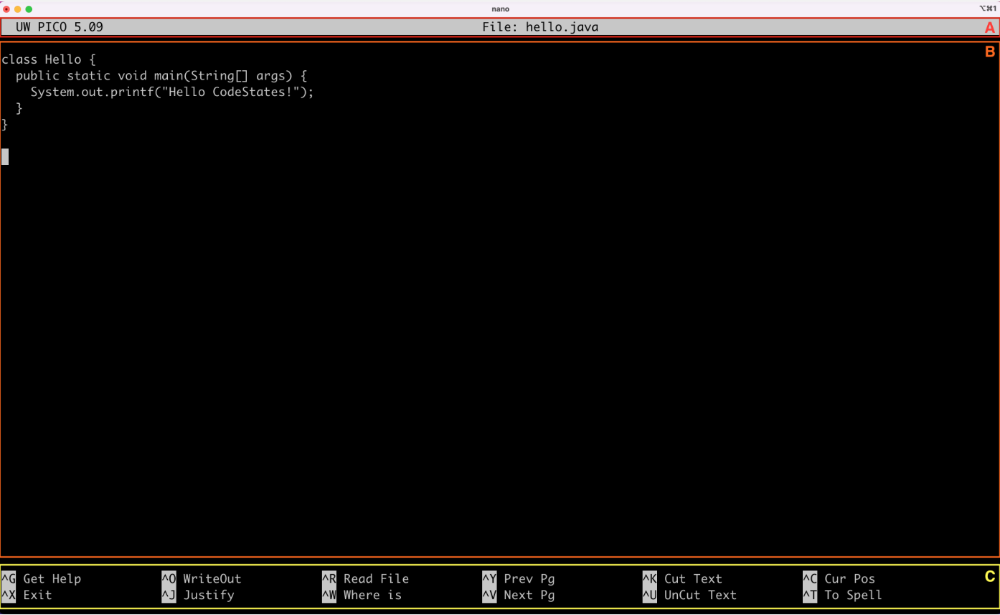

# 22-06-30 [04] Linux 기초_CLI 기본 명령어

- [컴퓨터 제어방식](#컴퓨터-제어방식) 
- [CLI 기본 명령어](#cli-기본-명령어)
- [텍스트 에디터 nano](#텍스트-에디터-nano)

---

## ✏️ Goal of Study

- 리눅스 터미널을 실행할 수 있다.
- CLI를 이용한 작업과 GUI를 이용한 작업이 동일함을 이해할 수 있다
- 리눅스 터미널에서 기본적인 명령어를 사용할 수 있다
- 명령어를 사용할 때, 등장하는 키워드에 대해 이해할 수 있다.
- 절대 경로와 상대 경로의 차이를 이해할 수 있다
- 텍스트 에디터 nano를 이용해 파일을 수정하고, 저장할 수 있다.

---


### 컴퓨터 제어방식

- CLI(Command-Line Interface)
  - 명령어로 컴퓨터를 제어하는 방식
  - 상대적으로 높은 안정성과 빠른 속도
  - 컴퓨터의 자원을 적게 사용

- GUI(Graphic User Interface)
  - 화면의 그래픽 요소들로 컴퓨터를 제어하는 방식
  - CLI에 비해 속도가 느림
  - 컴퓨터의 자원을 많이 사용

<br>

### CLI 기본 명령어

1. `pwd` : 현재 폴더 위치 확인하기, print working directory
2. `mkdir` + `폴더 이름` : 새로운 폴더 생성하기
3. `ls` : 특정 폴더에 포함된 파일이나 폴더 확인하기
   
   - `ls -a` : 숨어있는 폴더나 파일을 포함한 모든 항목을 터미널에 출력
   - `ls -l` : 폴더나 파일의 포맷을 전부 표현
   - `ls -la` or `ls -al` 
    
        ❗️옵션을 뜻하는 `대쉬(dash, -)` 뒤에 오는 옵션의 순서는 기능에 영향을 미치지 않는다.
4. `cd` + `폴더 이름` : 폴더에 진입하기
5. `touch` + `파일 이름` : 파일 생성하기
6. `>` : 실행 결과(출력)를 파일에 저장하기

    Ex. ```echo Hello World > hi.txt ```
    
    ➡️ hi.txt 파일 안에 Hello World가 입력됨.

    `echo` 는 뒤에 오는 내용을 그대로 출력해주는 명령어이다.

7. `cat` + `파일 이름` : 파일의 내용을 터미널에 출력하기

    📝 원격 서버에 접속하고 매우 큰 용량의 파일을 `cat`하면 어떻게 될까 ❓
    
    ➡️ 원격 서버 접속은 네트워크를 통해 이루어지기 때문에 굉장히 비효율적 ☠️

    🍯 명령어 cat은 이어지는 파일을 순서대로 읽고, 한 파일의 출력이 끝나면 <u>다음 line</u>에 <u>다음 파일</u>을 터미널에 출력한다.

    Ex ➡️ `cat t1.txt t2.txt t3.txt`

8. `rm` + `파일 이름` : 파일 지우기

    `rm`은 기본적으로 폴더를 지울 수 없다. 폴더를 지우려면 옵션이 필요하다. 그리고 CLI에서 삭제된 파일은 즉시 삭제되어 휴지통에도 남지 않아 **복구가 안된다.**

    Ex. 폴더 지우기 ➡️ `rm -rf` + `폴더 이름`

9. `mv` : 폴더나 파일 위치 옮기기 or 폴더나 파일 이름 변경하기

    1. 위치 옮기기
        - `mv` + `file or dir` + `dir` : file or dir ▶︎ dir 이동 ⭕️
        - file or dir ▶︎ file 이동은 불가능 ❌

    2. 이름 변경하기
        - `mv` + `A` + `B`
        - 파일의 경우
          - `B` 파일이 존재하는 경우 ➡️ `content` ➡️ `A`, `name` ➡️ `B`로 <u>대치.</u> 💀`B` 파일 사라짐.
          - `B` 파일이 존재하지 않는 경우 ➡️  A ▶︎ B 이름 변경
        - 폴더의 경우
          - `B` 폴더가 존재하는 경우 ➡️ **위치 옮기기 실행**
          - `B` 폴더가 존재하지 않는 경우 ➡️ **이름 변경 실행** 

10. `cp` : 폴더나 파일을 복사하기 ➡️ `cp` + `A` + `B`
    
    1. 파일 복사하기
        - `A`의 content를 가지고 `B`의 이름을 가진 파일을 생성하거나 대치

    2. 폴더 복사하기
        - `cp`는 기본적으로 폴더 복사를 지원하지 않는다. 욥션 사용 필요 ❗️
        - `cp`에 사용하는 옵션은, 명령어 `rm`에 사용하는 옵션과 동일
          - `B` 폴더가 존재하는 경우 ➡️ `B`폴더 안에 `A` 폴더 붙여넣기.
          - `B` 폴더가 존재하지 않는 경우 ➡️ `B` 이름을 가지고 `A` 폴더의 contents 를 가진 새로운 폴더 생성

✅ **각 명령어에 포함된 옵션은 명령어 이름만 입력하거나 -h 또는 --help와 같은 옵션을 통해 확인할 수 있다.**

<br>

**🍯 폴더나 파일 이름에 백슬래시**

폴더 또는 파일의 이름에 <u>공백(띄어쓰기)</u>이나 <u>특수문자</u>가 있으면, `백슬래시(\)`를 이용해 적용합니다.

 - Ex. ```mkdir Hello\ World```

터미널에 출력될 때, `백슬래시(\)`는 이어지는 특수문자를 출력하는 용도이므로, 실제 터미널에는 나타나지 않는다.

<br>

### 파일과 디렉토리 구분

```
drwxr-xr-x 
-rw-r--r--
```

`ls -l` 명령어로 출력되는 폴더나 파일의 포맷 중 가장 왼쪽에 출력되는 `d` 또는 `-` 각각 디렉토리와 파일을 의미한다. 디렉토리는 `cd`로 진입이 가능하지만 파일은 진입할 수 없다.

<br>

### 텍스트 에디터 nano

**nano 실행**

```markdown
nano hello.java # hello.java를 nano에서 연다.
nano # 그냥 실행할 수도 있다.
```



- (A) 파일 이름 안내
- (B) 파일 편집 화면, 실제로 여기서 텍스트 파일을 편집한다.
- (C) 사용에 필요한 각종 단축키


**파일 저장**

`^O WriteOut`

### ⭐️ 터미널에서 에디터 사용 이유

> AWS(Amazon Web Service)와 같은 원격 서버 환경에서 원격으로 텍스트 파일을 편집해야 하는 경우 CLI는 매우 유용하기 때문이다. 따라서 터미널에서 자유자재로 다룰 수 있는 에디터가 하나쯤은 있어야 한다.

<br>

터미널 에디터 추천 👉 [완전 초보를 위한 vim](https://nolboo.kim/blog/2016/11/15/vim-for-beginner/)