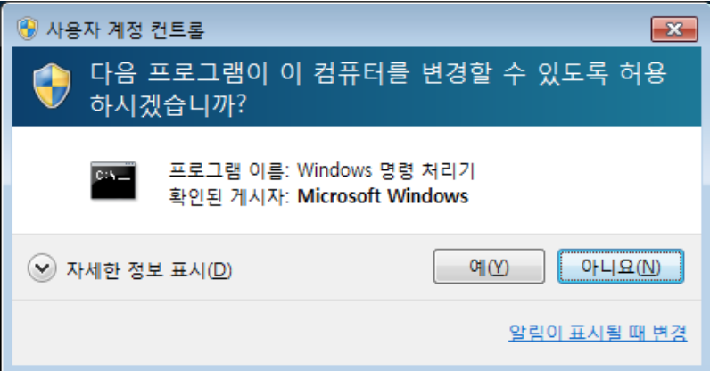
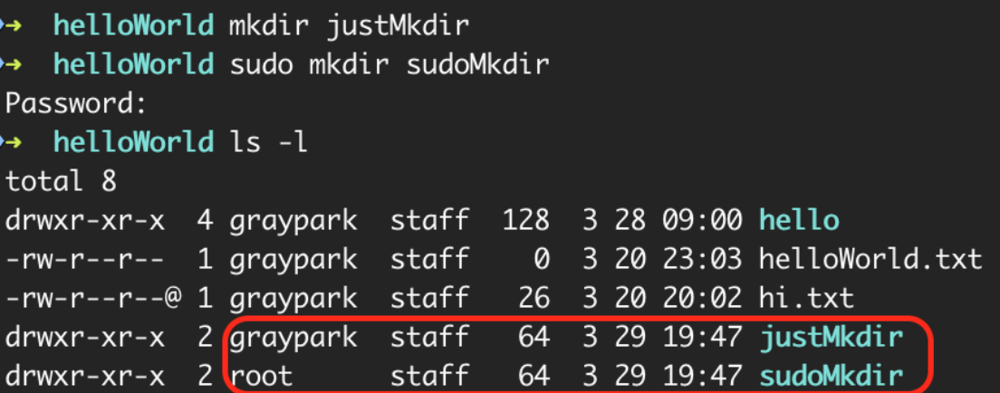

# 22-06-30 [04] Linux 기초_패키지, 권한, 경로, 환경 변수

- [사용자와 관리자](#사용자와-관리자)  
- [절대 경로와 상대 경로](#절대-경로와-상대-경로) 
- [관리자 권한](#관리자root-권한) 

---

## ✏️ Goal of Study

**패키지와 패키지 매니저**

- 패키지와 패키지 매니저 필요성을 이해할 수 있다.
- 각 운영체제에 맞는 패키지 매니저를 사용할 수 있다.
- MacOS 운영체제에서 터미널을 통해 Homebrew 패키지 매니저를 설치하고 패키지를 관리하는 명령어를 사용할 수 있다.
    - `brew update`: 패키지의 업데이트 여부 확인
    - `brew outdated`: 업데이트 필요한 파일 조회
    - `brew upgrade`: 프로그램 업그레이드
    - `brew info`: 프로그램의 정보 확인
    - `brew install`: 프로그램 설치
    - `brew list`: 설치된 프로그램 목록 보기
    - `brew uninstall`: 프로그램 삭제

**사용 권한**

- 사용 권한과 소유자에 대해 이해하고, 사용 권한을 변경할 수 있다
  - 파일의 소유자와 파일에 적용된 사용 권한을 확인하고 이해할 수 있다. `ls -l`
  - 파일에 적용된 사용 권한을 변경할 수 있다. `chmod`

**환경 변수**

- 환경변수가 무엇인지 이해한다.
- 환경변수를 왜 사용하는지 이해한다.
- 전역 및 지역 환경변수의 차이를 이해한다.
- 환경변수를 임시적으로 적용할 수 있다.
- 환경변수를 영구적으로 적용할 수 있다.
- 환경변수의 개별값을 확인할 수 있다.
- 환경변수들의 목록을 확인할 수 있다.

---

### 사용자와 관리자

❓ PC를 이용할 때 사용자와 관리자를 나누는 이유는 

- 악성코드 예방
- 해킹으로 인한 프로그램 설치, 변경, 삭제 예방
- 프로그램 간의 충돌 예방

- 관리자 ➡️ 프로그램 설치, 변경, 삭제 권한 보유
- 사용자 ➡️ 프로그램 실행만 가능

    구분하면 좋은 점 
    - 악성코드로부터 보호
    - 프로그램 충돌 방지
    - 여러 사용자 등록 가능 ➡️ 다른 사용자의 영역 침범 불가

➡️ MS사는 window에 사용자를 보호하기 위해 `사용자 계정 컨트롤(UAC, User Account Control)`을 탑재했다.

**사용자 계정 컨트롤(UAC, User Account Control)** 은 시스템을 관리하는 `관리자`와 PC를 일상적으로 사용하는 `사용자`로 구분한다.

✨ `UAC`는 사용자가 모르는 사이에 시스템 설정을 변경하는 `악성코드`가 실행될 때 접근 권한을 막아 사용자를 보호한다. `UAC`는 시스템을 관리하는 `관리자`와 일상적으로 PC를 사용하는 사용자를 구분하였다.

<br>

**UAC 장점과 기능**

- 관리자는 프로그램을 설치하거나 변경 또는 삭제하는 권한을 가짐.
- 사용자는 프로그램을 실행할 수 있지만, 변경은 불가능하도록 제한된 권한을 가짐.
- UAC는 시스템 설정을 임의로 변경하려는 악성코드가 실행될 때, 접근 권한을 막아 사용자를 보호한다.
- 하나의 PC에 여러 사용자를 등록하여, 여러 PC를 사용하는 것처럼 이용 가능하다. 다른 사용자의 영역을 침범할 수 없다.



<br>

### 절대 경로와 상대 경로

`절대 경로`
    
: 기준점으로부터의 절대적인 위치를 나타냄, 이 기준점을 루트폴더(/)라고 한다. `pwd` 명령어로 절대 경로를 확인할 수 있다.

`절대 경로` ➡️ `pwd`로 확인할 수 있는 `루트폴더(/)`부터 시작하는 경로.

Ex. `/home/[username]/helloWorld/hello/`

`상대 경로`

: 특정 폴더 또는 파일의 위치를 현재 위치를 기준점으로 나타낸다. `현재 위치한 폴더는 점(.)`으로 표현하고, `상위 폴더는 두 개의 점(..)`으로 표현한다. 명령어 `ls`를 통해 확인되는 폴더나 파일은, 상대 경로로써 `./`을 붙여 표현할 수 있다.

`상대 경로` ➡️ 특정 폴더 또는 파일의 `현재 위치`를 기준점으로 나타내는 경로.

- 현재 위치한 폴더는 `점(.)`
- 상위 폴더는 `두개의 점(..)`
- `./` ➡️ "현재 폴더 아래의"라는 뜻.

Ex. 
```cmd
cd ./hi # 현재 폴더 아래의 hi 폴더로 진입하는 명령
```

<br>

### 관리자(root) 권한

절대 경로의 기준점인 루트폴더(/)는 linux의 관리자 영역이다. 따라서 루트폴더는 관리자의 영역이기 때문에 사용자 권한으로는 할 수 있는 일이 없다. 

### 사용자 확인 명령어

```cmd
whoami
# [username]
```

명령어 `whoami`를 통해 확인할 수 있는 사용자는, 폴더의 형태로 존재한다. 사용자 권한은 [username] 폴더 내에서만 자유롭게 사용할 수 있다.

> 사용자 폴더의 경로는 `~/`로 표시됩니다. 물결 기호`(~)`는 루트폴더`(/)`로부터 사용자 폴더(username)까지의 경로를 축약한 형태입니다.

<br>

### `sudo`: 관리자 권한을 획득하는 명령어

사용자가 새로운 프로그램을 설치하거나 변경 또는 삭제할 때는, 관리자 권한이 필요하다. 사용자가 관리자 권한을 필요로 할 때, 관리자 권한을 이용할 수 있는 명령어 `sudo`가 있다.

> 명령어 `sudo`는 기본적인 CLI 명령어의 앞에 작성하여, 관리자 권한을 일시적으로 획득하는 명령어이다. 명령어 `sudo`는 한시적으로나마 관리자 권한을 가지기 때문에 항상 비밀번호와 함께 사용한다.

<br>



`sudo`를 이용해 생성한 폴더의 소유자는 루트이다. 즉, 관리자 권한으로 생성되었다는 뜻이다. 반면에 `sudo`를 사용하지 않은 폴더는 사용자 소유의 폴더이다.