# 22-06-27 [04] Git 기초_혼자 작업 시 Workflow

- [Git](#git)
- [Github](#github)
- [개인 Workflow](#github-private-workflow-overview)

---

## Git

버전 관리 시스템(Version Control System)

git을 사용하는 이유 ❓

- 파일의 변경 사항 저장 
- 이전 버전으로 복귀 가능
- 변경 사항 확인 가능
- 협업하기에 좋다
- 백업용

**스냅샷**

백업 복사본을 스냅샷이라고 한다. 스냅샷을 만들어 주는 작업을 `commit`이라 한다.
 

## Github

Git Repository를 관리하는 클라우드 기반 서비스

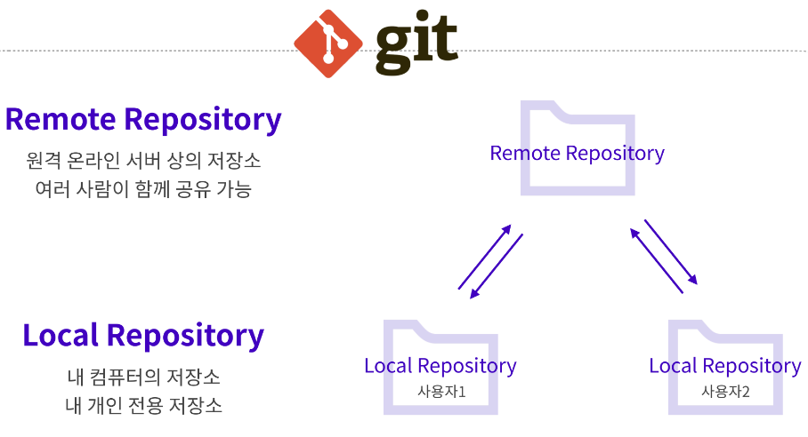

 

## 파일 status에 따른 Area 구분

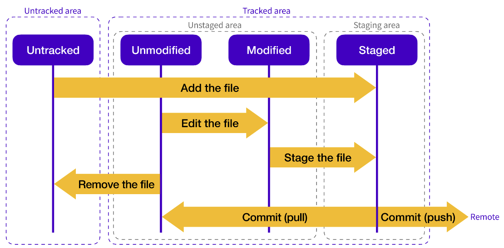

- Untracked area (commit을 한번도 하지 않은 파일)
  - Untracked
- Tracked area (commit을 한번이라도 한 파일)
  - Unstaged area
    - Unmodified
    - Modified
  - Staged area
    - Staged

 

## 🌈 Github Private Workflow 

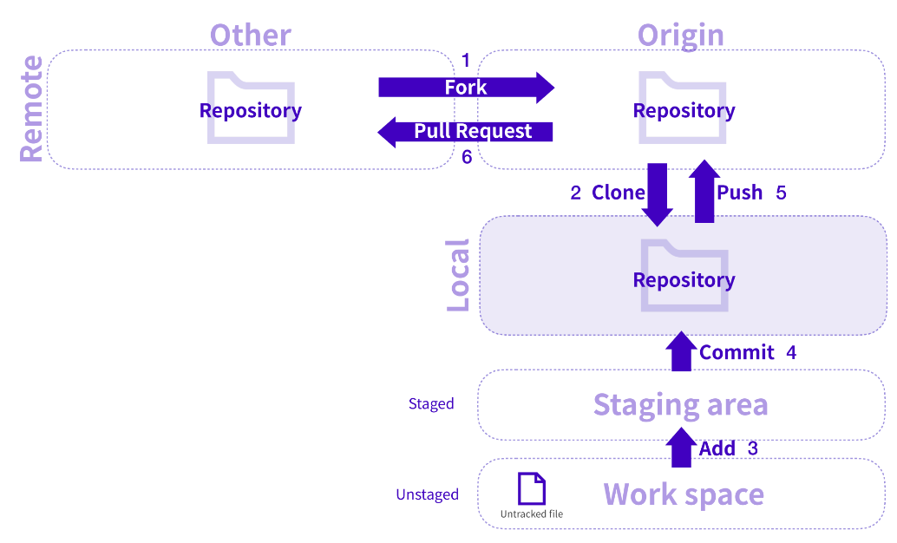

`Fork` ➡️ `clone` ➡️ `add` ➡️ `commit` ➡️ `push` ➡️ `Pull Request`

 

### Fork

다른 계정의 Remote REpository를 내 계정으로 가지고 올 때

 

### git clone <주소>

원격 Repository를 내 로컬에서 이용할 수 있도록 복사

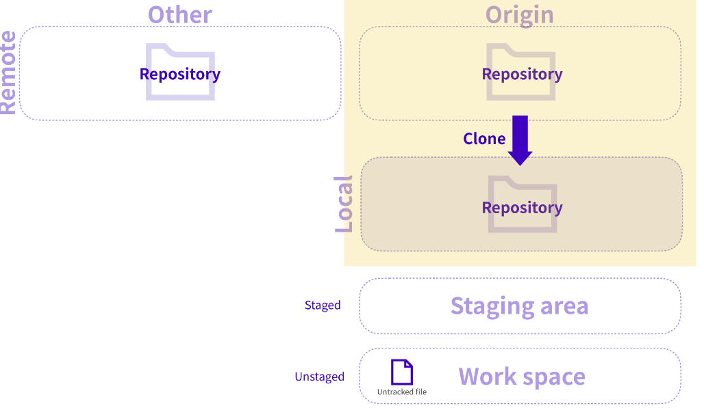

 

### git status

내 로컬로 복사해 온 디렉토리의 commit 되기 전 까지의 상태를 표시

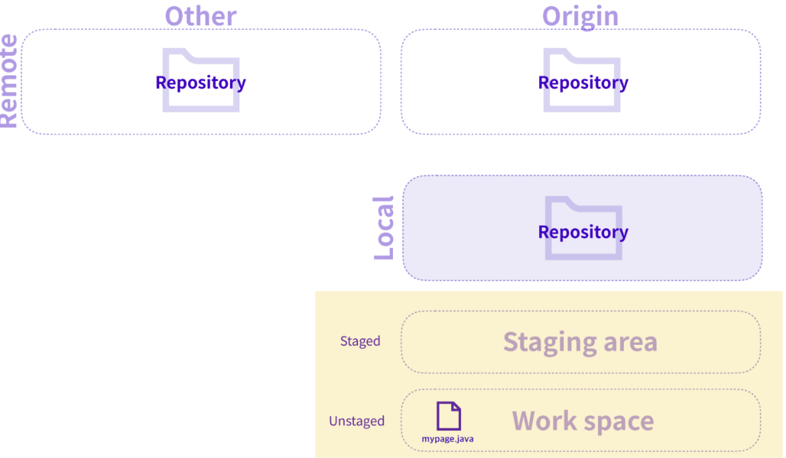

 

### git restore <파일명>

commit 혹은 staged 되지 않은 변경 사항을 폐기

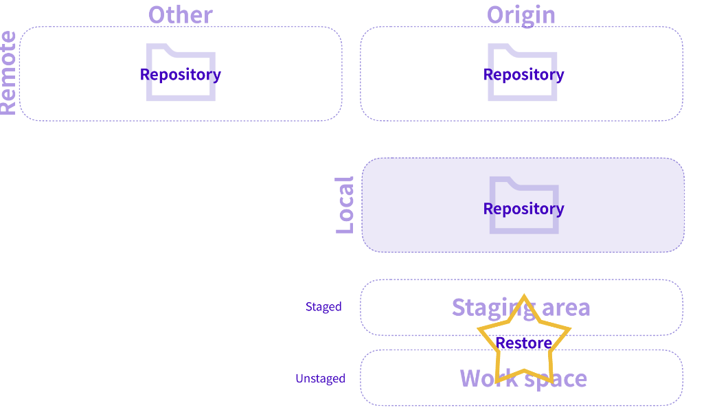

 

### git add <파일명>

Untracked files를 Staging area로 추가해서 Git의 관리하에 둠

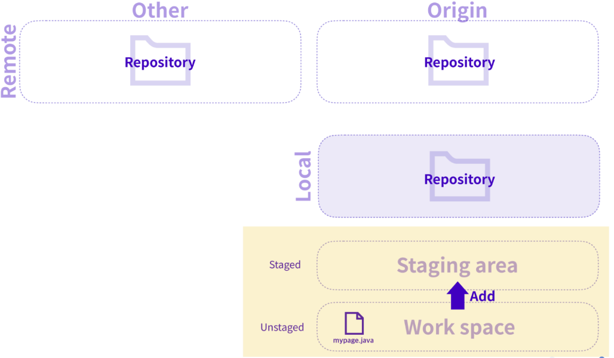

 

### git commit -m "message"

수정 작업이 끝났을 때 변경 사항을 저장

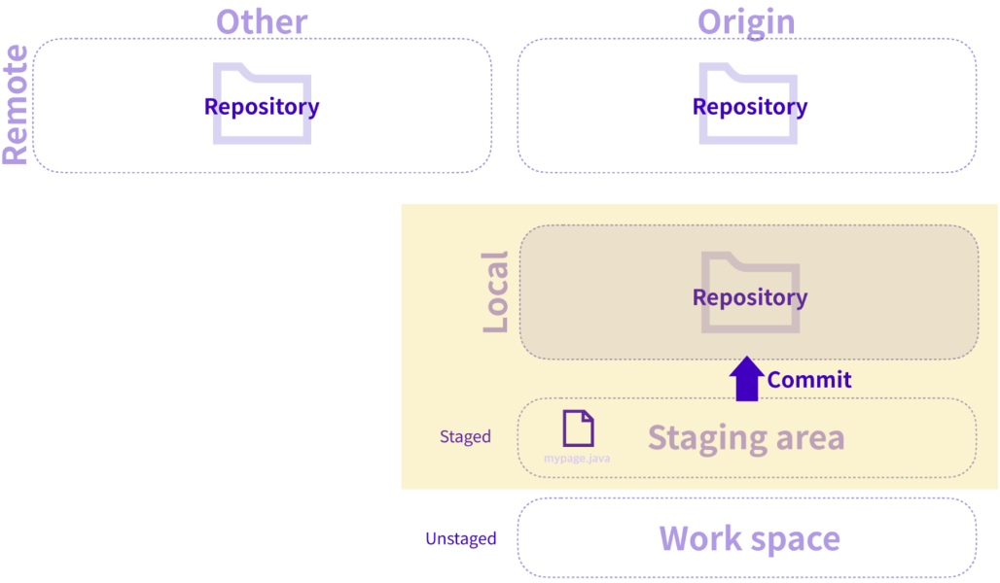

 

### git reset HEAD~<숫자>

Local에서 commit한 내용을 취소할 때

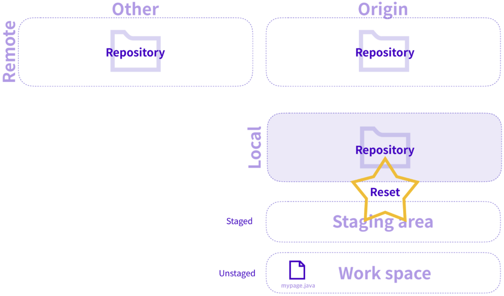

 

### git push

Local에서 변경, commit된 사항을 Remote Repository에 업로드

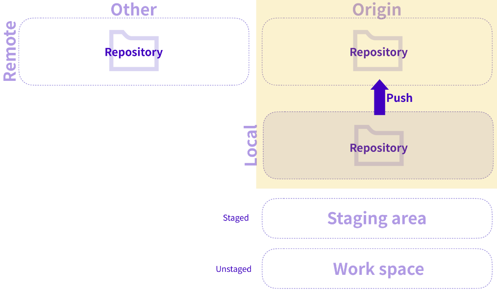

 

### git log

현재까지 commit된 내역들을 터미널 창에서 확인

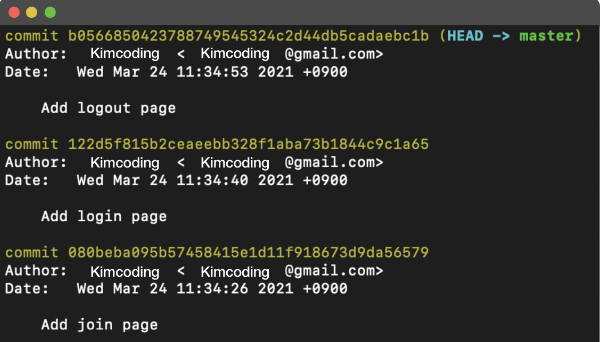

 

### Pull Request

내가 Push한 변경 사항에 대해서 다른 사람들에게 병합을 요청하는 것

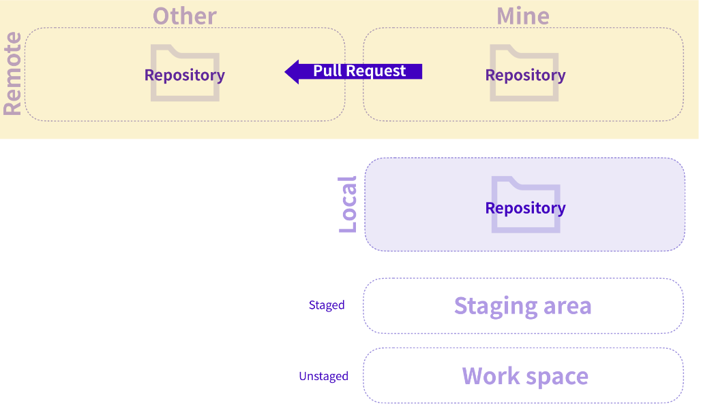

