# 22-07-01 [05] Git 기초_함께 작업 시 Workflow

- [git 초기화 및 원격 설정](#git-repo-초기화-및-원격-설정)
- [충돌 해결하기](#⚡️-충돌-해결하기)
- [협업 시 Workflow](#🌟-pair-programming-workflow)

---

## git repo 초기화 및 원격 설정

### git init

기존 디렉토리를 Git Repository로 변환

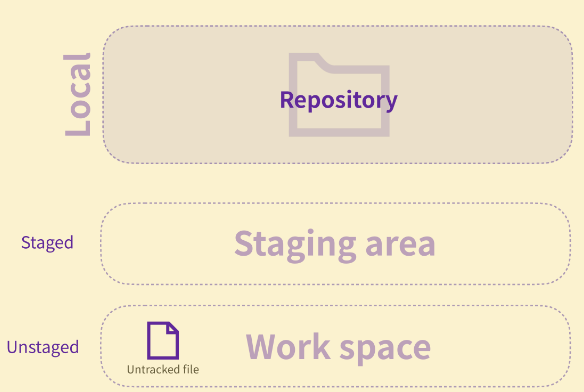

 

### git remote add origin `<my 주소>`

Local Repository를 나의 Remote Repository에 연결

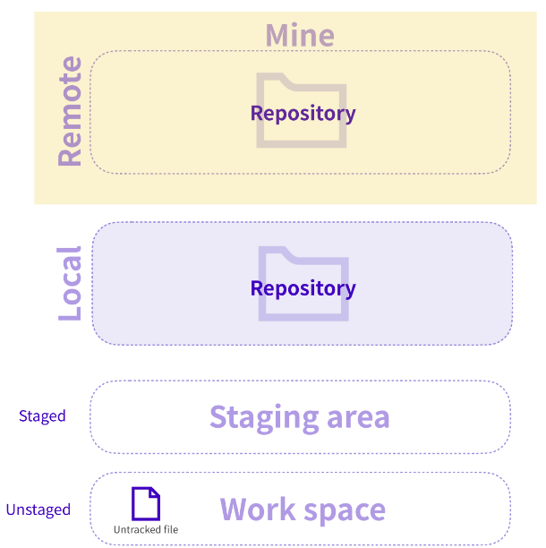

 

### git remote add pair `<pair 주소>`

Pair의 Remote Repository에 연결

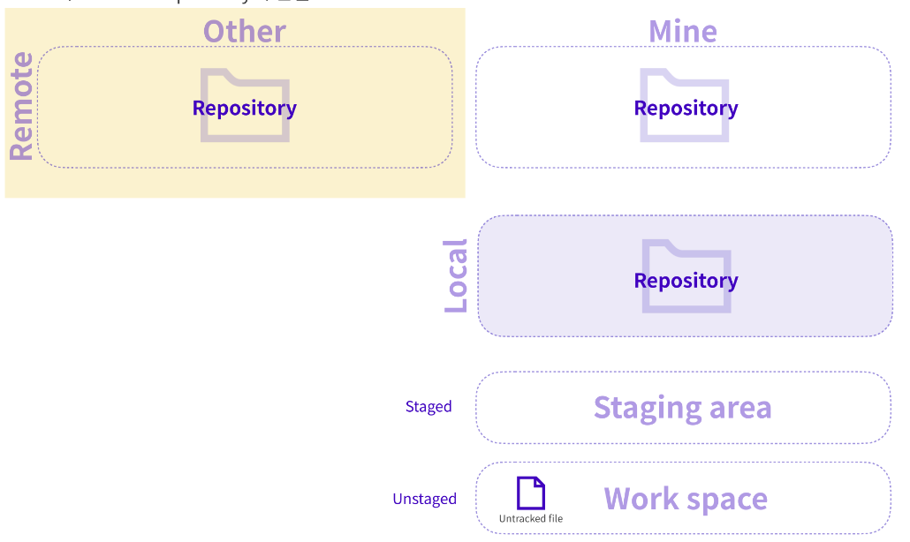

 

### git remote -v

현재의 Local Repository와 연결된 모든 Remote Repository 목록 확인

 

### git pull `<shortname> <branch>`

`<shortname> Remote Repository`의 해당 `branch` 내용을 Local Repository로 가져옴. 받아오는 내용은 자동으로 `병합(merge)` 된다.

 

### ⚡️ 충돌 해결하기

페어와 내가 동일한 라인을 수정한 파일이 있다면 ❓

자동 병합에 실패하고 충돌 발생 🙀

💀 Automatic merge failed error가 터미널 화면에 출력될 것이다...

git status를 통해 충돌이 일어나는 파일을 확인하자.

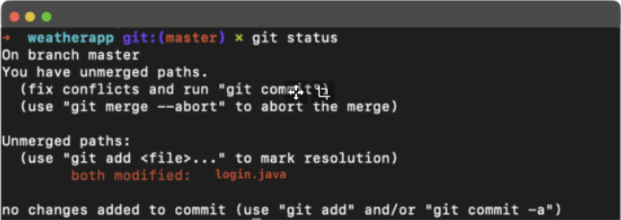

 

충돌이 일어나는 부분을 수정하고 `병합 커밋(merge commit)`을 생성해 주기 위해 파일을 `staging area`로 추가한다.

`modify` ➡️ `add` ➡️ `commit` ➡️ `push`
 
**🍯 VSC를 사용하면 수정을 용이하게 할 수 있다.**

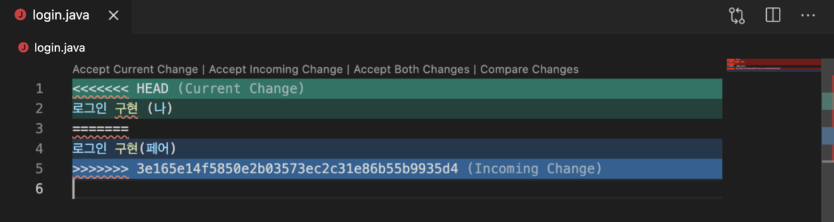

- Accept Current Change ➡️ Current 부분 채택
- Accept Incoming Change ➡️ Incoming 부분 채택
- Accept Both Changes ➡️ 둘다 채택
- Compare Changes ➡️ 충돌 일어나는 곳 비교

 

## 🌟 Pair Programming Workflow

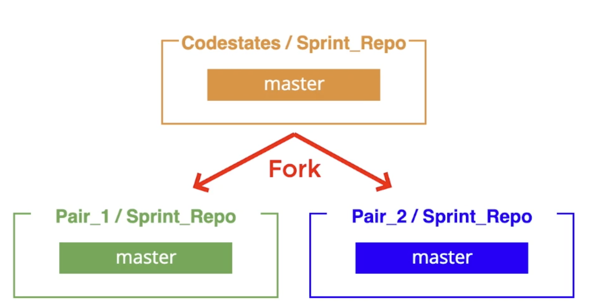
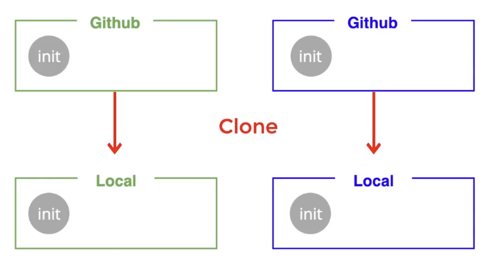
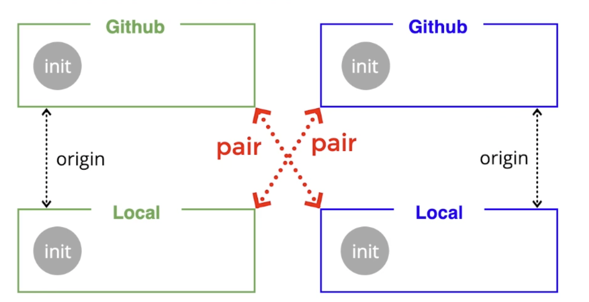
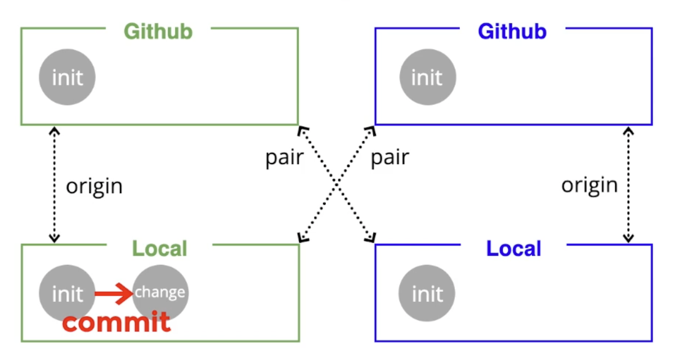
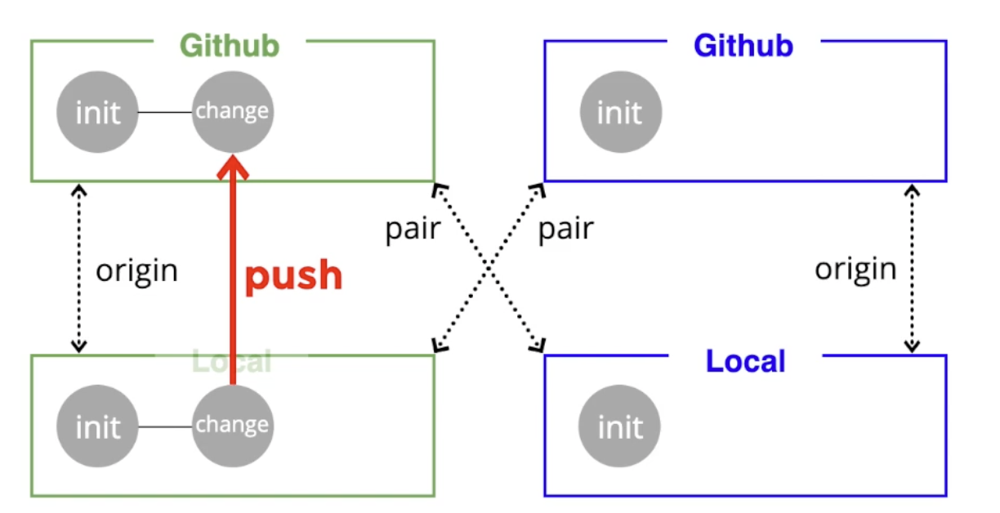
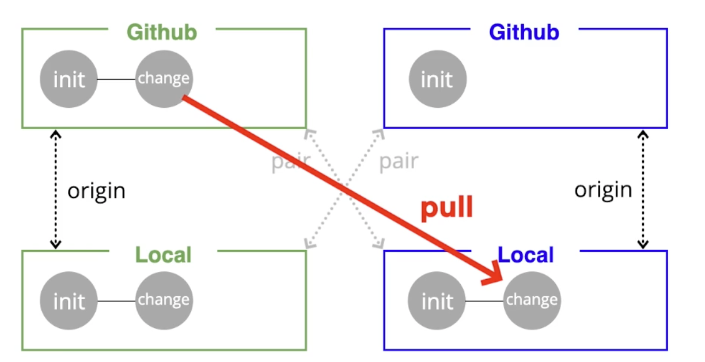
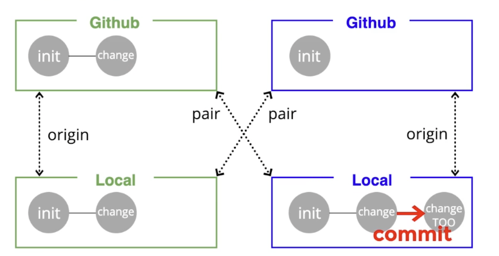
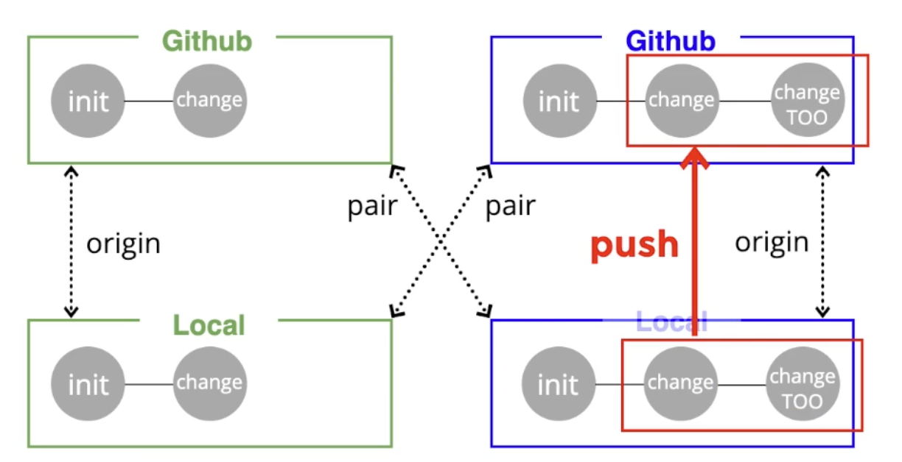
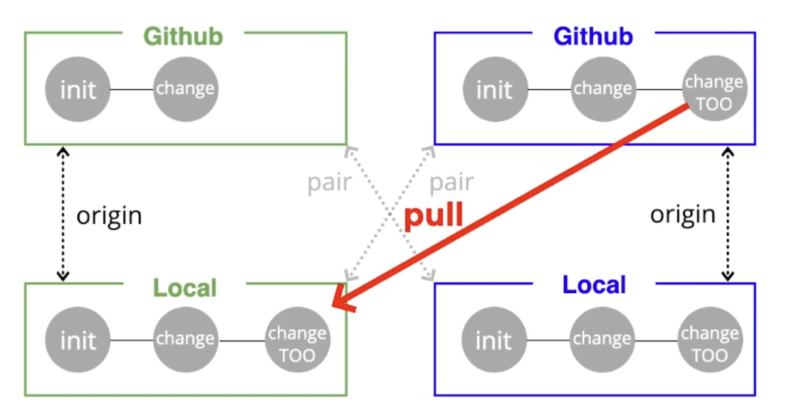