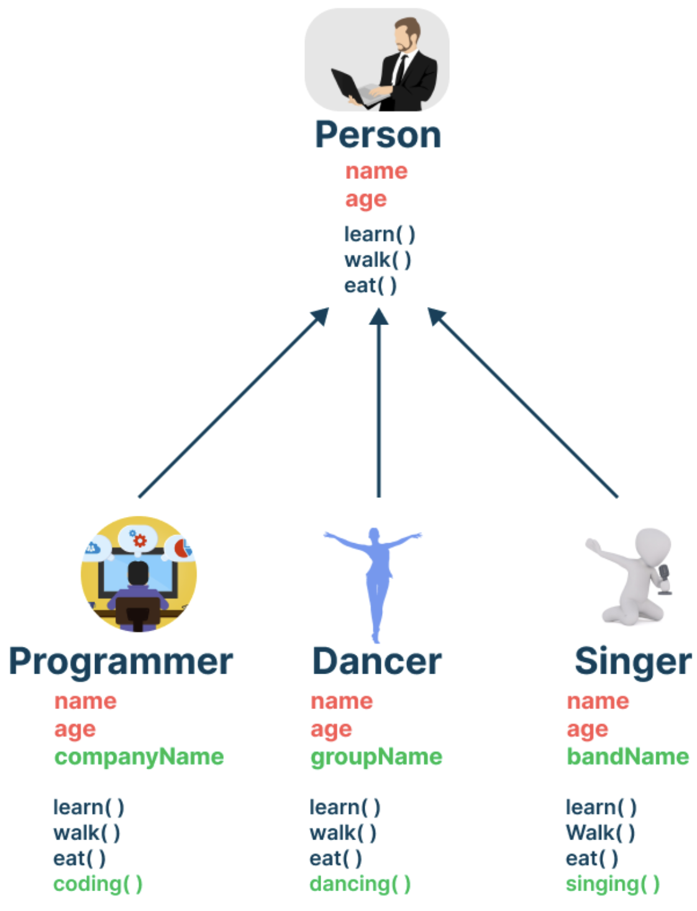

# 22-07-11 [08] OOP_상속

---
- [상속(Inheritance)](#상속inheritance) 
- [포함 관계(Composite)](#포함-관계composite) 
- [메서드 오버라이딩(Method Overriding)](#메서드-오버라이딩method-overriding) 
- [super & super()](#super-키워드와-super)

---

## ✏️ Goal of Study

**상속(Inheritance)**

- 상위 클래스-하위 클래스의 상속 관계의 핵심을 이해하고, 그 장점을 설명할 수 있다.
- extends 키워드를 사용하여 두 개 이상의 클래스 간 상속 관계를 정의할 수 있다.
- 포함관계와 상속관계의 차이를 설명할 수 있다.
- 상속 관계에서 사용할 수 있는 메서드 오버라이딩의 정의, 성립 조건, 장점을 이해하고 이를 활용할 수 있다.
- super 와 super() 의 차이를 설명할 수 있다.
- Object 클래스가 자바 클래스의 상속계층도에서 최상단에 위치한다는 사실을 이해할 수 있다.

---

### **상속(Inheritance)**

> 기존의 클래스를 **재사용**하여 새로운 클래스를 작성하는 자바의 문법 요소를 의미한다. 두 클래스가 상속 관계에 있을 때, **하위 클래스는 상위 클래스가 가진 모든 멤버(필드, 메서드, 이너 클래스)를 상속받게 된다.** 하위 클래스의 멤버 개수는 상위 클래스의 멤버 개수와 비교했을 때 항상 같거나 많다. 

**`extends`**

키워드 extends를 사용하여 상속 관계를 설정할 수 있다. 또한 **"~클래스로부터 상속받았다"** 라는 표현보다는 **"~클래스로부터 확장되었다"** 는 표현이 그 역할과 기능에 대한 적절한 표현이다.

>

위 사진을 통해 상속의 맥락에서 설명하면, 사람 클래스가 상위 클래스, 그리고 프로그래머, 댄서, 가수 클래스가 상위 클래스로부터 특정한 속성과 기능을 내려받는(또는 확장된) 하위 클래스가 된다.

🌈 상속 개념 예제 Code 👉 [HelloJava](../Java/OOP_Ex_Code/Inheritance_Encapsulation/HelloJava.java) 

 

**상속은 왜 사용하는 것일까❓**

1. 코드를 **재사용**하여 보다 적은 양의 코드로 새로운 클래스를 작성할 수 있어 코드의 **중복**을 제거할 수 있다. 👍
2. 다형적 표현이 가능하다. 예를 들면, '프로그래머는 프로그래머다'라는 문장은 참이고, 동시에 '프로그래머는 사람이다' 또한 참이다. 즉 하나의 객체가 여러 모양으로 표현될 수 있다는 것을 **다형성**이라 한다.

 

**주의 사항❗️**

✅ 자바의 객체지향 프로그래밍에서는 **단일 상속(single inheritance)만을 허용한다.**

🙏 다중 상속과 비슷한 효과를 내는 `인터페이스`에 관한 글 👉 (추후 업데이트 예정)

 

### **포함 관계(composite)**

> 포함(composite)은 상속처럼 클래스를 **재사용**할 수 있는 방법으로, **클래스의 멤버로 다른 클래스 타입의 참조 변수를 선언하는 것**을 의미한다.

🍯 클래스 간의 관계 설정 시 상속과 포함 관계중 어떤 관계가 적절한지를 판별하는 간단한 방법 ✨

- `~은 ~이다.(Is-A)` ➡️ 상속
- `~은 ~을 가지고 있다.(Has_A)` ➡️ 포함

**⭐️ OOP에서 상속보다는 포함 관계를 사용하는 경우가 더 많다.**

🌈 포함 관계 예제 Code 👉 [Composite](../Java/OOP_Ex_Code/Inheritance_Encapsulation/Employee.java) 

 

### **메서드 오버라이딩(Method Overriding)**

> 메서드 오버라이딩이란 ❓
>
> 상위 클래스로부터 상속받은 메서드와 동일한 이름의 메서드를 재정의하는 것이다. `Override`의 의미가 `~위에 덮어쓰다`를 생각하면 이해하기 쉽다.

✅ 메서드 오버라이딩을 사용할 때 반드시 지켜야 할 **세 가지 조건**

1. 메서드의 선언부(메서드 이름, 매개변수, 반환타입)이 상위클래스의 메서드와 완전히 일치해야한다.
2. 접근 제어자의 범위가 상위 클래스의 메서드보다 같거나 넓어야 한다.
3. 예외는 상위 클래스의 메서드보다 많이 선언할 수 없다.

🌈 메서드 오버라이딩 예제 Code 👉 [Method Overriding](../Java/OOP_Ex_Code/Inheritance_Encapsulation/Main.java) 

 

### **super 키워드와 super()**

`super` 키워드와 `super()` 메서드는 각각 `this` 키워드와 `this()` 메서드와 비슷하다.

- `this` ➡️ 자신의 객체를 가리킴
- `this()` ➡️ 같은 클래스의 생성자 호출
- `super` ➡️ 상위 클래스의 객체를 가리킴
- `super()` ➡️ 상위 클래스의 생성자를 호출

⭐️ super & super() 모두 공통적으로 상위 클래스의 존재를 상정하며 상속 관계를 전제로 합니다.

 

**super keyword**

상위, 하위 클래스에 이름이 겹치는 변수가 존재할 경우 둘을 구분할 때 주로 사용한다.

`super` 키워드를 사용하면 부모의 객체의 멤버 값을 참조할 수 있다. 만약 `super` 키워드를 붙이지 않으면 자바 컴파일러가 해당 객체에 대해 자신이 속한 인스턴스 객체의 멤버를 먼저 참조한다.

🌈 super 키워드 예제 Code 👉 [super](../Java/OOP_Ex_Code/Inheritance_Encapsulation/Super.java) 

 

**super() Method**

`super()` 메서드는 **생성자 안에서만 사용가능하고, 반드시 첫 줄에만 와야 한다.** 만약 `super()`가 없는 경우에는 컴파일러가 생성자의 첫 줄에 자동으로 `super()`를 삽입한다. 이때 상위클래스에 기본생성자가 없으면 에러가 발생하게 된다. **따라서 클래스를 만들 때는 기본 생성자를 생성하는 것을 습관화하는 것이 좋다.**

🌈 super() 메서드 예제 Code 👉 [super()](../Java/OOP_Ex_Code/Inheritance_Encapsulation/Test.java) 
