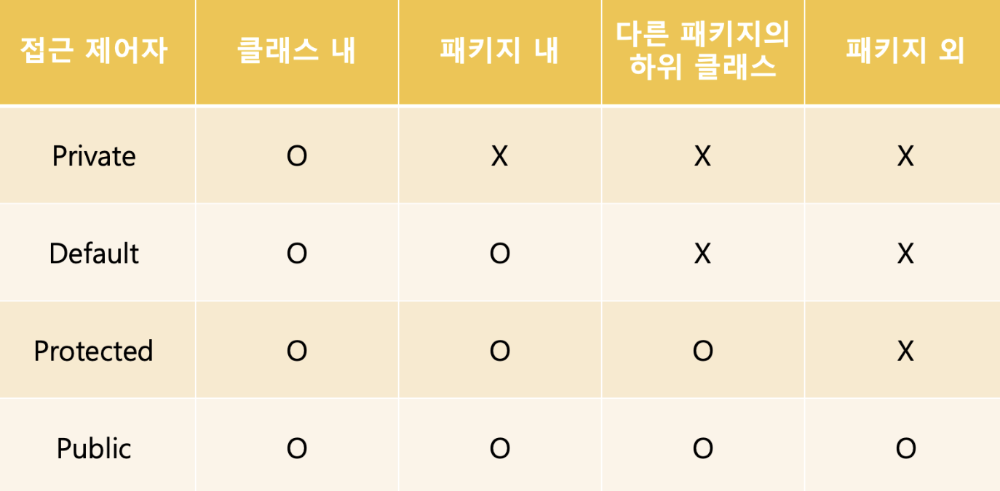

# 22-07-11 [08] OOP_캡슐화

---

- [캡슐화(Encapsulation) 💊](#캡슐화encapsulation) 
- [패키지(package) 📁](#패키지package)
- [Import 🚪](#import-문)
- [접근제어자(Access Modifier)](#접근-제어자access-modifier)
- [getter & setter Method](#getter와-setter-메서드)

---

## ✏️ Goal of Study

**캡슐화(Encapsulation)**

- 캡슐화의 핵심 개념과 목적을 이해하고 설명할 수 있다.
- 패키지의 개념과 import문이 어떻게 사용되는 지 이해할 수 있다.
- 자바에서 캡슐화를 달성하기 위핸 핵심적인 수단으로 접근제어자 네 가지를 이해하고, 각각의 접근 가능 범위를 설명할 수 있다.
- 데이터를 효과적으로 보호하기 위한 수단으로 getter/setter 메서드를 이해하고 사용할 수 있다.

---

<br>

### **캡슐화(Encapsulation)**

> 💊 캡슐화란 ❓
> 
> 특정 객체 안에 관련된 속성과 기능을 하나의 캡슐(capsule)로 만들어 데이터를 외부로부터 보호하는 것을 말한다.

<p align="center"></p>

**캡슐화 목적 두 가지 ✌️**
1. 데이터 보호
2. 내부적으로만 사용되는 데이터에 대한 불필요한 외부 노출 방지

**캡슐화의 장점 ➡️ 정보 은닉(data hiding) ✨**

- 외부로부터 객체의 속성과 기능이 함부로 변경되지 못하게 막고, 데이터가 변경되더라도 다른 객체에 영향을 주지 않기에 <u>독립성</u>을 확보할 수 있다.
- 유지보수와 코드 확장 시에도 오류의 범위를 최소화할 수 있어서 효과적으로 <u>유지보수에 용이하다.</U>

**캡슐화를 수행하기 위한 핵심적인 수단 두 가지 ✌️**
1. 접근제어자(Access Modifier)
2. getter&setter Method

✅ 접근 제어자를 이해하기 위해 선행되어야 하는 개념인 `패키지(package)`에 대한 내용부터 살펴보자❗️

<br>

### **패키지(package)**

> 패키지란 ❓
> 
> 특정한 목적을 공유하는 클래스와 인터페이스의 묶음을 의미한다. 패키지는 **클래스들을 그룹 단위로 묶어 효과적으로 관리하기 위한 목적**을 가지고 있다.

자바에서 `패키지`는 **하나의 디렉토리(directory)** 이다. 이 디렉토리는 하나의 계층구조를 가지고 있는데, **계층 구조 간 구분은 `점(.)`** 으로 한다.

✅ 만약 패키지가 있는 경우 소스 코드의 첫 번째 줄에 반드시 `package 패키지명`이 명시되어야 하고, 만약 패키지 선언이 없으면 이름없는 패키지에 속하게 된다.

```java
// practice라는 package(디렉토리) 안에 test.java가 있는 경우
package practice.test;

public class test {}
```

**패키지의 장점 ✨**

패키지로 클래스를 묶는 것은 <u>클래스의 충돌을 방지해준다.</u> 예를 들어, 같은 이름의 클래스를 가지고 있더라도 각각 다른 패키지에 소속되어 있다면, 이름명으로 인한 충돌이 발생하지 않는다.

<br>

### **Import 문**

> Import 문이란❓
>
> 다른 패키지 내의 클래스를 이용하기 위해 사용하며, <u>일반적으로 패키지 구문과 클래스문 사이에 작성한다.</u>

**Import의 장점 ✨**

사전에 컴파일러에게 소스파일에 사용된 클래스에 대한 정보를 제공하여 **매번 패키지명을 붙이는 번거로움을 덜어준다.**

❌ Ex. Import문 사용없이 다른 패키지의 클래스 사용 ~~(매우 번거롭🙀)~~

```java
package practicepack.test;

public class ExampleImport {
		public int a = 10;
		public void print() {
			System.out.println("Import문 테스트")
}
```

```Java
package practicepack.test2; // import문을 사용하지 않는 경우, 다른 패키지 클래스 사용방법

public class PackageImp {
		public static void main(String[] args) {
			practicepack.test.ExampleImport example = new practicepack.test.ExampleImport();
		}
}
```

⭕️ Ex. Import문 사용하여 매번 패키지명을 붙이는 번거로움을 제거 😻

```Java
package practicepack.test;

public class ExampleImp {
		public int a = 10;
		public void print() {
			System.out.println("Import문 테스트")
}
```

```java
package practicepack.test2; // import문을 사용하는 경우

import practicepack.test.ExampleImp // import문 작성

public class PackageImp {
		public static void main(String[] args) {
			ExampleImp x = new ExampleImp(); // 이제 패키지명을 생략 가능
		}
}
```

<br>

**Import문 작성법**

```java
import 패키지명.클래스명; //또는
import 패키지명.*
```
`import 패키지명.*`을 쓰게 될 경우 해당 패키지의 모든 클래스를 패키지명 없이 사용 가능하다.

<br>

### **접근 제어자(Access Modifier)**

자바에서 제어자는 **클래스, 필드, 메서드, 생성자 등에 부가적인 의미를 부여하는 키워드(형용사의 역할)** 를 의미한다.

제어자는 크게 **접근 제어자**와 **기타 제어자**로 구분 할 수 있다. ✌️

| 접근 제어자 | public, protected, (default), private                       |
| ----------- | ----------------------------------------------------------- |
| 기타 제어자 | static, final, abstract, native, transient, synchronized 등 |

✅ 제어자는 **하나의 대상에 대해 여러 제어자를 사용할 수 있다.** <u>단, 접근 제어자는 한번만 사용할 수 있다.</u>

기타제어자와 관련해서는 `static`, `final`, `abstract` 키워드가 주로 사용된다.

<br>

**캡슐화를 위한 접근 제어자 💊**

접근 제어자를 사용하면 **클래스의 외부로부터 불필요한 데이터 노출을 방지(Data hiding)할 수 있고, 외부로부터 데이터가 임의로 변경되지 않도록 막을 수 있다.**

**접근 제어자 총 4 가지 🍀**

| 접근 제어자 | 접근 제한 범위                                        |
| ----------- | ----------------------------------------------------- |
| private     | 동일 클래스에서만 접근 가능                           |
| default     | 동일 패키지 내에서만 접근 가능                        |
| protected   | 동일 패키지 + 다른 패키지의 하위 클래스에서 접근 가능 |
| public      | 접근 제한 없음                                        |


**접근 제한 범위**

`public(접근 제한 없음)` > `protected(동일 패키지 + 하위클래스)` > `default(동일 패키지)` > `private(동일 클래스)`



<br>

Ex. 동일한 패키지의 클래스
```Java
package package1; // 패키지명 package1 

//파일명: Parent.java
class Test { // Test 클래스의 접근 제어자는 default
    public static void main(String[] args) {
        Parent p = new Parent();

//      System.out.println(p.a); // 동일 클래스가 아니기 때문에 에러발생!
        System.out.println(p.b);
        System.out.println(p.c);
        System.out.println(p.d);
    }
}

public class Parent { // Parent 클래스의 접근 제어자는 public
    private int a = 1; // a,b,c,d에 각각 private, default, protected, public 접근제어자 지정
    int b = 2;
    protected int c = 3;
    public int d = 4;

    public void printEach() { // 동일 클래스이기 때문에 에러발생하지 않음
        System.out.println(a);
        System.out.println(b);
        System.out.println(c);
        System.out.println(d);
    }
}

// 출력값
2
3
4
```

`Parent` 클래스 내에서 `a`,`b`,`c`,`d`는 모두 에러 없이 접근 가능하다. 반면, `Test` 클래스 내에서는 `private` 접근 제어자가 있는 `a`만 접근이 불가하다.

<br>

Ex. 다른 패키지의 클래스

```Java
package package2; // package2 

import package1.Parent; // 위 예제 코드에 대한 package 

class Child extends package1.Parent {  // package1으로부터 Parent 클래스를 상속
    public void printEach() {
        // System.out.println(a); // 에러 발생!
        // System.out.println(b);
        System.out.println(c); // 다른 패키지의 하위 클래스
        System.out.println(d);
    }
}

public class Test2 {
    public static void main(String[] args) {
        Parent p = new Parent();

//      System.out.println(p.a); // public을 제외한 모든 호출 에러!
//      System.out.println(p.b);
//      System.out.println(p.c);
        System.out.println(p.d);
    }
}
```

먼저 package1의 `Parent` 클래스로부터 상속을 받아 만들어진 `Child` 클래스를 살펴보자. 같은 클래스와 같은 패키지 안에 있는 `private(a)`와 `default(b)` 접근 제어자를 사용하는 멤버에는 접근이 불가능하지만, 다른 패키지의 하위 클래스에 접근 가능한 `protected(c)`와 어디서나 접근이 가능한 `public(d)`에는 접근이 가능하다.

마지막으로 `Test2` 클래스는 상속받은 클래스가 아니기 때문에 `protected(c)`에는 접근 불가하고 `public(d)`에만 접근이 가능하다.

<br>

⭐️ **접근 제어자 정리**

*접근 제어자를 통해 외부로부터 데이터를 보호하고, 불필요하게 데이터가 노출되는 것을 방지 할 수 있다. ➡️ 캡슐화 구현❗️*

<br>

### **getter와 setter 메서드**

객체지향의 캡슐화 목적을 달성하면서도 데이터의 변경이 필요한 경우에 `getter`와 `setter` 메서드를 사용한다. 대표적으로 `private` 접근제어자가 포함되어 있는 객체 변수의 데이터 값을 추가하거나 수정할고 싶을 때 사용할 수 있다.

**`setter`**

외부에서 메서드에 접근하여 조건에 맞을 경우 **데이터 값을 변경 가능하게 해주고** 일반적으로 메서드 명에 `set-`을 메서드명 앞에 붙여서 정의한다.

**`getter`**

setter를 통해 설정한 변수 값을 읽어오는 데 사용하는 메서드이다. 경우에 따라 객체 외부에서 필드 값을 사용하기에 부적절한 경우가 발생할 수 있는데, 이런 경우에 그 값을 가공한 이후에 외부로 전달하는 역할을 한다. `get-`을 메서드명 앞에 붙여서 사용한다.

<br>

**⭐️ getter & setter 정리**

getter와 setter 메서드를 활용하면 **데이터를 효과적으로 보호하면서도 의도하는 값으로 값을 변경**하여 캡슐화를 보다 효과적으로 달성할 수 있다.

🌈 getter & setter 예제 코드 👉 [getter & setter](../Java/OOP_Ex_Code/Inheritance_Encapsulation/GetterSetter.md)