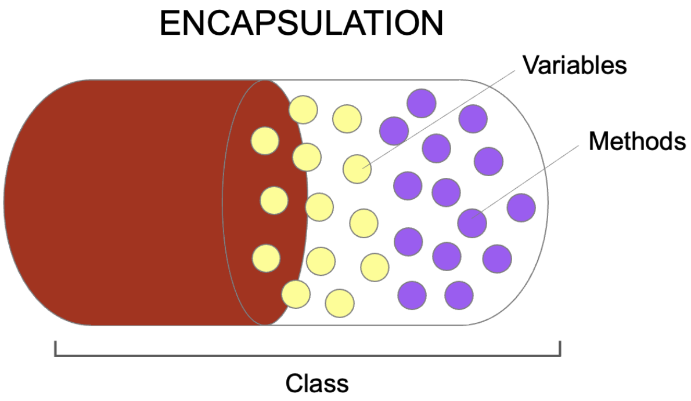

# 22-07-11 [08] OOP_캡슐화

---

- [캡슐화(Encapsulation) 💊](#캡슐화encapsulation) 
- [패키지(package) 📁](#패키지package)
- [Import 🚪](#import-문)

---

## ✏️ Goal of Study

**캡슐화(Encapsulation)**

- 캡슐화의 핵심 개념과 목적을 이해하고 설명할 수 있다.
- 패키지의 개념과 import문이 어떻게 사용되는 지 이해할 수 있다.
- 자바에서 캡슐화를 달성하기 위핸 핵심적인 수단으로 접근제어자 네 가지를 이해하고, 각각의 접근 가능 범위를 설명할 수 있다.
- 데이터를 효과적으로 보호하기 위한 수단으로 getter/setter 메서드를 이해하고 사용할 수 있다.

---

<br>

### **캡슐화(Encapsulation)**

> 💊 캡슐화란 ❓
> 
> 특정 객체 안에 관련된 속성과 기능을 하나의 캡슐(capsule)로 만들어 데이터를 외부로부터 보호하는 것을 말한다.

<p align="center"></p>

**캡슐화 목적 두 가지 ✌️**
1. 데이터 보호
2. 내부적으로만 사용되는 데이터에 대한 불필요한 외부 노출 방지

**캡슐화의 장점 ➡️ 정보 은닉(data hiding) ✨**

- 외부로부터 객체의 속성과 기능이 함부로 변경되지 못하게 막고, 데이터가 변경되더라도 다른 객체에 영향을 주지 않기에 <u>독립성</u>을 확보할 수 있다.
- 유지보수와 코드 확장 시에도 오류의 범위를 최소화할 수 있어서 효과적으로 <u>유지보수에 용이하다.</U>

**캡슐화를 수행하기 위한 핵심적인 수단 두 가지 ✌️**
1. 접근제어자(Access Modifier)
2. getter&setter Method

✅ 접근 제어자를 이해하기 위해 선행되어야 하는 개념인 `패키지(package)`에 대한 내용부터 살펴보자❗️

<br>

### **패키지(package)**

> 패키지란 ❓
> 
> 특정한 목적을 공유하는 클래스와 인터페이스의 묶음을 의미한다. 패키지는 **클래스들을 그룹 단위로 묶어 효과적으로 관리하기 위한 목적**을 가지고 있다.

자바에서 `패키지`는 **하나의 디렉토리(directory)** 이다. 이 디렉토리는 하나의 계층구조를 가지고 있는데, **계층 구조 간 구분은 `점(.)`** 으로 한다.

✅ 만약 패키지가 있는 경우 소스 코드의 첫 번째 줄에 반드시 `package 패키지명`이 명시되어야 하고, 만약 패키지 선언이 없으면 이름없는 패키지에 속하게 된다.

```java
// practice라는 package(디렉토리) 안에 test.java가 있는 경우
package practice.test;

public class test {}
```

**패키지의 장점 ✨**

패키지로 클래스를 묶는 것은 <u>클래스의 충돌을 방지해준다.</u> 예를 들어, 같은 이름의 클래스를 가지고 있더라도 각각 다른 패키지에 소속되어 있다면, 이름명으로 인한 충돌이 발생하지 않는다.

<br>

### **Import 문**

> Import 문이란❓
>
> 다른 패키지 내의 클래스를 이용하기 위해 사용하며, <u>일반적으로 패키지 구문과 클래스문 사이에 작성한다.</u>

**Import의 장점 ✨**

사전에 컴파일러에게 소스파일에 사용된 클래스에 대한 정보를 제공하여 **매번 패키지명을 붙이는 번거로움을 덜어준다.**

❌ Ex. Import문 사용없이 다른 패키지의 클래스 사용 ~~(매우 번거롭🙀)~~

```java
package practicepack.test;

public class ExampleImport {
		public int a = 10;
		public void print() {
			System.out.println("Import문 테스트")
}
```

```Java
package practicepack.test2; // import문을 사용하지 않는 경우, 다른 패키지 클래스 사용방법

public class PackageImp {
		public static void main(String[] args) {
			practicepack.test.ExampleImport example = new practicepack.test.ExampleImport();
		}
}
```

⭕️ Ex. Import문 사용하여 매번 패키지명을 붙이는 번거로움을 제거 😻

```Java
package practicepack.test;

public class ExampleImp {
		public int a = 10;
		public void print() {
			System.out.println("Import문 테스트")
}
```

```java
package practicepack.test2; // import문을 사용하는 경우

import practicepack.test.ExampleImp // import문 작성

public class PackageImp {
		public static void main(String[] args) {
			ExampleImp x = new ExampleImp(); // 이제 패키지명을 생략 가능
		}
}
```

<br>

**Import문 작성법**

```java
import 패키지명.클래스명; //또는
import 패키지명.*
```
`import 패키지명.*`을 쓰게 될 경우 해당 패키지의 모든 클래스를 패키지명 없이 사용 가능하다.

<br>

### **접근 제어자(Access Modifier)**