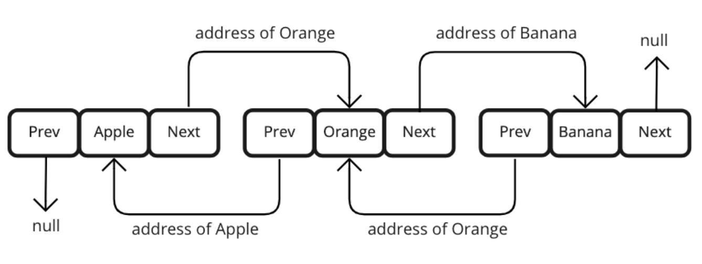

# 22-07-14 [09] 컬렉션 프레임워크(Collection Framework)

---

- [Collection Framework](#컬렉션-프레임워크collection-framework) 
- [Collection 인터페이스 메서드](#collection-인터페이스-메서드)
- [List란?](#list)
- [List 인터페이스 메서드](#list-인터페이스-메서드)
- [ArrayList](#arraylist)
- [LinkedList](#linkedlist)
- [ArrayList vs LinkedList](#arraylist-vs-linkedlist)
- [Iterator](#iterator)
- [Set](#set)

---

## ✏️ Goal of Study

**컬렉션 프레임워크(Collection Framework)**

- 컬렉션 프레임워크의 핵심 인터페이스를 이해하고 사용할 수 있다.
- 주요 인터페이스와 컬렉션 클래스의 핵심 메서드를 사용할 수 있다.
- 필요에 따라 어떤 인터페이스와 컬렉션 클래스를 사용하는 것이 적합한지 결정할 수 있다.

---

### 컬렉션 프레임워크(Collection Framework)

<br>

**📁 컬렉션(Collection)**

여러 데이터들의 집합을 의미한다. 즉, 여러 데이터들을 그룹으로 묶어놓은 것을 `컬렉션`이라고 한다.

**🗄 컬렉션 프레임워크(Collection Framework)**

컬렉션을 다루는 데에 있어 편리한 메서드들을 미리 정의해놓은 것을 `컬렉션 프레임워크`라고 한다. 컬렉션 프레임워크는 특정 자료 구조에 데이터를 추가하고, 삭제하고, 수정하고, 검색하는 등의 동작을 수행하는 편리한 메서드들을 제공해준다.

<br>

**컬렉션 프레임워크의 구조**

<p align="center"></p>

컬렉션 프레임워크는 주요 인터페이스로 List, Set, Map을 제공한다.

1. List
    - List는 데이터의 순서가 유지되며, 중복 저장이 가능한 컬렉션을 구현하는 데 사용된다.
    - ArrayList, Vector, Stack, LinkedList 등이 List 인터페이스를 구현한다.
2. Set
    - Set은 데이터의 순서가 유지되지 않으며, 중복 저장이 불가능한 컬렉션을 구현하는 데 사용된다.
    - HashSet, TreeSet 등이 Set 인터페이스를 구현한다.
3. Map
    - Map은 키(key)와 값(value)의 쌍으로 데이터를 저장하는 컬렉션을 구현하는 데 사용된다.
    - 데이터의 순서가 유지되지 않으며, 키는 값을 식별하기 위해 사용되므로 중복 저장이 불가능하지만, 값은 중복 저장이 가능하다.
    - HashMap, HashTable, TreeMap, Properties 등이 Map 인터페이스를 구현한다.

<br>

📌 `List`와 `Set`은 서로 공통점이 많아 `Collection`이라는 인터페이스로 묶인다. 즉, 이 둘의 공통점이 추출되어 추상화된 것이 바로 `Collection 인터페이스`이다.

<br>

#### **Collection 인터페이스 메서드**

| 기능      | 리턴 타입 | 메소드                                         | 설명                                                         |
| --------- | --------- | ---------------------------------------------- | ------------------------------------------------------------ |
| 객체 추가 | boolean   | add(Object o) / addAll(Collection c)           | 주어진 객체 및 컬렉션의 객체들을 컬렉션에 추가합니다.        |
| 객체 검색 | boolean   | contains(Object o) / containsAll(Collection c) | 주어진 객체 및 컬렉션이 저장되어 있는지 여부를 리턴합니다.   |
|           | Iterator  | iterator()                                     | 컬렉션의 iterator를 리턴합니다.                              |
|           | boolean   | equals(Object o)                               | 컬렉션이 동일한지 여부를 확인합니다.                         |
|           | boolean   | isEmpty()                                      | 컬렉션이 비어있는지 여부를 확인합니다.                       |
|           | int       | size()                                         | 저장되어 있는 전체 객체 수를 리턴합니다.                     |
| 객체 삭제 | void      | clear()                                        | 컬렉션에 저장된 모든 객체를 삭제합니다.                      |
|           | boolean   | remove(Object o) / removeAll(Collection c)     | 주어진 객체 및 컬렉션을 삭제하고 성공 여부를 리탄합니다.     |
|           | boolean   | retainAll(Collection c)                        | 주어진 컬렉션을 제외한 모든 객체를 컬렉션에서 삭제하고, 컬렉션에 변화가 있는지의 여부를 리턴합니다. |
| 객체 변환 | Object[]  | toArray()                                      | 컬렉션에 저장된 객체를 객체배열(Object [])로 반환합니다.     |
|           | Object[]  | toArray(Object[] a)                            | 주어진 배열에 컬렉션의 객체를 저장해서 반환합니다.           |

🌈 Collection 인터페이스 메서드 👉 [Click!](https://docs.oracle.com/javase/8/docs/api/java/util/Collection.html)

<br>

### **List**

> List 인터페이스 ❓
> 
> 배열과 같이 객체를 일렬로 늘어놓은 구조이다. 객체를 인덱스로 관리하기 때문에 객체를 저장하면 자동으로 인덱스가 부여되고, 인덱스로 객체를 검색, 추가, 삭제할 수 있는 여러 기능을 제공한다.

<br>

#### **List 인터페이스 메서드**

✅ List 객체는 Collection 인터페이스 메서드 또한 상속받아 사용이 가능하다.

| 기능      | 리턴 타입    | 메서드                                    | 설명                                                         |
| --------- | ------------ | ----------------------------------------- | ------------------------------------------------------------ |
| 객체 추가 | void         | add(int index, Object element)            | 주어진 인덱스에 객체를 추가                                  |
|           | boolean      | addAll(int index, Collection c)           | 주어진 인덱스에 컬렉션을 추가                                |
|           | Object       | set(int index, Object element)            | 주어진 위치에 객체를 저장                                    |
| 객체 검색 | Object       | get(int index)                            | 주어진 인덱스에 저장된 객체를 반환                           |
|           | int          | indexOf(Object o) / lastIndexOf(Object o) | 순방향 / 역방향으로 탐색하여 주어진 객체의 위치를 반환       |
|           | ListIterator | listIterator() / listIterator(int index)  | List의 객체를 탐색할 수 있는ListIterator 반환 / 주어진 index부터 탐색할 수 있는 ListIterator 반환 |
|           | List         | subList(int fromIndex, int toIndex)       | fromIndex부터 toIndex에 있는 객체를 반환                     |
| 객체 삭제 | Object       | remove(int index)                         | 주어진 인덱스에 저장된 객체를 삭제하고 삭제된 객체를 반환    |
|           | boolean      | remove(Object o)                          | 주어진 객체를 삭제                                           |
| 객체 정렬 | void         | sort(Comparator c)                        | 주어진 비교자(comparator)로 List를 정렬                      |

<br>

List 인터페이스를 구현한 클래스

- ArrayList
- Vector
- LinkedList
- Stack 

이 중에서 가장 중요하며 많이 사용되는 `ArrayList`와 `LinkedList`를 살펴보자 🎯

<br>

### **ArrayList**

컬렉션 프레임워크에서 가장 많이 사용된다. 기능적으로 `Vector`와 비슷하지만 이를 개선한 것이 `ArrayList`이므로 주로 `ArrayList`를 사용한다.

**💡 ArrayList 특징**
1. 배열은 생성될 때 크기가 고정되어 변경할 수 없지만, `ArrayList`는 저장 용량을 초과하여 객체들이 추가되면, **자동으로 저장용량이 늘어난다.**
2. 데이터가 연속적으로 존재한다. 즉, 데이터의 순서를 유지한다.

<br>

`ArrayList`를 생성하기 위해서는 저장할 객체 타입을 <u>타입 매개변수</u>, 즉 <u>제네릭</u>으로 표기하고 기본 생성자를 호출한다.

Ex. ArrayList 생성
```java
List<타입 매개변수> 객체명 = new ArrayList<타입 매개변수>(초기 저장 용량);

List<String> container1 = new ArrayList<String>();
// String 타입의 객체를 저장하는 ArrayList 생성
// 초기 용량이 인자로 전달되지 않으면 기본적으로 10으로 지정됩니다. 

List<String> container2 = new ArrayList<String>(30);
// String 타입의 객체를 저장하는 ArrayList 생성
// 초기 용량을 30으로 지정하였습니다. 
```

ArrayList에 객체를 추가하면 인덱스 0부터 차례대로 저장된다. 그리고 **특정 인덱스의 객체를 제거하면, 바로 뒤 인덱스부터 마지막 인덱스까지 모두 앞으로 1씩 당겨진다.**

🌈 ArrayList 추가, 검색, 삭제 예제 코드 👉 [Click!](../Java/Collection_Ex_Code/List/ArrayList.md)

🌈 ArrayList 메서드 공식 문서 👉 [Click!](https://docs.oracle.com/javase/8/docs/api/java/util/ArrayList.html)

<br>

### **LinkedList**

`LinkedList` 컬렉션은 **데이터를 효율적으로 추가, 삭제, 변경하기 위해 사용한다.** 데이터가 불연속적으로 존재하며, 서로 연결(link)되어 있다.

<p align="center"></p>

<br>

**LinkedList 장점 ✨**

데이터를 추가하거나 삭제할 때 배열처럼 데이터를 이동하기 위해 복사할 필요가 없기 때문에 처리 속도가 훨씬 빠르다.

🌈 LinkedList 예제 👉 [Click!](../Java/Collection_Ex_Code/List/LinkedList.md)

### **ArrayList vs LinkedList**

- `ArrayList` 강점
  - 데이터를 순차적으로 추가하거나 삭제하는 경우
  - 데이터를 읽어들이는 경우(인덱스로 바로 접근)
- `ArrayList` 약점
  - 중간 위치에 데이터를 추가하거나, 중간 위치의 데이터를 삭제하는 경우

<br>

- `LinkedList` 강점
  - 데이터를 중간에 추가하거나 삭제하는 경우
- `LinkedList` 약점
  - 찾고자하는 데이터까지 순차적으로 접근해야 하므로 검색이 느림

<br>

⭐️ **결론**: 데이터의 잦은 변경이 예상된다면 `LinkedList`를, 데이터의 개수가 변하지 않는다면 `ArrayList`를 사용하는 것이 좋다.

<br>

### **Iterator**

`반복자`라는 의미를 가지며, 일반적으로 컬렉션에 저장된 요소들을 순차적으로 읽어오는 역할을 한다.

`Iterator`의 컬렉션 **순회 기능**은 Iterator 인터페이스에 정의되어 있다. Collection 인터페이스 메서드에는 `iterator()`가 정의되어 있다.

> `iterator()`를 호출하면, Iterator 타입의 인스턴스가 반환된다. **따라서 Collection 인터페이스를 상속받는 `List`와 `Set` 인터페이스를 구현한 클래스들은 `iterator()` 메서드를 사용할 수 있다.**

<br>

**Iterator 인터페이스 메서드**

`iterator()`를 통해 만들어진 인스턴스는 아래의 메서드를 사용할 수 있다.

| 메서드    | 설명                                                         |
| --------- | ------------------------------------------------------------ |
| hasNext() | 읽어올 객체가 남아 있으면 true를 리턴하고, 없으면 false를 리턴합니다. |
| next()    | 컬렉션에서 하나의 객체를 읽어옵니다. 이 때, next()를 호출하기 전에 hasNext()를 통해 읽어올 다음 요소가 있는지 먼저 확인해야 합니다. |
| remove()  | next()를 통해 읽어온 객체를 삭제합니다. next()를 호출한 다음에 remove()를 호출해야 합니다. |

<br>

Ex. List에서 String 객체들을 반복해서 하나씩 가져오는 코드
```java
// 방법1. Iterator 사용
List<String> list = ...;
Iterator<String> iterator = list.iterator();

while(iterator.hasNext()) {     // 읽어올 다음 객체가 있다면 
	String str = iterator.next(); // next()를 통해 다음 객체를 읽어옵니다. 
	...
}

// 방법2. Enhanced for문 사용
List<String> list = ...;
for(String str : list) {
	...
}
```

✅ `next()` 메서드는 컬렉션의 객체를 그저 읽어오는 메서드로, 실제 컬렉션에서 객체를 빼내는 것은 아니다.

<br>

Ex. `next()`로 가져온 객체를 컬렉션에서 제거하고 싶을 때 `remove()` 사용
```java
List<String> list = ...;
Iterator<String> iterator = list.iterator();

while(iterator.hasNext()){        // 다음 객체가 있다면
	String str = iterator.next();   // 객체를 읽어오고,
	if(str.equals("str과 같은 단어")){ // 조건에 부합한다면
		iterator.remove();            // 해당 객체를 컬렉션에서 제거합니다. 
	}
}
```

<br>

### **Set**

`Set`은 요소의 **중복을 허용하지 않고, 저장 순서가 없는 컬렉션이다**. 대표적인 Set을 구현한 클래스에는 `HashSet`, `TreeSet`이 있다.

<br>

**Set 인터페이스 메서드**

| 기능      | 리턴 타입 | 메서드             | 설명                                                         |
| --------- | --------- | ------------------ | ------------------------------------------------------------ |
| 객체 추가 | boolean   | add(Object o)      | 주어진 객체를 추가하고, 성공하면 true를, 중복 객체면 false를 반환합니다. |
| 객체 검색 | boolean   | contains(Object o) | 주어진 객체가 Set에 존재하는지 확인합니다.                   |
|           | boolean   | isEmpty()          | Set이 비어있는지 확인합니다.                                 |
|           | Iterator  | Iterator()         | 저장된 객체를 하나씩 읽어오는 반복자를 리턴합니다.           |
|           | int       | size()             | 저장되어 있는 전체 객체의 수를 리턴합니다.                   |
| 객체 삭제 | void      | clear()            | Set에 저장되어져 있는 모든 객체를 삭제합니다.                |
|           | boolean   | remove(Object o)   | 주어진 객체를 삭제합니다.                                    |

<br>

### **HashSet**

`HashSet`은 Set 인터페이스를 구현한 가장 대표적인 컬렉션 클래스이다. 따라서 중복된 값을 허용하지 않으며, 저장 순서가 없다.

<br>

📝 `HashSet`에 값 추가 시 중복 여부 확인 방법

1. `add(Object o)`를 통해 객체를 저장하려고 함.
2. 이 때, 저장하고자 하는 객체의 해시코드를 `hashCode()` 메서드를 통해 얻어냄.
3. `Set`이 저장하고 있는 모든 객체들의 해시코드를 `hashCode()` 메서드로 얻어냄.
4. 저장하고자 하는 객체의 해시코드와, Set에 이미 저장되어져 있던 객체들의 해시코드를 비교함.

    - 만약 같은 해시코드가 이미 존재한다면 Set에 추가되지 않고 `add(Object o)` 메서드가 `false` 리턴.
    - 같은 해시코드가 없다면 Set에 추가되고 `add(Object o)` 메서드가 `true` 리턴.
5. `equals()` 메서드를 통해 객체 비교.
    
    - `true`가 리턴되면 Set에 추가되지 않으며, `add(Object o)`가 `false` 리턴.
    - `false`가 리턴되면 Set에 추가되며, `add(Object o)`가 `true` 리턴.

<br>

🌈 HashSet 예제 코드 👉 [Click!](../Java/Collection_Ex_Code/Set/HashSet.md)

🌈 HashSet 클래스 메서드 👉 [Click!](https://docs.oracle.com/javase/7/docs/api/java/util/HashSet.html)

<br>

### **TreeSet**

`TreeSet`은 **이진 탐색 트리 형태**로 데이터를 저장한다. 데이터의 중복 저장을 허용하지 않고, 저장 순서를 유지하지 않는다.

> 이진 탐색 트리(Binary Search Tree) ❓
>
> 하나의 부모 노드가 최대 두 개의 자식 노드와 연결되는 이진 트리(Binary Tree)의 일종으로, **정렬과 검색에 특화된 자료 구조이다.**