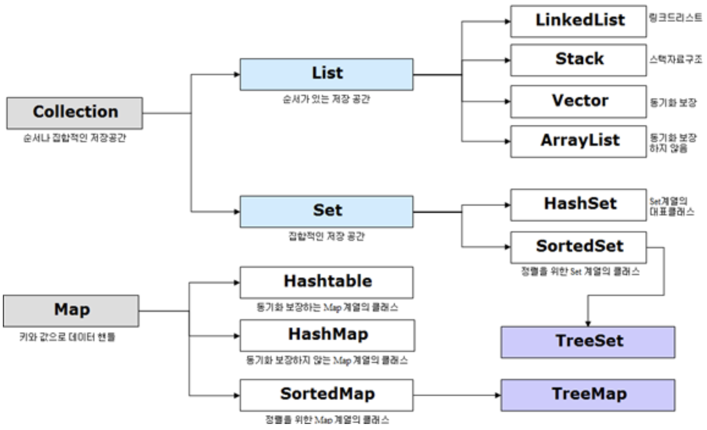

# 22-07-14 [09] 컬렉션 프레임워크(Collection Framework)

---

- [Collection Framework](#컬렉션-프레임워크collection-framework) 

---

## ✏️ Goal of Study

**컬렉션 프레임워크(Collection Framework)**

- 컬렉션 프레임워크의 핵심 인터페이스를 이해하고 사용할 수 있다.
- 주요 인터페이스와 컬렉션 클래스의 핵심 메서드를 사용할 수 있다.
- 필요에 따라 어떤 인터페이스와 컬렉션 클래스를 사용하는 것이 적합한지 결정할 수 있다.

---

### 컬렉션 프레임워크(Collection Framework)

 

**📁 컬렉션(Collection)**

여러 데이터들의 집합을 의미한다. 즉, 여러 데이터들을 그룹으로 묶어놓은 것을 `컬렉션`이라고 한다.

**🗄 컬렉션 프레임워크(Collection Framework)**

컬렉션을 다루는 데에 있어 편리한 메서드들을 미리 정의해놓은 것을 `컬렉션 프레임워크`라고 한다. 컬렉션 프레임워크는 특정 자료 구조에 데이터를 추가하고, 삭제하고, 수정하고, 검색하는 등의 동작을 수행하는 편리한 메서드들을 제공해준다.

 

**컬렉션 프레임워크의 구조**

