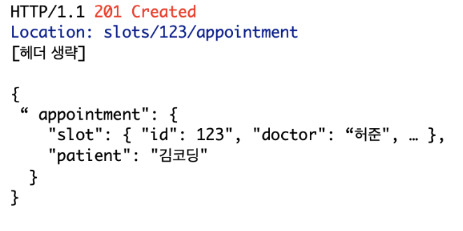
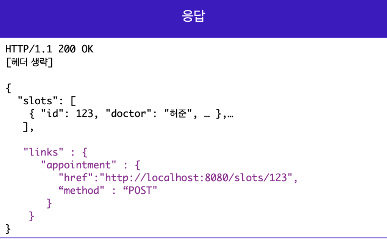

# 22-08-03 [06] REST API
---

- [REST API 개요](#rest-api) 
- [좋은 REST API 디자인](#좋은-rest-api를-디자인하는-방법)
- [REST 성숙도 모델 0단계](#rest-성숙도-모델-0단계)
- [REST 성숙도 모델 1단계](#rest-성숙도-모델-1단계)
- [REST 성숙도 모델 2단계](#rest-성숙도-모델-2단계)
- [REST 성숙도 모델 3단계](#rest-성숙도-모델-3단계)
- [REST API 디자인 가이드 레퍼런스](#api-디자인-가이드-reference)
  
---

## ✏️ Goal of Study

**REST API**
- REST API에 대해 이해할 수 있다.
- REST API 문서를 읽을 수 있다.
- REST API에 맞춰 디자인할 수 있다.
- Open API와 API Key에 대해 이해할 수 있다.

---

### REST API

> REST API란 ❓
>
> REST는 "Representational State Transfer"의 약자로 웹(http)의 장점을 최대한 활용할 수 있는 아키텍처이다. REST API는 웹에서 사용되는 데이터나 자원(Resource)을 HTTP URI로 표현하고, HTTP 프로토콜을 통해 요청과 응답을 정의하는 방식을 말한다.

💡 API를 메뉴판이라 생각하면 이해에 도움이 된다.

 

### 좋은 REST API를 디자인하는 방법

<align>

✅ 실제로 3단계까지 적용하기 어렵기 때문에 2단계까지만 적용해도 좋은 API 디자인이라고 볼 수 있다. 2단계까지 적용한 경우 HTTP API라고도 부른다.~~(3단계까지 전부 만족해야 REST API라고 주장한다.)~~

 

#### **REST 성숙도 모델 0단계**

- 단순히` HTTP 프로토콜`만을 사용한다.
- 해당 API를 REST API라고 할 수 없다.
- 좋은 REST API를 작성하기 위한 기본 단계

 

#### **REST 성숙도 모델 1단계**

- 개별 리소스와의 통신을 준수해야 한다
- 모든 자원은 개별 리소스에 맞는 `엔드포인트(Endpoint)`에 요청해야 한다는 것과 해당 요청의 자원에 대한 정보를 응답으로 전달해야 한다는 것이 1단계 의미이다.
- <u>엔드포인트 작성 시</u>에는 동사, HTTP 메서드, 혹은 어떤 행위에 대한 단어 사용은 지양하고, 리소스에 집중해 명사 형태의 단어로 작성하는 것이 바람직 방법이다.

 

#### **REST 성숙도 모델 2단계**

- `CRUD`에 맞게 적절한 `HTTP 메서드`를 사용하는 것에 중점을 둔다.
    - `CREATE` ➡️ `POST`
    - `READ`   ➡️ `GET`
    - `UPDATE` ➡️ `PUT : 교체` & `PATCH : 수정`
    - `DELETE` ➡️ `DELETE`
- GET 메서드는 body를 가지지 않기 때문에 query parameter를 사용하여 필요한 리소스를 요청한다.
- 2단계에서는 POST 요청에 대한 응답이 어떻게 반환되는지도 중요하다. 응답 코드도 명확하게 작성해야 하며, 관련 리소스를 클라이언트가 Location 헤더에 작성된 URI를 통해 확인할 수 있도록 해야, 완벽하게 REST 성숙도 모델의 2단계를 충족한 것이라고 볼 수 있다.

더 자세한 HTTP 메서드 👉 [Click!](https://developer.mozilla.org/en-US/docs/Web/HTTP/Methods)

`PUT`의 멱등성에 관한 자료 👉 [Idempotent](https://developer.mozilla.org/en-US/docs/Glossary/Idempotent)

 

#### **REST 성숙도 모델 3단계**

- 마지막 단계는 `HATEOAS(Hypertext As The Engine Of Application State)`라는 약어로 표현되는 하이퍼미디어 컨트롤을 적용한다.
- 3단계의 요청은 2단계와 동일하지만, 응답에는 리소스의 `URI`를 포함한 링크 요소를 삽입하여 작성한다는 것이 다르다.
- 응답에 들어가게 되는 링크 요소는 응답을 받은 다음에 할 수 있는 다양한 액션들을 위해 많은 `하이퍼미디어 컨트롤`을 포함하고 있다.
- 응답 내에 새로운 링크를 넣어 새로운 기능에 접근할 수 있도록 하는 것이 3단계의 중요 포인트이다.
- 만약 클라이언트 개발자들이 응답에 담겨 있는 링크들을 눈여겨본다면, 이러한 링크들은 조금 더 쉽고, 효율적으로 리소스와 기능에 접근할 수 있게 하는 트리거가 될 수 있다.

 

**⭐️ 좋은 RESTful API 작성법 정리**
> REST 성숙도 모델을 통해 리소스 중심의 올바른 엔드포인트 작성, 적절한 응답 코드와 리소스에 대한 정보 기재, CRUD에 적합한 HTTP 메서드 사용 등을 고려해야 좋은 REST API를 디자인할 수 있다.

 

### API 디자인 가이드 Reference

- [5가지의 기본적인 REST API 디자인 가이드](https://blog.restcase.com/5-basic-rest-api-design-guidelines/)
- [구글 API 작성 가이드](https://cloud.google.com/apis/design?hl=ko)
- [MS의 REST API 가이드라인](https://github.com/Microsoft/api-guidelines/blob/master/Guidelines.md)

