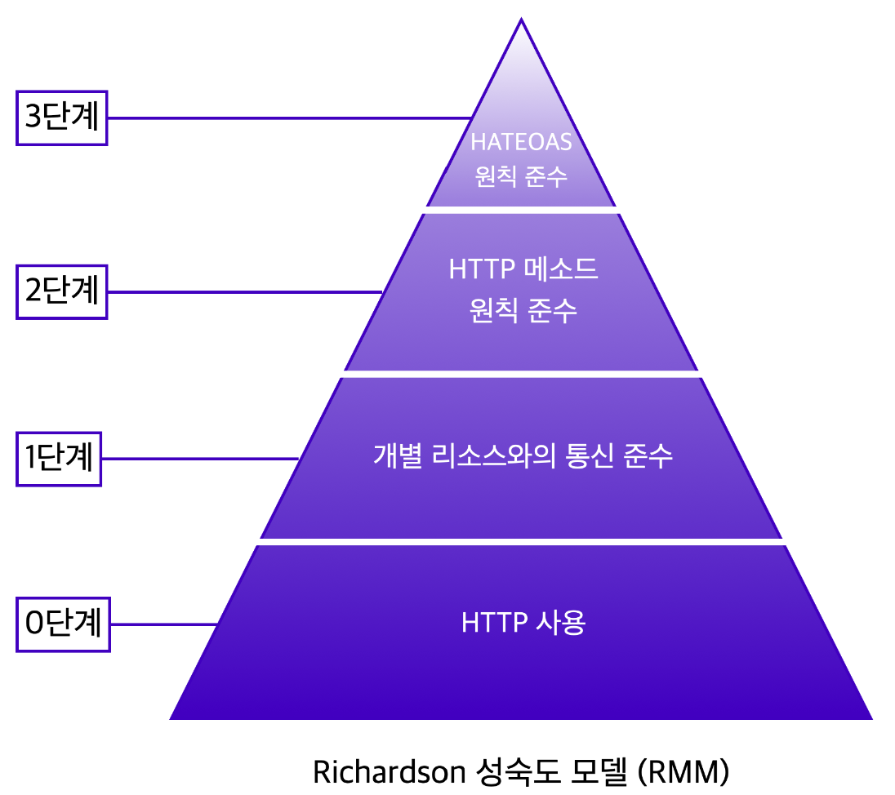

# 22-08-03 [06] REST API & Postman
---

---

## ✏️ Goal of Study

**REST API**
- REST API에 대해 이해할 수 있다.
- REST API 문서를 읽을 수 있다.
- REST API에 맞춰 디자인할 수 있다.
- Open API와 API Key에 대해 이해할 수 있다.

**Postman**
- Postman이 무엇인지 이해하고 사용할 수 있다.
- HTTP API 테스팅이 무엇인지 알 수 있다.
- Postman을 사용하여 서버에 GET, POST 요청을 보내고 응답을 받을 수 있다.

---

### REST API

> REST API란 ❓
>
> REST는 "Representational State Transfer"의 약자로 웹(http)의 장점을 최대한 활용할 수 있는 아키텍처이다. REST API는 웹에서 사용되는 데이터나 자원(Resource)을 HTTP URI로 표현하고, HTTP 프로토콜을 통해 요청과 응답을 정의하는 방식을 말한다.

💡 API를 메뉴판이라 생각하면 이해에 도움이 된다.

 

### 좋은 REST API를 디자인하는 방법

<align>

✅ 실제로 3단계까지 적용하기 어렵기 때문에 2단계까지만 적용해도 좋은 API 디자인이라고 볼 수 있다. 3단계 이전까지 적용한 경우 HTTP API라고도 부른다.~~(3단계까지 전부 만족해야 REST API라고 주장한다.)~~

 

#### **REST 성숙도 모델 0단계**

- 단순히 HTTP 프로토콜만을 사용한다.
- 해당 API를 REST API라고 할 수 없다.
- 좋은 REST API를 작성하기 위한 기본 단계

#### **REST 성숙도 모델 1단계**

- 개별 리소스와의 통신을 준수해야 한다
- 

#### **REST 성숙도 모델 2단계**

#### **REST 성숙도 모델 3단계**