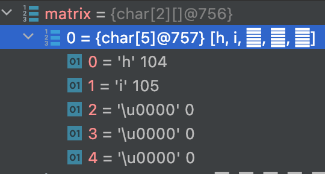

# convertListToObject

### 문제 
`난이도: 🟢🟢⚫️⚫️⚫️`

문자열을 요소로 갖는 배열을 입력받아 문자열을 세로로 읽었을 때의 문자열을 리턴해야 합니다.


<br>

### 입력

인자 1 : array

`String` 타입을 요소로 갖는 배열

<br>

### 출력

`String` 타입을 리턴해야 합니다

<br>

### 주의 사항

- 각 문자열의 길이는 다양합니다.
- 각 문자의 위치를 행, 열로 나타낼 경우, 비어있는 (행, 열)은 무시합니다.

<br>

### 입출력 예시

```Java
String[] input = new String[]{
  "hello",
  "wolrd",
};
String output = readVertically(input);
System.out.println(output); // --> "hweolllrod"

input = new String[]{
  "hi",
  "wolrd",
};
output = readVertically(input);
System.out.println(output); // --> "hwiolrd"
```

---

### Test

- [x] 1 회 Clear
- [ ] 2 

```java
import java.util.*;

public class Test {
    public static void main(String[] args){
        Solution solution = new Solution();
        String[] input = new String[]{
                "hello",
                "world",
        };
        String test = solution.readVertically(input);
        System.out.println("[test1] {hello, world} -> " + test);

        input = new String[]{
                "hi",
                "world",
        };
        test = solution.readVertically(input);
        System.out.println("[test2] {hi, world} -> " + test);

    }
}

class Solution {
    public String readVertically(String[] arr) {
        // TODO:

    }
}


```

<br>

Test 통과시 출력문
```java
[test1] {hello, world} -> hweolrllod
[test2] {hi, world} -> hwiorld
```

<br>

<details>
    <summary>ToDo ❌</summary>

- [x] Test Clear!
- [x] CheckPoint 작성! 
</details>

<br>

<details>
    <summary>Solution</summary>

```java
class Solution {
    public String readVertically(String[] arr) {
        // TODO:
        String result = "";
        // 1. 입력받는 배열의 요소 개수를 -> 행
        // 2. 각 요소들의 문자열 길이 중 가장 큰 길이 -> 열
        int row = arr.length;
        int column = arr[0].length();
        for(int i = 1; i < arr.length; i++){
            column = arr[i].length() >= column ? arr[i].length() : column;
        }
        char[][] matrix = new char[arr.length][column];
        // 3. 행과 열의 매트릭스를 만들고 각 문자들을 위치에 맞게 적재
        for(int i=0; i < row; i++){
            for(int j=0; j < arr[i].length(); j++){
                matrix[i][j] = arr[i].charAt(j);
            }
        }
        // 4. 0번 째 열부터 세로로 읽는다. -> 문자열에 더하기
        for(int j=0; j < column; j++){
            for(int i=0; i<row; i++){
                // 5. 빈 칸인 경우 무시한다.
                if(matrix[i][j] != '\u0000'){
                    result += matrix[i][j];
                }
            }
        }
        // 6. 세로로 읽은 문자열 결과를 리턴한다.
        return result;
    }
}
```
</details>

<br>

---

### CheckPoint ✅

- [x] `char[]` default value is `\u0000` Not `null`

<p align="center"></p>

- [x] `String concatenation(문자열 접합) '+='`에 의한 자동 형변환 `String` + `char` -> `String` + `String`