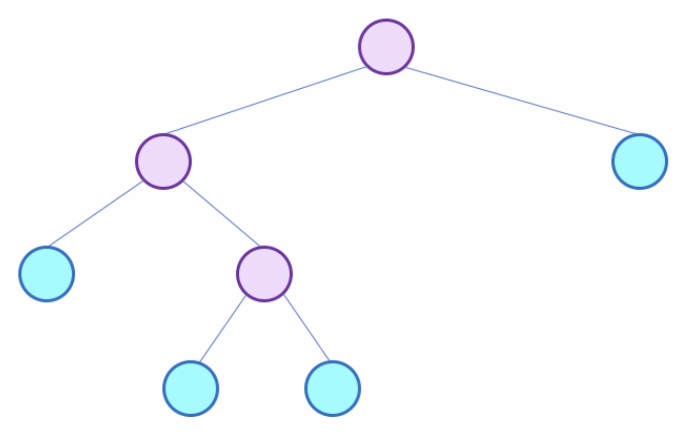
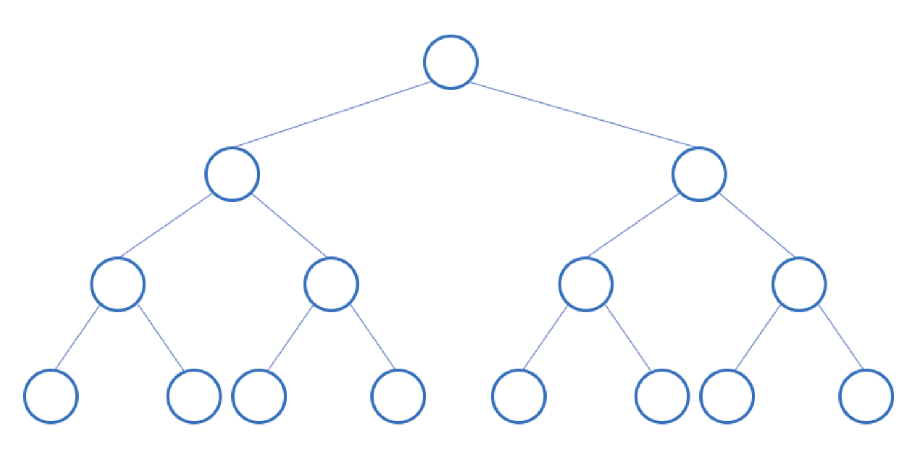
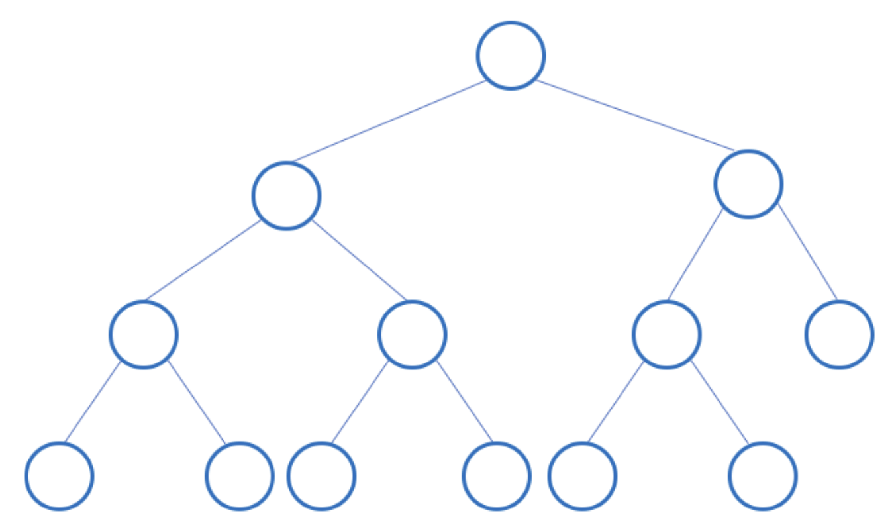

# Binary Tree

Binary Tree 에는 여러 종류가 있다. 아래 세 종류에 대해서 알아보자.

- Full Binary Tree
- Perfect Binary Tree
- Complete Binary Tree

 

### Full Binary Tree

- 모든 노드가 0개 혹은 2개의 자식 노드를 가지고 있을 때 Full Binary Tree 라고 한다.
- 리프 노드를 제외한 모든 노드들이 2개의 자식 노드를 가지고 있다.
- 리프 노드와 내부 노드의 개수를 계산할 때 L = leaf nodes(하늘색), I = interval nodes(보라색), `L = I + 1` 이 성립한다.

 

### Perfect Binary Tree

- 모든 내부 노드(interval node)가 두 개의 자식을 가지고 있고, 모든 리프 노드(leaf node)가 같은 Level에 있으면 Perfect Binary Tree라고 한다.
- 루트(root)의 높이가 h일 때, Perfect Binary Tree는 $2^h - 1$ 개의 노드를 가진다. (leaf's height = 1)

 

### Complete Binary Tree

- Perfect Binary Tree 에서 마지막 level에서 가장 왼쪽 부터 채워지고 오른쪽에 일정 부분 비워져 있는 형태를 Complete Binary Tree라고 한다.