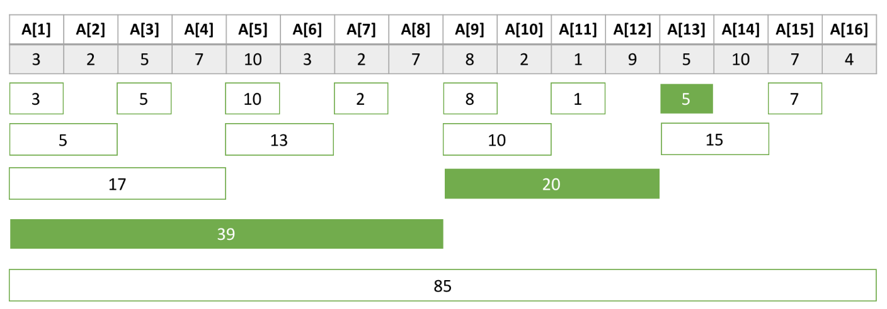

# 18. 펜윅 트리(Fenwick Tree)

### Concept

→ 펜윅트리는 Binary Indexed Tree(BIT, Fenwick Tree) 라고도 불린다. 세그먼트 트리와 마찬가지로 데이터의 변경이 잦고, 구간 합에 대한 연산을 빠르게 진행하기 위해 사용되는 자료구조이다. **하지만 세그먼트 트리보다 메모리 사용량이 적고 코드 또한 매우 간결하기 때문에 세그먼트 트리보다 더 향상된 자료구조로 볼 수 있다.**

<br>

### 구현

펜윅트리를 구현하려면, 어떤 수 X를 이진수로 나타냈을 때, 마지막 1의 위치를 알아야 한다.

- $3 = 11_2$
- $5 = 101_2$
- $6  = 110_2$
- $8 = 1000_2$
- $9 = 1001_2$
- $10 = 1010_2$
- $11 =1011_2$
- $12 = 1100_2$
- $16 = 10000_2$

<br>

### $L[i]$ 값 구하기

어떤 수 X를 이진수로 표현하고 마지막 1의 위치의 값을 L[ i ]라고 표현 한다.

해당 값에 대한 공식은 아래와 같다. 음의 값을 이진수를 표현할 때 2의 보수법을 사용한다.

$$L[i] = i \& -i$$

- $L[3] = 1$
- $L[10]  =2$
- $L[12] = 4$

<br>

### $L[i]$ graph

입력되는 N개의 배열 원소 대하여 각각 $A[1]$ ~ $A[N]$ 이라 할 때, 

$Tree[i]$는 $A[i]$ 부터 앞으로 $L[i]$ 개 만큼의 원소들의 합이 저장되어 있다.

![각 i에 대하여, L[ i ]를 나타낸 표이다. 초록 박스는 i부터 앞으로 L[ i ] 개가 나타내는 구간이다.](../../../images/CodingTest/Tree/FenwickTree/1.png)

각 i에 대하여, L[ i ]를 나타낸 표이다. 초록 박스는 i부터 앞으로 L[ i ] 개가 나타내는 구간이다.

<br>

### 구간 합 구하기

입력되는 배열이 A = [3, 2, 5, 7, 10, 3, 2, 7, 8, 2, 1, 9, 5, 10, 7, 4] 인 경우에, $Tree[i]$가 저장하고 있는 값은 아래 표와 같다.

![Tree[12] = A[9] + A[10] + A[11] + A[12], Tree[7] = A[7]](../../../images/CodingTest/Tree/FenwickTree/2.png)

Tree[12] = A[9] + A[10] + A[11] + A[12], Tree[7] = A[7]

<br>

### 예시

Tree를 이용해서 A[1] + … + A[13]은 어떻게 구할 수 있을까?

13을 이진수로 나타내면 $1102_2$ 이고 Tree의 인덱스는 이진수라 할 때,

**A[1] + … + A[13] = Tree[1101] + Tree[1100] + Tree[1000]** 이 표현할 수 있다. 



1101 → 1100 → 1000 은 **마지막 1의 위치의 값을 빼면서 찾을 수 있다. 즉, -1 → -4 → -8**

<br>

구간합 → **마지막 1의 위치 값 빼기**

```java
int sum(int i) {
    int ans = 0;
    while (i > 0) {
        ans += tree[i];
        i -= (i & -i);
    }
    return ans;
}
```

![모든 i에 대하여, A[1] + … + A[ i ] 를 구하는 과정이다.](../../../images/CodingTest/Tree/FenwickTree/4.png)

모든 i에 대하여, A[1] + … + A[ i ] 를 구하는 과정이다.

<br>

> **💡 Tip.
어떤 구간의 합 A[ i ] + … + A[ j ] 는 A[1] + … + A[ j ] 에서 A[1] + … + A[ i ] 을 뺀 값과 같다.
따라서 `sum( j ) - sum(i - 1)` 을 통해 구할 수 있다.**
> 

<br>

### 데이터 변경

어떤 수를 변경한 경우에는 그 수를 담당하고 있는 구간을 모두 업데이트 해줘야 한다. 아래 코드와 같이 마지막 1의 위치의 값을 더하는 방식으로 구현할 수 있다.

**데이터 변경 →** **마지막 1의 위치 값 더하기**

```java
void update(int i, int num) {
    while (i <= n) {
        tree[i] += num;
        i += (i & -i);
    }
}
```

<br>

![i 번째 데이터를 변경했을 때, 업데이트 해야하는 Tree[ i ]를 나타낸 그림이다.](../../../images/CodingTest/Tree/FenwickTree/5.png)

i 번째 데이터를 변경했을 때, 업데이트 해야하는 Tree[ i ]를 나타낸 그림이다.

<br>

<details>
  <summary>Reference</summary>

- [동근님  유튜브 강의](https://www.youtube.com/watch?v=fg2iGP4e2mc)
- [백준 설명](https://www.acmicpc.net/blog/view/21)
</details>