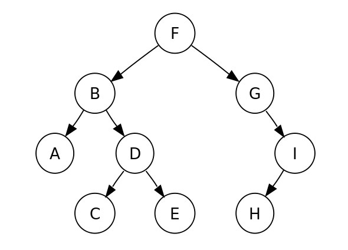

# Tree Traversal

### Tree Traversal 이란?

→ 트리 순회는는 트리 구조에서 각각의 노드를 정확히 한 번만, 체계적인 방법으로 방문하는 과정을 말한다. 노드를 방문하는 순서에 따라 여러 순회 방법이 존재한다.

<br>

### 전위 순회(Preorder traversal)

→ 전위 순회는 깊이 우선 순회(depth-first traversal)라고도 한다.

1. 루트를 방문한다.
2. 왼쪽 서브 트리를 전위 순회한다.
3. 오른쪽 서브 트리를 전위 순회한다.

<br>

### 중위 순회(Inorder traversal)

→ 중위 순회는 대칭 순회(symmetric)라고도 한다.

1. 왼쪽 서브 트리를 중위 순회한다.
2. 루트를 방문한다.
3. 오른쪽 서브 트리를 중위 순회한다.

<br>

### 후위 순회(Postorder traversal)

1. 왼쪽 서브 트리를 후위 순회한다.
2. 오른쪽 서브 트리를 후위 순회한다.
3. 루트를 방문한다.

<br>

### 레벨 순서 순회(Lever-order traversal)

→ 모든 노드를 낮은 레벨부터 차례대로 순회한다. 레벨 순서 순회는 너비 우선 순회(breadth-first traversal)라고도 한다.

<br>

<p align="center">
  
</p>

위 이진 탐색 트리에서

- 전위 순회: F, B, A, D, C, E, G, I, H (root, left, right)
- 중위 순회: A, B, C, D, E, F, G, H, I (left, root, right)
- 후위 순회: A, C, E, D, B, H, I, G, F (left, right, root)
- 레벨 순서 순회: F, B, G, A, D, I, C, E, H

<br>

### 구현

```kotlin
preorder(node)
  print node.value
  if node.left ≠ null then preorder(node.left)
  if node.right ≠ null then preorder(node.right)
```

```kotlin
inorder(node)
  if node.left  ≠ null then inorder(node.left)
  print node.value
  if node.right ≠ null then inorder(node.right)
```

```kotlin
postorder(node)
  if node.left  ≠ null then postorder(node.left)
  if node.right ≠ null then postorder(node.right)
  print node.value
```

```kotlin
levelorder(root)
  q = empty queue
  q.enqueue(root)
  while not q.empty do
    node := q.dequeue()
    visit(node)
    if node.left ≠ null
      q.enqueue(node.left)
    if node.right ≠ null
      q.enqueue(node.right)
```