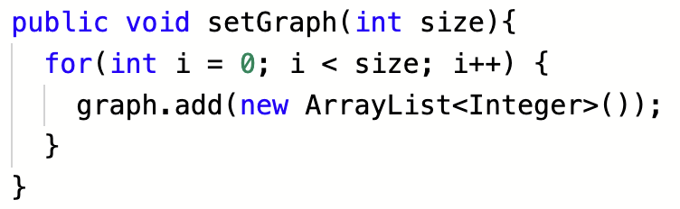
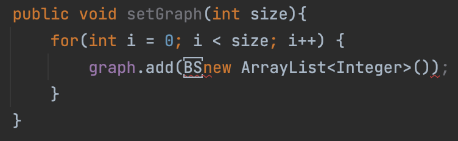

# [Java_Error] error: illegal character: '\u0008'

### 오류 메시지
---

error: illegal character: '\u0008'

 

### 원인

---
유니코드 `BOM`을 인식 못하는 문제였다. 유니코드 `BOM`이란, 유니코드에는 파일의 맨 앞에 보이지 않는 어떤 표시를 해둔 것을 말한다. 자바는 컴파일 시 `BOM`이 있는 유니코드를 인식하지 못하면 해당 에러 메시지가 발생하게 된다.

 

### 해결 방법

1. 코딩 테스트 진행하던 에디터에서는 아무런 이상을 확인할 수 없었다.

2. 코드를 IntelliJ 에 `복사` + `붙여넣기`를 해주었더니 안 보이던 `BS` 문자가 생겼고 이를 지워주었다.

3. `BS` 문자를 지워주고 재복사하여 원래 사용하던 에디터에 붙여 넣으니 해결되었다.

 

⭐️ 요약: 다른 텍스트 에디터에 해당 내용을 `복사` > `붙여넣기` > `재복사` > `기존 파일에 대체`

- 해결 방법 참고 레퍼런스 [Reference](https://question0.tistory.com/30)

