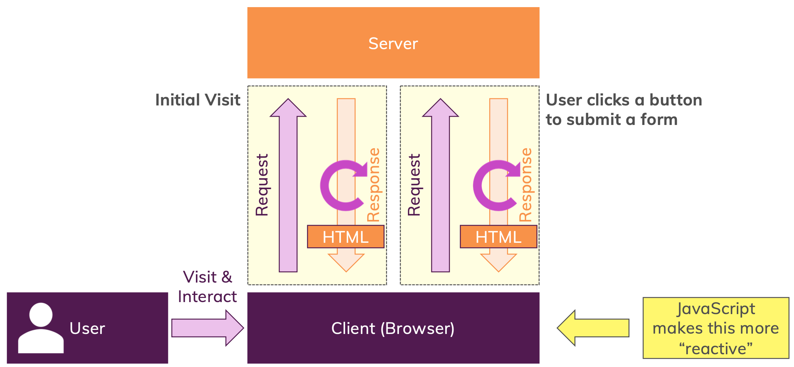

# What Is JavaScript

### javaScript

> 자바스크립트는 런타임에 컴파일되는 동적이면서 약한 타입의 프로그래밍 언어이다. 자바스크립트는 웹 페이지를 더욱 동적으로 만들게 해준다. 클라이언트와 서버간의 상호 작용시 특정 요청(second req)을 생략할 수 있도록 해주고, 이미 업로드된 페이지를 새로고침 하지 않으면서 그 페이지 안에서 어떤 동작을 할 수 있게 해준다.

 

주목해야할 특징

- Compiled at Runtime : 런타임에 컴파일 된다.
- Weakly Type : 약한 타입이다.
- Dynamic : 동적이다.

 

📝 강한 타입 언어와 약한 타입 언어의 차이점 👉 [StackOverFlow](https://stackoverflow.com/questions/2690544/what-is-the-difference-between-a-strongly-typed-language-and-a-statically-typed)
 
 

- Initial Visit : 최초 요청 ➡️ (welcome page)
- User Click a button : 후속(second) 요청 ➡️ (새로운 html)