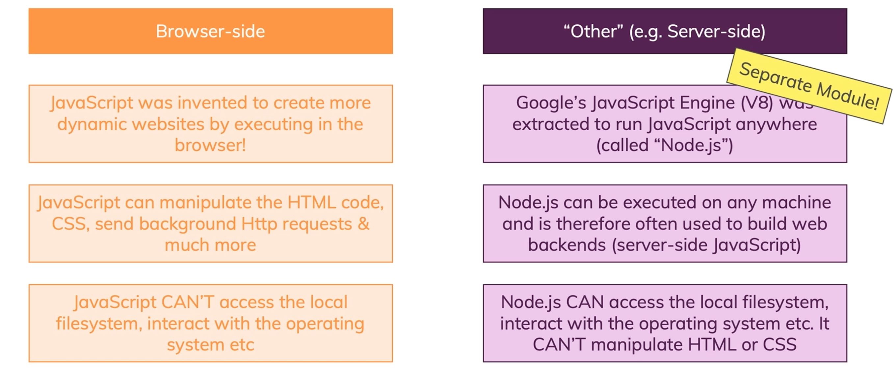

# 자바 스크립트 실행 환경

 

**Browser-side**
- 자바스크립트는 웹 사이트를 더욱 동적이게 만들어준다.
- 브라우저 위에서 실행되면 HTML, CSS를 조작할 수 있고, HTTP Request를 보낼 수 있다.
- 하지만, 로컬의 파일 시스템에 접근이 안되며 운영체제와 상호작용도 못한다.

 

**Server-side**
- 구글 브라우저의 js 엔진을 빼온 것이 Node.js이다.
- Node.js는 어떠한 장치이든 동작하며, 주로 웹 백엔드 빌드에 사용된다.
- Node.js는 파일 시스템에 접근 가능하며, 운영체제와 상호작용이 가능하다.
- 하지만 Node.js는 클라이언트 측의 HTML, CSS를 조작할 수 없다.