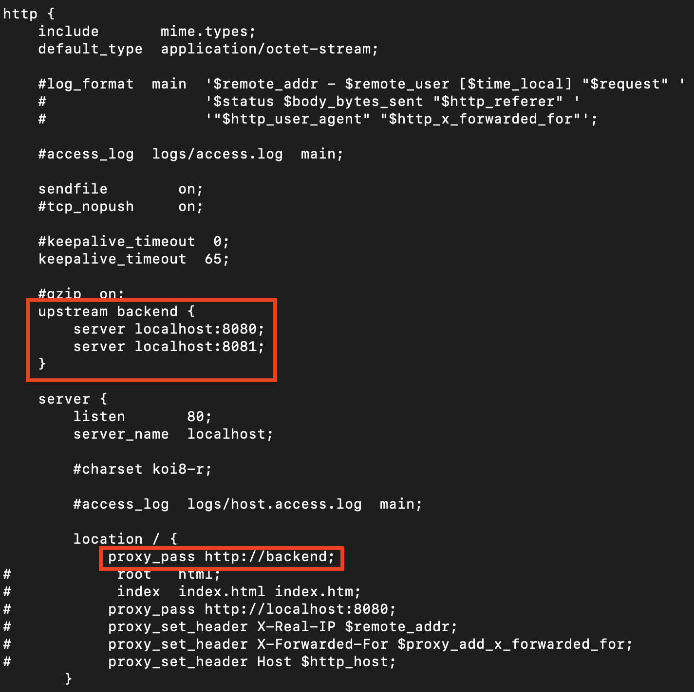

# Nginx를 통한 로드 밸런싱(로컬)

<br>

<p align="center"></p>


### 프로젝트 빌드
```bash
$ ./gradlew build
```
<br>

### 특정 포트번호로 서버 실행
```bash
$ java -Dserver.port=<포트번호> -jar <jar 파일>
```

<br>

### Nginx 설정파일 수정
```bash
http {
	upstream backend {
		server localhost:8080;
		server localhost:8081;
	}
	location / {
		proxy_pass http://backend;
	}
}
```

<p align="center"></p>