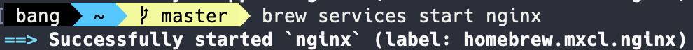
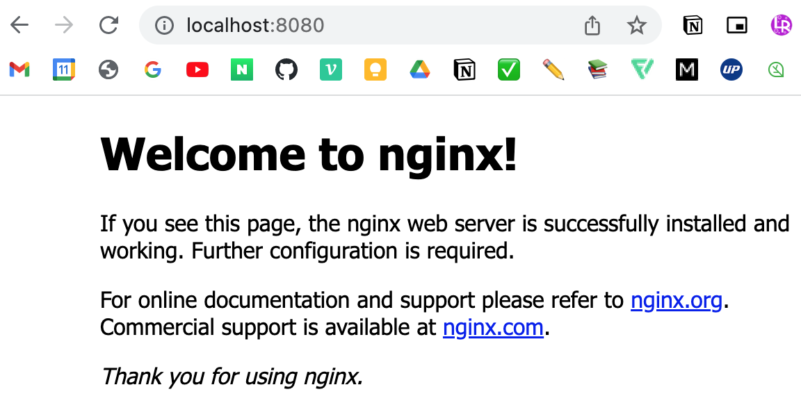
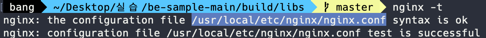

# Nginx 설치부터 실행까지 기본 명령어 모음

### 설치

터미널에 아래 명령어 입력하기
```
$ brew install nginx
```

<br>

### 실행

아래 명령어로 `Nginx` 실행
```
$ brew services start nginx
```

<p align="center"></p>

실행 성공적으로 완료되면, Mac OS는 `http://localhost:8080`로 연결해서 확인한다.(맥은 기본 포트로 8080 설정)

<p align="center"></p>

<br>

### Nginx 설정 파일 수정

설정 파일의 수정을 통해 `proxy`, `loadbalancing` 등의 기능을 할 수 있게 된다.

❗️ 주의: 사용자의 `brew` 버전에 따라 설정 파일의 위치가 다를 수 있기 때문에 `Nginx` 설정파일 위치를 찾는 명령어를 통해 접근해야 한다.

```
$ nginx -t
```
<p align="center"></p>

`vim`, `nano` 에디터로 설정파일을 수정한다.
```
$ nano /usr/local/etc/nginx/nginx.conf
```

<br>

### 재시작

설정 파일을 수정하였으면 변경 사항을 적용하기 위해 재시작 명령어를 입력해야 한다.
```
$ brew services restart nginx
```

<br>

### 종료

nginx 서버를 종료하려면 아래 명령어를 사용한다.
```
$ brew services stop nginx
```