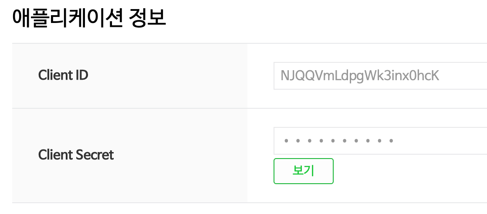

# Open API와 API Key

### Open API

`Open API`란 글자 그대로 누구에게나 열려있는 API이다. 그러나 <u>무제한으로 이용할 수 있다</u>라는 의미가 아닙니다. 기관이나 API마다 정해진 이용 수칙이 있고, 그 이용 수칙에 따라 제한사항(가격, 정보의 제한 등)이 있을 수 있다.

 

### API Key

API를 이용하기 위해서는 `API Key`가 필요합니다. API key는 서버의 문을 여는 열쇠라고 생각할 수 있다. 클라이언트의 요청에 따라 서버에서 응답한다는 말은 결국 서버를 운용하는 데에 비용이 발생한다는 말이다. 따라서 서버 입장에서 아무런 조건 없이 익명의 클라이언트에게 데이터를 제공할 의무도, 이유도 없다. (가끔 API key가 필요하지 않은 경우도 있습니다.)

그래서 로그인된 이용자에게만 자원에 접근할 수 있는 권한을 API Key의 형태로 제공하고, 데이터를 요청할 때 API key를 같이 전달해야만 원하는 응답을 받을 수 있습니다.

 

**Naver Open API Key Example**

API를 호출할 때 제공받은 API Key를 같이 첨부해서 요청을 보내야 제대로 API를 호출하여 응답을 받을 수 있다.

