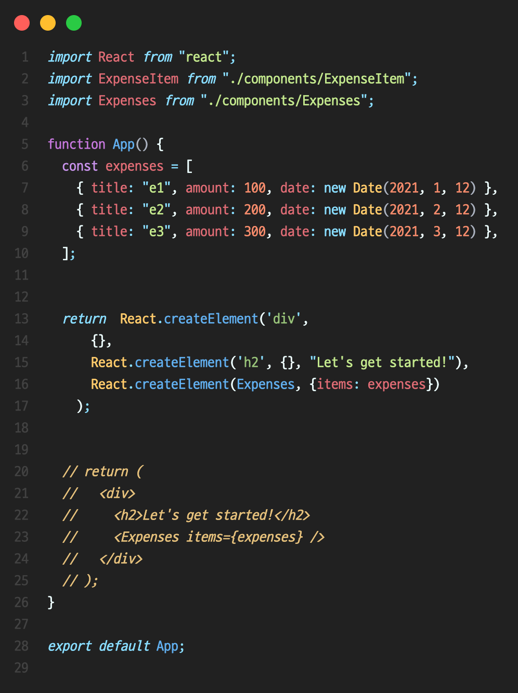

# 컴포넌트(Component)

### 리액트 컨벤션

컴포넌트 함수명, 컴포넌트 파일 이름, import 할당변수명 모두 **파스칼케이스**로 일치시킨다.

 

### 컴포넌트 리턴 규칙 

반환하는 JSX 코드 블록 하나에 반드시 하나의 루트 요소를 가져야 한다. 즉 반환되는 JSX 코드 블록 안에 최상단 위치에서 요소들이 나란히 두 개 이상 존재할 수 없다는 것이다.(JSX 코드 블록 안에서 최상단 위치에서 두 개의 div 요소들은 둘 다 root 역할이다.)

JSX 요소를 작성하는 대신 React 객체를 사용하여 똑같이 블록 요소를 반환할 수 있다. 그 이면을 들여다 보면 반환되는 블록이 왜 root가 하나이어야 하는지, 즉 JSX 요소들을 최상단 래핑 요소로 감싸서 반환해야되는지 이유를 알 수 있다.

`React.createElement(요소, 속성, 컨텐츠)`

예전에는 JSX 가 사용된 컴포넌트 파일에선 반드시 `import React from 'react'` 를 반드시 불러왔어야 했다. 하지만 현대 리액트 프로젝트 셋업에서는 이를 생략하고도 JSX를 자동으로 변환과정이 진행된다. 한편, 여전히 React 객체가 사용된다는걸 강조하기 위해 명시적으로 import 구문을 작성하기도 한다.

**결과적으로, 리턴되는 JSX 코드 블록의 root는 반드시 하나로 구성되어야 한다. 보통 div 하나 또는 커스텀 UI 컴포넌트(eg. Card.js)로 감싼다.**

> Card
> 
> 일반적으로 웹 개발에서 카드(Card)라는 용어는 컨테이너 같은 레이아웃을 의미한다. 컨테이너 UI를 래퍼(wrapper) 컴포넌트라고도 불른다. 이를 사용하면 중복된 CSS를 제거할 수 있다. 또한 여러 컴포넌트에 재사용하여 UI 레이아웃을 동일하게 적용할 수도 있다.

 

### 컴포지션(Composition)

큰 블록에서 더 작은 블록으로 UI를 만드는 접근 방식을 **컴포지션(Composition)** 이라 한다. 컴포넌트를 작고 집중적으로 유지하는 것은 좋은 습관이다. 코드의 재사용 가능성이 올라가고, 코드도 훨씬 간결해진다.

 

### 컴포넌트 CSS

- 일반적으로 컴포넌트와 동일한 위치에 css 파일을 추가한다.

- css 파일명은 컴포넌트 파일과 동일하게 만든다.

- 컴포넌트 파일에서 해당 css 파일을 불러올 땐  `import './ComponentName.css'` 처럼 경로만 적어주면 된다.

- HTML의 class 속성이 JSX에선 `className` 으로 JSX 요소에 클래스명을 부여한다.

 

### 빈 태그 컴포넌트

`<Component />`

열고 닫히는 JSX 요소 태그의 내용(Content)이 없다면 빈 태그 형식으로 작성할 수 있다.

 

### Arrow Function

함수 컴포넌트를 화살표 함수 방식으로도 작성할 수 있다. 일반 함수 또는 화살표 함수 중 개발자 취향대로 작성하면 된다.

[Arrow Function docs](https://developer.mozilla.org/en-US/docs/Web/JavaScript/Reference/Functions/Arrow_functions)

