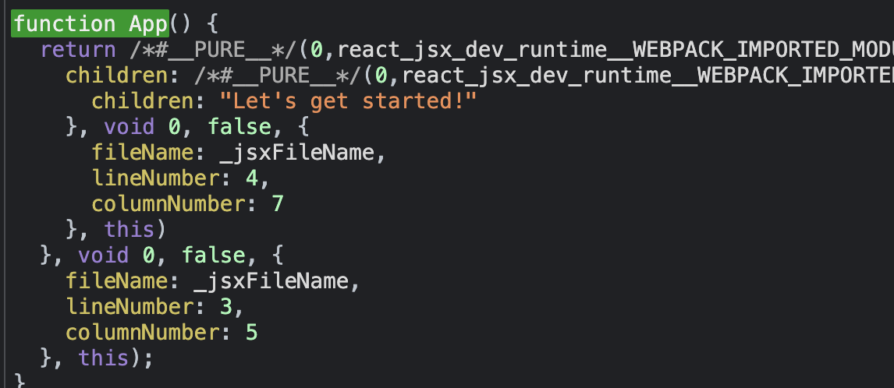
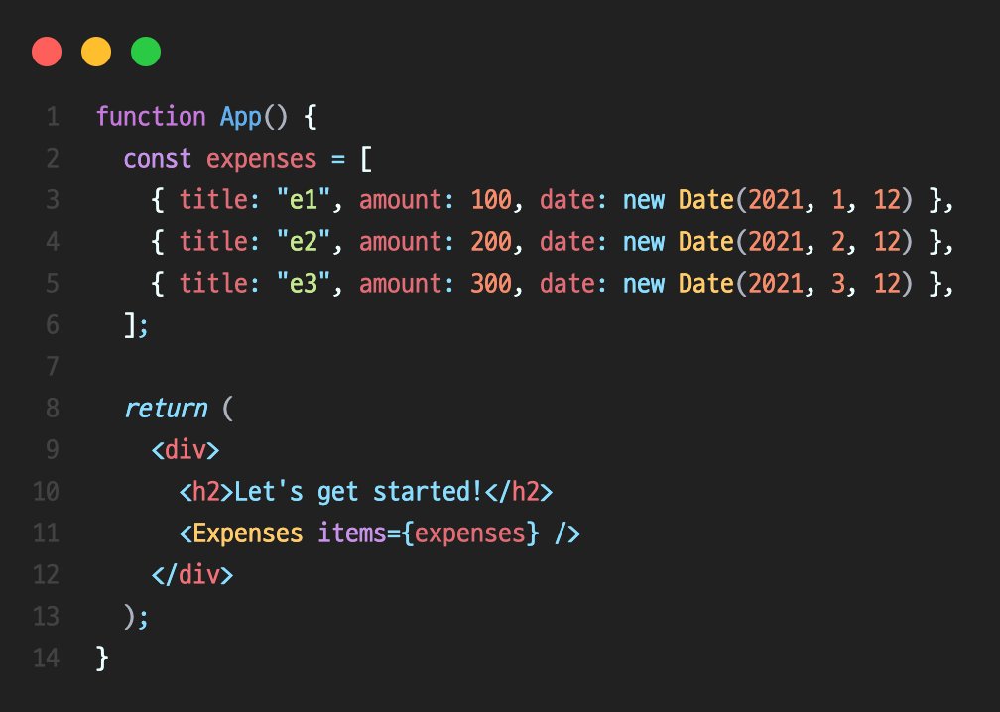

# 리액트(React)에 관하여

### 리액트란 무엇인가?

- React makes building complex, interactive and reactive user interface simpler
  (리액트는 복잡하고, 상호작용적이며, 반응적인 UI 구축을 쉽게 만들수 있도록 도와주는 JS 라이브러리이다.)

- React is all about "components" (리액트는 전부 컴포넌트로 구성되어 있다. 컴포넌트란 재사용 가능한 UI 블록으로 생각할 수 있다.)

- React allows you to create re-usable and reactive components consisting of HTML and Javascript (and CSS)
  (리액트로 반응적이며 재사용 가능한 컴포넌트를 만들 수 있다. 컴포넌트는 HTML, Javscript, CSS 로 구성된 코드 조합이다. 태그를 작성하듯이 HTML, JS 을 조합하여 작성하는 문법이 JSX 이다.)

- Declarative Approach: Define the desired target state(s) and let React firgure out the actual javascript DOM instructions (바닐라 자바스크립트에서 하듯이 직접 DOM 업데이트를 할 필요가 없다. React는 desired target state만 정의해주면 DOM 업데이트를 알아서 해준다.)

- 리액트는 JSX 코드를 기반으로 "변환" 과정을 통해 브라우저에 html, css, js 를 알려준다.

- package.json 안의 종속성 "react" + "react-dom" 두 개가 합쳐져서 "리액트 라이브러리" 가 된다.

<br>

### 컴포넌트 왜 사용할까?

리액트의 컴포넌트는 재사용성과 관심사를 분리할 수 있다. 중복된 코드를 피할 수 있고 작은 단위의 유닛들로 하나의 관심사를 집중적으로 다룰 수 있게된다. 즉, 유지보수가 용이해진다.

<br>

### 리액트 프로젝트 진입점

index.js -> 리액트 앱의 랜딩페이지이다.

```javascript
const root = React.createRoot(document.getElementById("root"));
```

**렌더링**

루트(root)는 리액트 랜딩페이지의 진입점이다. 실제 해당 html 파일은 /public/index.html 에 가면 변환전 원본 템플릿이 존재한다. 해당 템플릿 안에 `<div id="root"></div>` 가 존재하는데 리액트의 모든 컴포넌트가 이 블록 안에서 변환되어 완전한 HTML로 작성되고 브라우저에서 출력된다.

- root.render(components): 루트에 render() 함수를 호출하여 인자로 전달되는 컴포넌트들을 변환하여 브라우저에 앱을 띄운다.

- import './index.css': 원래는 js 안에 css를 불러오는 것이 불가능하지만, 리액트 프로젝트 셋업이 이를 가능하게 해준다.

- import \_ from '경로.(확장자)': js 파일 또는 라이브러리는 .js 확장자를 붙이지 않는다. 그 외의 파일들은 확장자를 명시해줘야 한다.

<br>

### JSX

`크롬 개발자 도구 -> Sources 탭 -> static/js -> bundle.js`

위 과정을 통해 **bundle.js** 파일을 살펴보면 앱의 소스 코드 뿐만 아니라 프로젝트 패키지의 모든 라이브러리가 함께 번들링 된 내용이 담겨져 있다. 이 안에서 `cmd + f` 를 통해서 코드가 어떻게 번들링 되었는지 검색할 수도 있다.

아래 사진은 번들링 과정을 거친 `App.js` 코드이다.

<p align="center"></p>

<br>

`JSX`

브라우저에서 번들 파일 내부를 보면 엄청 복잡하다는 것을 확인할 수 있다. 개발자가 번들 파일처럼 코드를 직접 작성하는 것은 굉장히 비효율적이다. 하지만 JSX를 사용하면 개발자는 효율적으로 작업을 할 수 있게된다. JSX 문법을 통해 작성된 코드는 리액트에 의해 변환 과정을 거치게 되면데, 브라우저에서 번들 파일 내부의 코드처럼 변환된다. **즉 JSX 는 개발자 친화적인 코드이며 효율성을 높여준다.**

아래 함수의 리턴구문 처럼 HTML과 Javascript의 조합으로 태깅하듯이 작성한 문법을 JSX라 한다.
<p align="center"></p>


<br>

### React Vs Vanilla JS

만약 `'This is also visible'` 이라는 한 문단을 추가한다 했을 때, 리액트의 JSX 방법과 바닐라 자바스크립트의 차이는 어떻게 될까?

1. JSX: 컴포넌트 리턴 구문에 p태그 요소 추가만 해주면 끝.

```html
<p>This is also visible</p>
```

2. 바닐라 JS: 아래 명령어 3줄을 입력해야 한다.

```javascript
const para = document.createElement('p');
para.textContent = 'This is also visible';
document.getElementById('root').append(para);
```
JSX 와 바닐라 JS 비교했을 때 JSX를 쓰면 매우 효율적인 것을 알 수 있다.

**JSX는 원하는 최종 상태(요소)만을 정의하는 것을 볼 수 있다. 이러한 특징 때문에 리액트를 '선언적(declarative)' 특징이 있다고 보는 것이다.**