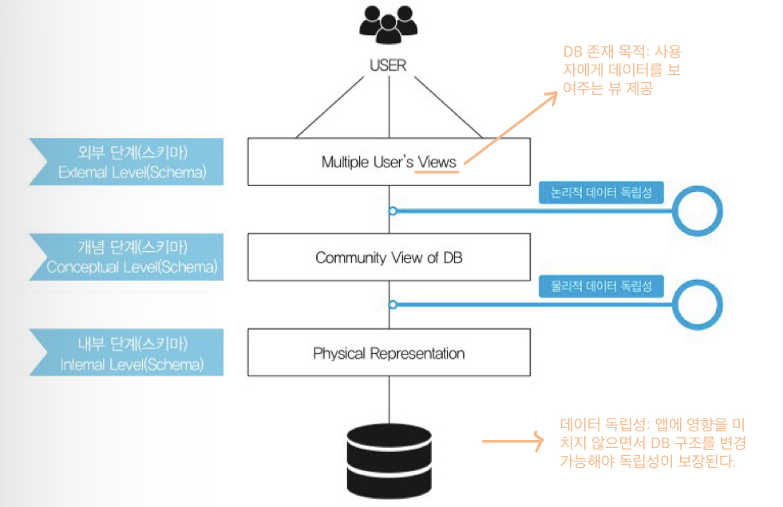
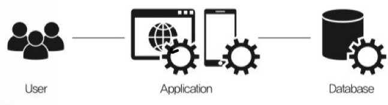

# ANSI-SPARC 아키텍처

`ANSI-SPARC 아키텍처` 는 데이터베이스 관리 시스템(DBMS)의 추상적인 설계 표준이다.

ANSI-SPARC 아키텍처는 스키마를 3단계 구조로 나누는데, 이렇게 분리하는 목적은 데이터베이스에 대한 사용자들의 관점과 데이터베이스가 실제로 표현되는 물리적인 방식을 분리하기 위함이다.

### 3 단계 스키마 구조

- 외부 스키마(External Schema) - 각 사용자가 보는 DB 스키마
- 개념 스키마(Conceptual Schema) - 모든 사용자가 보는 DB 스키마
- 내부 스키마(Internal Schema) - 물리적인 저장 구조

**스키마를 3단계 구조로 나누는 이유**

데이터베이스에 대한 사용자들의 관점과 데이터베이스가 실제로 표현되는 물리적인 방식을 분리하여 데이터 독립성 보장을 위해서이다.

즉, 물리적인 구조와는 별개로 개념 구조를 변경할 수 있고 개념 구조와는 별개로 물리적인 구조의 변경이 가능하다.

- 논리적 독립성: 개념 스키마가 변경되어도 외부 스키마는 영향받지 않는다.
- 물리적 독립성: 내부 스키마가 변경되어도 외부/개념 스키마는 영향받지 않는다.