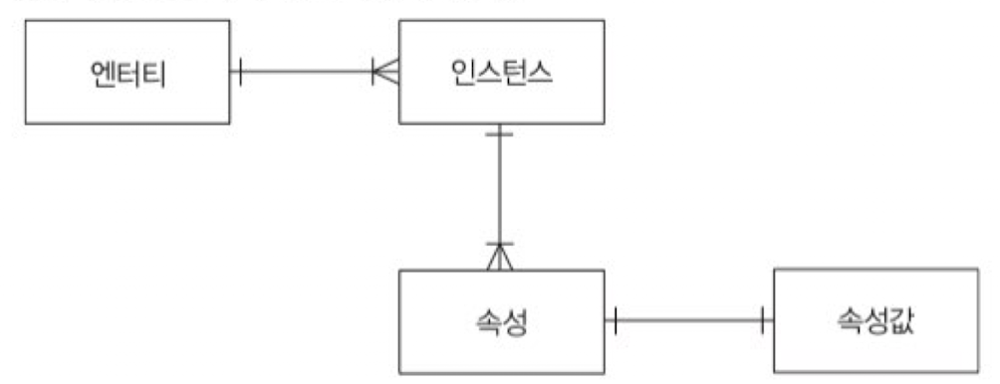

# 속성(Attribute)

사물이나 개념의 특징을 설명해줄 수 있는 항목들을 `속성`이라고 부른다. 

- 속성은 엔티티의 특징을 나타내는 최소의 데이터 단위이다.
- 속성은 의미상 더 이상 쪼개지지 않는 레벨이어야 하고 프로세스에 필요한 항목이어야 한다.
- 업무상 불필요한 데이터라고 판단되면 해당 속성은 삭제하는 것이 바람직하다.

 

**속성값**

각각의 속성은 `속성값`을 가지며 속성값은 엔티티에 속한 하나의 인스턴스를 구체적으로 나타내주는 데이터라고 볼 수 있다.

|   이름(속성)   |   생년월일(속성)   |
| :------------: | :----------------: |
| 홍길동(속성값) | 1998.12.25(속성값) |

**하나의 속성은 한 개의 속성값만 가질 수 있다. <u>만약 하나의 속성이 여러 개의 속성값을 갖는 경우 별도의 엔티티로 분리하는 것이 바람직하다.</u>**

 

### 엔티티, 인스턴스, 속성, 속성값의 관계

- 한 개의 엔티티는 두 개 이상의 인스턴스를 갖는다.
- 한 개의 인스턴스는 두 개 이상의 속성을 갖는다.
- 한 개의 속성은 하나의 속성값을 갖는다.

 

### 속성 분류

1. 특성에 따른 분류
    - 기본 속성 : 업무 프로세스 분석을 통해 바로 정의가 가능한 속성
    - 설계 속성 : 업무에 존재하지는 않지만 설계하다 보니 필요하다고 판단되어 도출해낸 속성
    - 파생 속성 : 다른 속성의 속성값을 계산하거나 특정한 규칙으로 변형하여 생성한 속성. 데이터 조회 시 빠른 성능을 보장하기 위해 본래의 속성값을 계산하여 따로 저장할 수 있도록 만든 속성이다.

> 파생 속성 주의 ❗️
>
> 파생 속성을 설계할 경우 데이터의 정합성이 고려되어야 한다. 만약 계산 과정에서 누락되는 데이터가 생기는 경우, 잘 못된 결과값이 도출 될 위험 요소가 존재한다. 따라서 불가피한 경우에만 정의하는 것이 바람직하다.

2. 구성방식에 따른 분류
    - PK 속성 : 엔티티에 속한 각 인스턴스에 유니크함을 부여하는 속성이다. 
    - FK 속성 : 다른 엔티티와 관계를 맺게 해주는 매개체 역할을 하는 속성이다. 다른 엔티티의 PK값과 일치하거나 NULL 값을 가질 수도 있다.
    - 일반 속성 : PK, FK를 제외한 나머지 속성을 일반속성이라고 한다.

 

**도메인**

속성이 가질 수 있는 속성값의 범위를 `도메인`이라고 한다. 도메인은 엔티티를 정의할 때 `데이터 타입`과 `크기`로 나타낼 수 있다.

 

**용어 사전**

엔티티의 속성명을 정의할 때 명확한 의미의 이름을 부여하고 다른 엔티티와의 혼란을 예방하기 위해  `용어 사전`을 두어 공통된 룰을 적용하는 것이 좋다. 하나의 데이터베이스에서 같은 의미를 가진 데이터가 엔티티마다 다른 명으로 정의되는 것을 예방하기에 좋다.