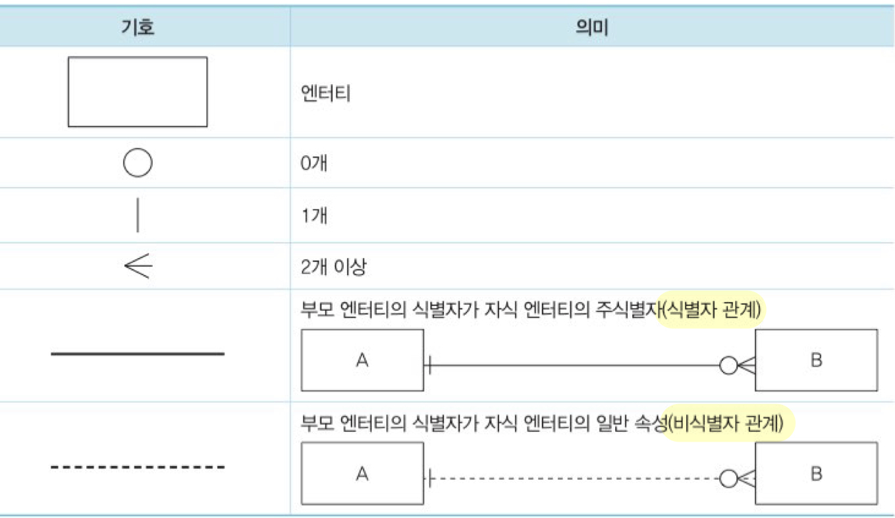

# ERD(Entity Relationship Diagram)

시스템에 어떤 엔티티들이 존재하며 그들 간에 어떤 관계가 있는지를 나타내는 다이어그램이다.

 

ERD 표기법 중 가장 많이 쓰이는 `IE/Crow’s Foot` 표기법에 대해 알아보자.

 

### ERD 작성 순서

어떤 표기법을 사용하든 ERD를 작성하는 순서는 공통된 룰이다.

1. 엔티티를 도출하고 그린다.
2. 엔티티를 적절하게 배치한다.
3. 엔티티 간의 관계를 설정한다.
4. 관계명을 기입한다. (Membership)
5. 관계의 참여도를 기입한다. (Cardinality)
6. 관계의 필수/선택 여부를 기입한다. (Optionality)