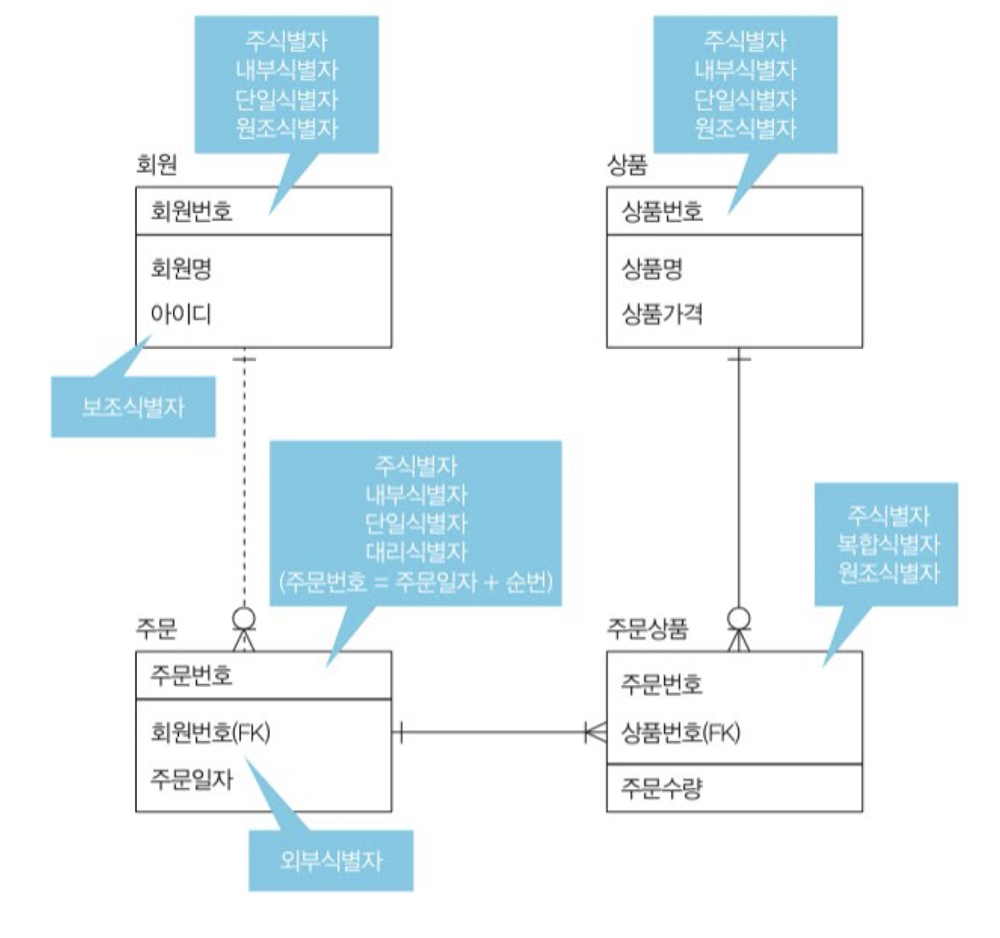
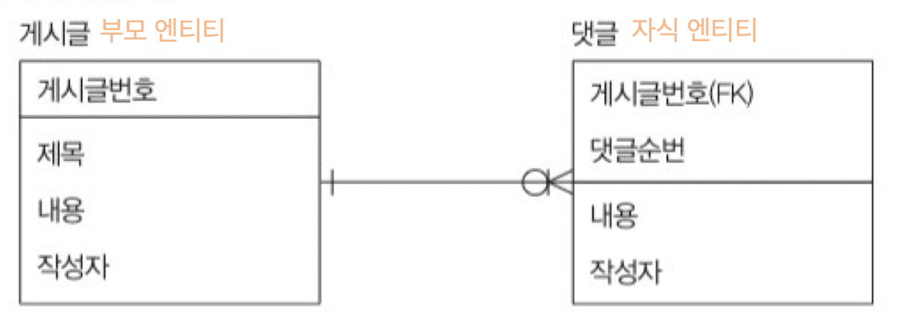
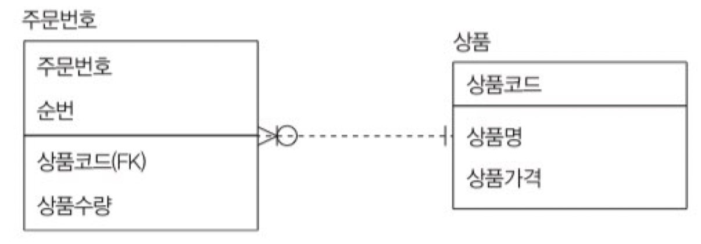

# 식별자(Identifiers)

`식별자`는 속성 중에 각각의 인스턴스(Row)를 구분 가능하게 만들어주는 대표 격인 속성을 의미한다.

 

### 주식별자

`주식별자`는 기본키(PK, Primary Key)에 해당하는 속성이다. 하나의 속성이 주식별자가 될 수도 있고 여러 개의 속성이 주식별자가 될 수도 있다.

**주식별자 특징**
- 유일성 : 각 인스턴스에 유니크함을 부여하여 식별이 가능하도록 한다.
- 최소성 : 유일성을 보장하면서 최소 개수의 속성이어야 한다.
- 불변성 : 속성값이 변하지 않아야 한다.
- 존재성 : 속성값이 NULL일 수 없다.

 

### 식별자 분류

1. 대표성 여부
   - 주식별자(Primary Iden) : 주식별자 특징을 만족하는 **대표 식별자**, **다른 엔티티와 참조 관계로 연결됨**
   - 보조식별자(Alternate Identifier) : 인스턴스를 식별할 순 있지만 대표 식별자가 아님, 다른 엔티티와 참조 관계로 연결되지 않음
2. 스스로 생성되었는지 여부
   - 내부식별자(Internal Identifier) : 엔티티 내부에서 스스로 생성된 식별자
   - 외부식별자(Foreign Identifier) : 다른 엔티티에서 온 식별자, 다른 엔티티와의 연결고리 역할
3. 단일 속성의 여부
    - 단일식별자(Single Identifier) : 하나의 속성으로 구성된 식별자
    - 복합식별자(Composite Identifier) : 두 개 이상의 속성으로 구성된 식별자
4. 대체 여부
    - 원조식별자(Original Identifier) : 업무 프로세스에 존재하는 식별자, 가공되지 않은 원래의 식별자(본질식별자)
    - 대리식별자(Surrogate Identifier) : 주식별자의 속성이 두 개 이상인 경우 그 속성들을 하나로 묶어서 사용하는 식별자(인조식별자)

 

 

### 식별자 관계 vs 비식별자 관계

**1. 식별자 관계(Identification Relationship)**

부모 엔티티의 식별자가 자식 엔티티의 주식별자가 되는 관계이다.

 

**2. 비식별자 관계(Non-Identification Relationship)**

부모 엔티티의 식별자가 자식 엔티티의 주식별자가 아닌 일반 속성이 되는 관계이다.

