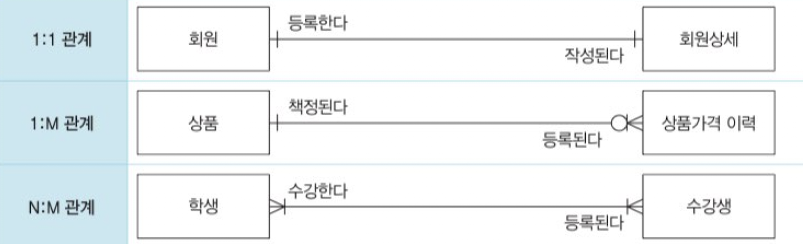

# 관계(Relationship)

엔티티와 엔티티와의 관계를 의미하며, 어떠한 연관성이 있는지 타입을 분류하여 `존재 관계`와 `행위 관계`로 나눌 수 있다.

- 존재 관계 : 존재 자체로 연광성이 있는 관계
- 행위 관계 : 특정한 행위를 함으로써 생기는 관계

 

### 표기법

- 관계명(Membership) : 관계의 이름
- 관계차수(Cardinality) : 관계에 참여하는 수
- 관계선택사양(Optionality) : 필수인지 선택인지의 여부

 

**관계명**

모든 관계는 두 개의 관계명을 가진다. 각 엔티티의 관점에서 관계명을 하나씩 가지기 때문이다. `관계명`은 반드시 `명확한 문장`을 표현해야 하며 `현재형`이어야 한다.

 

**관계차수**

각 엔티티에서 관계에 참여하는 수를 의미하며, 1:1, 1:M, M:N 형식으로 구분할 수 있다.

 

**관계선택사양**

- 필수적 관계 : 참여자가 반드시 존재해야 하는 관계 (1개 이상)
- 선택적 관계 : 참여자가 없을 수도 있는 관계 (0개 이상)