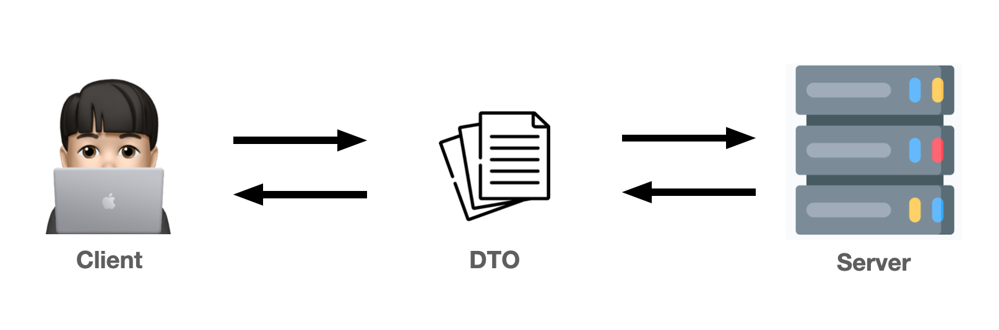

# DTO(Data Transfer Object)

DTO 패턴이란 **마틴 파울러**가 제안한 애플리케이션 아키텍처 패턴 중 하나이다. DTO는 <u>Transfer</u> 의미에서 알 수 있듯이 <u>데이터를 전송하기 위한 용도의 객체</u>로 생각 할 수 있다.

 

DTO는 서버(Controller)와 클라이언트 사이에서 교환되는 데이터라고 생각할 수 있다. 주로 `JSON` 형식으로 주고 받는다.

 

**DTO가 필요한 이유**

1. 코드의 간결성

- 여러 개의 `@RequestParam` 사용 대신 `@RequestBody` 하나로 사용 가능하다.
- 유효성 검증 로직(`@Valid`)을 컨트롤러의 핸들러 메서드에서 DTO 클래스로 분리할 수 있다.

> ⭐️ Tip. HTTP 요청을 전달 받는 핸들러 메서드는 요청을 전달 받는 것이 주 목적이기 때문에 최대한 간결하게 작성되는 것이 좋습니다.

2. HTTP 요청의 수를 줄이기 위함.

 

**DTO 클래스 설계 시 주의 사항 ❗️**

멤버 변수에 해당하는 <u>`getter`메서드가 반드시 존재해야 한다.</u>
만약 getter 메서드가 없다면 Response Body에 있는 데이터가 DTO 객체에 제대로 매핑이 안 될 수도 있다.

 

**@RequestBody**

JSON -> DTO (역직렬화, Deserialization)

`@RequestBody` 애너테이션은 `JSON` 형식의 Request Body를 DTO 클래스의 객체로 변환시켜준다. 즉, 클라이언트의 Request Body 형식이 JSON이어야 한다.

 

**@ResponseBody**

DTO -> JSON (직렬화, Serialization)

`@ResponseBody` 애너테이션은 DTO 자바 클래스의 객체를 JSON 형식으로 변환시켜 클라이언트 측에 JSON 데이터를 보낼 때 사용한다.

 

>💡 Spring MVC에서는 핸들러 메서드에 @ResponseBody 애너테이션이 붙거나 핸들러 메서드의 리턴 값이 ResponseEntity일 경우, 내부적으로 HttpMessageConverter가 동작하게 되어 응답 객체(DTO 클래스의 객체)를 JSON 형식으로 바꿔줍니다.

 

**🔥 DTO 클래스의 단점?**

만약 Controller에 Post, Patch 두 개가 있다면, Dto 클래스는 각각 PostDto, PatchDto 두 개가 있어야 한다.
결과적으로 Controller 클래스가 늘어남에 따라 DTO 클래스가 두 배씩 늘어나는 단점이 있다.

✨ 보완 방법 : 공통된 멤버 변수의 추출 및 내부 클래스를 이용해서 어느 정도 개선이 가능