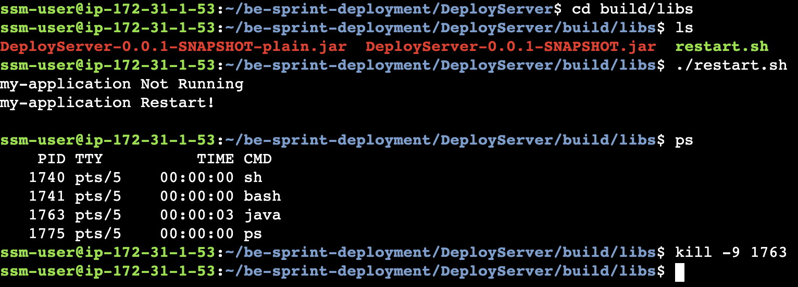

# Spring Boot 백그라운드 실행 & 종료

### 셸 스크립트 작성 템플릿

```
$ nano restart.sh // 에디터로 파일을 생성한 후 아래 내용을 붙여넣기 하면 된다.
================================================================================
#!/bin/bash

ps -ef | grep "DeployServer-0.0.1-SNAPSHOT.jar" | grep -v grep | awk '{print $2}' | xargs kill -9 2> /dev/null

if [ $? -eq 0 ];then
    echo "my-application Stop Success"
else
    echo "my-application Not Running"
fi

echo "my-application Restart!"
echo $1
nohup java -jar {현 위치로부터 스냅샷 jar 파일의 상대경로} --spring.profiles.active=dev > /dev/null 2>&1 &
```

`{현 위치로부터 스냅샷 jar 파일의 상대경로}` 이 부분만 작성해주면 된다.

<br>

리눅스에 위와 같이 파일을 저장하고 아래 명령어를 통해 실행 권한을 부여해야 접근 가능하다.

```
chmod 755 restart.sh
```

아래 명령을 통해 실행하면 백그라운드로 스프링 부트가 돌아간다.

```
./restart.sh
```

💡 경우에 따라 권한 이슈로 실행이 되지 않는 경우가 있는데, 이 경우 `sudo`를 붙여 실행하면 오류없이 실행이 된다.

<br>

---

### 백그라운드에서 실행되고 있는 서버 종료하기

터미널에서 백그라운드로 돌아가고 있는 서버 파일의 위치로 이동합니다.

해당 위치로 이동했으면 아래 명령을 통해 백그라운드 서버를 종료할 수 있습니다.
```
kill -9 {실행되고 있는 Java 프로세스의 PID}
```

`PID는` 리눅스 명령어 `ps`를 통해 확인할 수 있다.

아래 이미지는 `spring application`을 `background`로 실행하고 종료하는 과정이다.
<p align="center"></p>

<br>


📝 **요약: 앱 실행 흐름**

1. `./gradlew clean build`를 통해 새로운 스냅샷(.jar) 생성 (`gradlew`이 존재하는 위치에서 명령해야 한다.)
2. `cd build/libs` 이동
3. 백그라운드 실행 셸스크립트 작성
4. 작성한 셸스크립트에 권한부여하고 실행
5. 서버 종료를 원할 때 `kill`