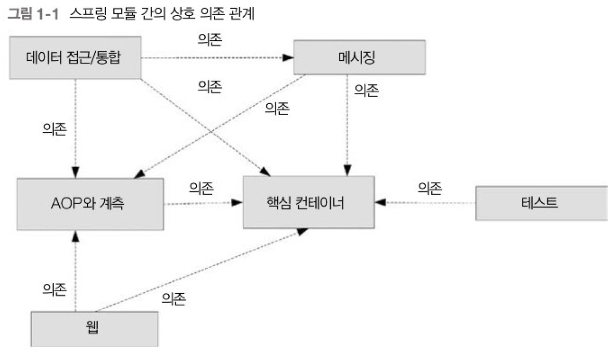
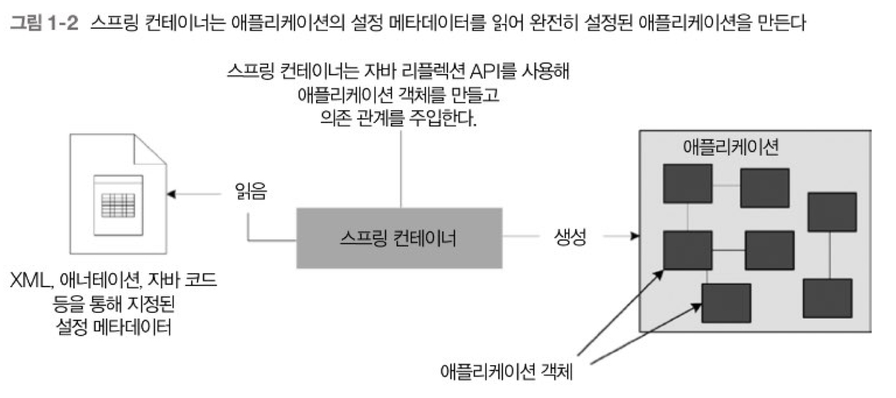

# Chapter 1 스프링 프레임워크 소개

- [스프링 프레임워크 소개](#11-소개) 
- [스프링 모듈](#12-스프링-모듈)
- [스프링 IoC 컨테이너](#13-스프링-ioc-컨테이너)
- [스프링 장점](#14-스프링의-장점)

---

### 1.1 소개

`스프링 프레임워크`(줄여서 '스프링')는 자바 엔터프라이즈 애플리케이션 개발을 단순하게 해주는 오픈소스 애플리케이션 프레임워크다.

 

**인프라 제공**

스프링은 구조가 잘 잡히고 유지 보수하기 쉬우며 테스트하기 좋은 애플리케이션을 개발하기 위한 인프라를 제공한다.

**비즈니스 로직**

스프링을 사용하면 개발자는 애플리케이션의 비즈니스 로직을 작성하는 데 집중할 수 있어 생산성이 향상된다.

 

### 1.2 스프링 모듈

스프링은 담당하는 애플리케이션 개발 요소에 따라 여러 모듈로 구성된다.

- 핵심 컨테이너
- AOP와 계측
- 메시징
- 데이터 접근/통합
- 웹
- 테스트

위 스프링 모듈을 통해 웹 애플리케이션을 개발하고 데이터베이스에 접근하며, 트랜잭션을 관리하고 단위 테스트와 통합 테스트를 개발하는 등의 일을 할 수 있다.

스프링 중심에 핵심 컨테이너 그룹에 속한 모듈이 있고, 다른 모듈이 이 그룹에 의존한다. 다른 스프링 모듈에 AOP 기능을 제공하는 AOP와 계측 그룹도 핵심 컨테이너 그룹만큼 중요하다.

 

### 1.3 스프링 IoC 컨테이너

`의존 관계(Dependency)`

객체가 다른 객체와 상호 작용하는 경우를 객체의 의존 관계라고 한다.

`DI(Dependency Injection)`

DI는 객체 간의 의존 관계를 생성자 인수(Constructor argument)나 세터 메서드 인수(setter method argument)로 명시하고 객체를 생성할 때 생성자나 세터를 통해 의존 관계를 주입하는 방식을 따르는 **디자인 패턴**이다.

의존하는 객체가 속한 클래스는 스프링의 어떤 인터페이스나 클래스를 구현하거나 확장하지 않는다는 점에 유의하자.

`스프링 컨테이너`

스프링 IoC 컨테이너(이를 '스프링 컨테이너'라고도 한다)는 스프링 애플리케이션에 존재하는 객체를 생성하고 의존 관계를 주입하는 일을 담당한다.

`빈(Bean)`

스프링 컨테이너가 생성하고 관리하는 애플리케이션 객체들을 빈(Bean)이라고 부른다.

스프링 빈으로 설졍하려면 의존 관계를 생성자 인수로 받거나 세터 메서드 인수로 받게 코드를 작성해야 한다.

`IoC(Inversion Of Control)`

의존 관계를 만들고 주입하는 책임은 애플리케이션의 객체가 아닌 스프링 컨테이너에 있어 DI를 제어의 역전(IoC)이라고도 부른다.

`설정 메타데이터(Configuration metadata)`

스프링 기반 애플리케이션에서 애플리케이션 객체(Bean)와 그들의 의존 관계(Dependency)의 정보는 설정 메타데이터를 사용해 지정한다.

스프링 IoC 컨테이너는 애플리케이션의 설정 메타데이터를 읽어서 애플리케이션 객체들과 그들의 의존 관계를 인스턴스화한다.

스프링 컨테이너에 제공되는 설정 메타데이터 방식

- XML
- 자바 애너테이션
- 자바 코드

`Reflection API`

스프링 컨테이너는 자바 리플렉션(Reflection) API를 사용해 객체를 만들고 의존 관계를 주입한다.

`POJO(Plain Old Java Object)`

스프링 컨테이너는 애플리케이션 객체에 추가 기능을 부여하고 애플리케이션 객체를 평범한 자바 객체(기존 자바 객체, POJO)로 모델링할 수 있다.

POJO에 해당하는 자바 클래스를 POJO 클래스라고 부른다.

POJO 클래스는 프레임워크가 지정하는 인터페이스나 클래스를 구현 및 확장하지 않는 보통 자바 클래스를 뜻한다.

 

### 1.4 스프링의 장점

- 스프링은 객체 생성과 의존 관계 주입을 처리함으로써 자바 애플리케이션 조합을 쉽게 만들어준다.
- 스프링은 POJO로 애플리케이션을 개발하는 것을 권장한다.
- 번거로운 준비 코드를 알아서 처리해주는 추상화 계층 제공
  - JMS 공급자
  - JNDI
  - MBean 서버
  - 전자우편 서버
  - 데이터베이스